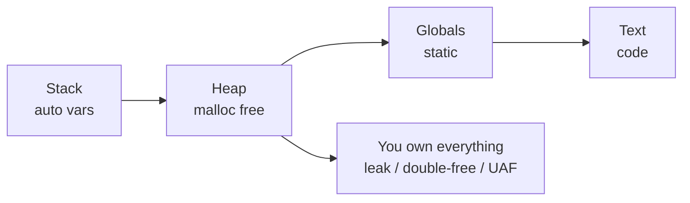

# C Notes

**Part of:** [[Programming-Languages-Cobweb]]
**Siblings:** [[Cpp]], [[CSharp]], [[Swift]], [[Rust]], [[Comparisons]], [[Toolchain-Interop]]
**Born:** 1972, Bell Labs. Portable assembler.

## Pointers in 30 Seconds

```c
int x = 42;
int *p = &x;   // address of x
*p = 43;       // mutate through pointer
char *buf = malloc(64);
if (!buf) return 1;
free(buf);     // forget = leak, twice = crash
```

## Memory Map



## Gotchas

- `strcmp` returns 0 on equal.
- `sizeof(array)` decays to a pointer inside functions.
- Signed overflow is undefined behavior.
- `a[i]` is `*(a + i)`, so `i[a]` also compiles.

**Mental model:** array + pointer + manual free.

Tags: #programming #c #cobweb
