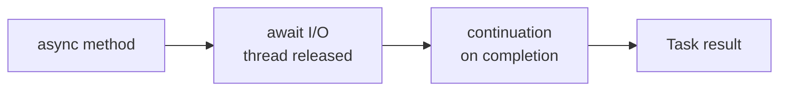

# CSharp Notes

**Part of:** [[Programming-Languages-Cobweb]]
**Siblings:** [[C]], [[Cpp]], [[Swift]], [[Rust]], [[Comparisons]], [[Toolchain-Interop]]
**Born:** 2000. Managed OOP on .NET, GC, LINQ, async/await.

## Properties in 30 Seconds

```csharp
public class Task {
    public string Title { get; set; } = "";
    public bool Done { get; private set; }
    public void Complete() => Done = true;
}
var t = new Task { Title = "ship it" };
t.Complete();
```

## Async Pipeline



Random fact: `async/await` was mainstreamed by C# 5 (2012) before JS and Python copied the pattern.

## Gotchas

- `==` on strings compares values, on classes compares reference unless overloaded.
- `IDisposable` needs `using`.
- Nullable `int?` needs `.Value` or `??`.

**Mental model:** GC + LINQ + async, batteries included.

Tags: #programming #csharp #cobweb
