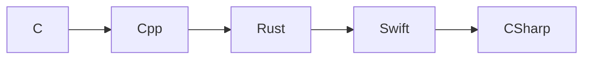
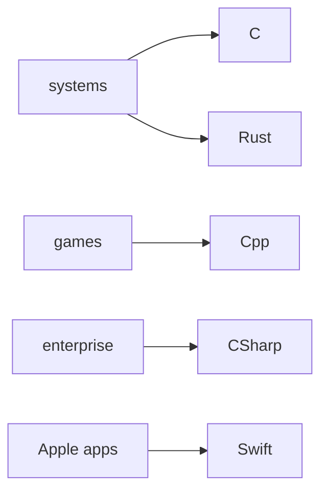
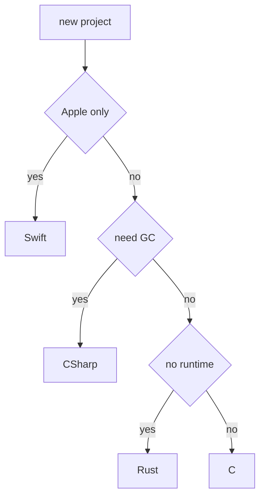

# Comparisons

**Part of:** [[Programming-Languages-Cobweb]]
**Covers:** C, Cpp, CSharp, Swift, Rust

## Safety vs Control

Move right when bugs cost more than nanoseconds, move left when hardware or ABI forces you.

## Where Each Wins

## Decision Tree

## One Idea Each

| Lang | Mental model |
|------|--------------|
| C | Array + pointer + manual free |
| Cpp | Zero-cost abstractions |
| CSharp | GC + LINQ + async |
| Swift | Optionals + ARC + protocols |
| Rust | Ownership + traits + match |

## Tags
#note-comparisons
