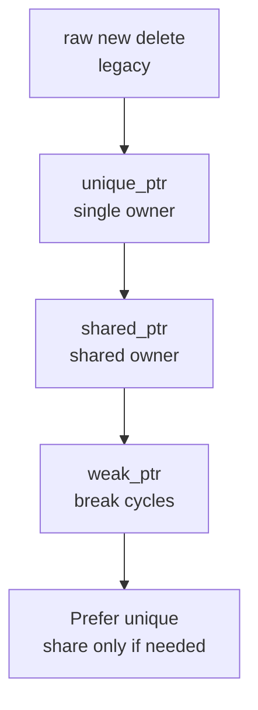

# Cpp Notes

**Part of:** [[Programming-Languages-Cobweb]]
**Siblings:** [[C]], [[CSharp]], [[Swift]], [[Rust]], [[Comparisons]], [[Toolchain-Interop]]
**Born:** 1985. C with classes, then templates, RAII, zero-cost abstractions.

## RAII in 30 Seconds

```cpp
#include <memory>
struct File {
    FILE* f;
    File(const char* p) { f = fopen(p, "r"); }
    ~File() { if (f) fclose(f); } // cleanup on scope exit
};
auto p = std::make_unique<int>(42); // freed automatically
```

Destructors run in reverse order of construction. That is the whole trick.

## Ownership Ladder



## Gotchas

- Rule of 3/5/0 for copy and move.
- Object slicing on pass-by-value.
- `vector<bool>` is not a real container.
- Uninitialized `int x;` holds garbage.

**Mental model:** zero-cost abstractions, pay only for what you use.

Tags: #programming #cpp #cobweb
