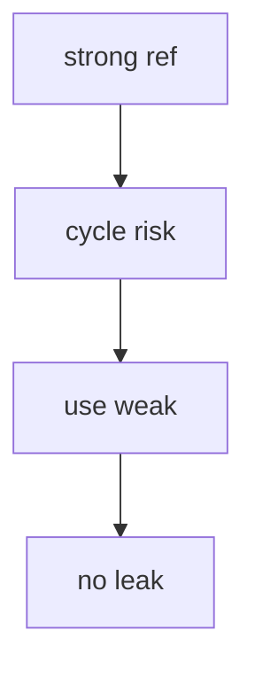

# Swift Notes

**Born:** 2014. Safe Apple development, ARC, optionals, protocols.

## Optionals in 30 Seconds

```swift
var name: String? = nil
name = "nazky"
if let n = name {
    print("hello \(n)")
}
let upper = name?.uppercased() ?? "UNKNOWN"
```

Optionals are just `enum Optional { case none, some(T) }`.

## ARC Web



## Gotchas

- Structs copy (value), classes share (reference).
- `weak` avoids ARC cycles in closures.
- Force unwrap `!` crashes on nil.

**Mental model:** optionals + ARC + protocols over inheritance.

Tags: #programming #swift #cobweb #managed
