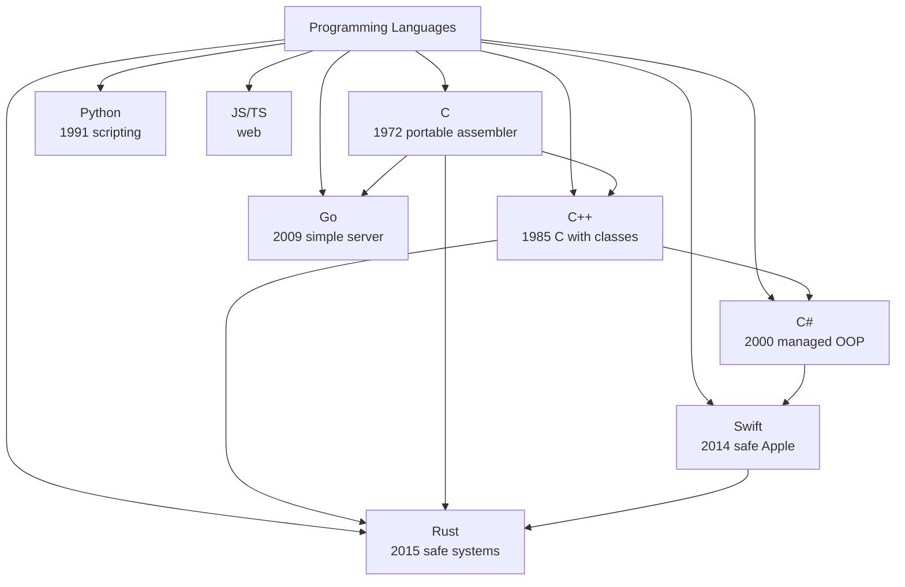
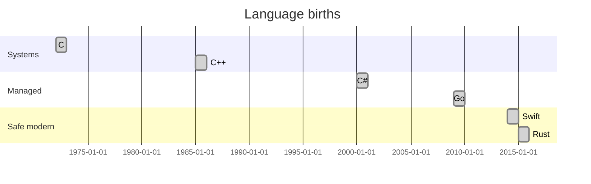
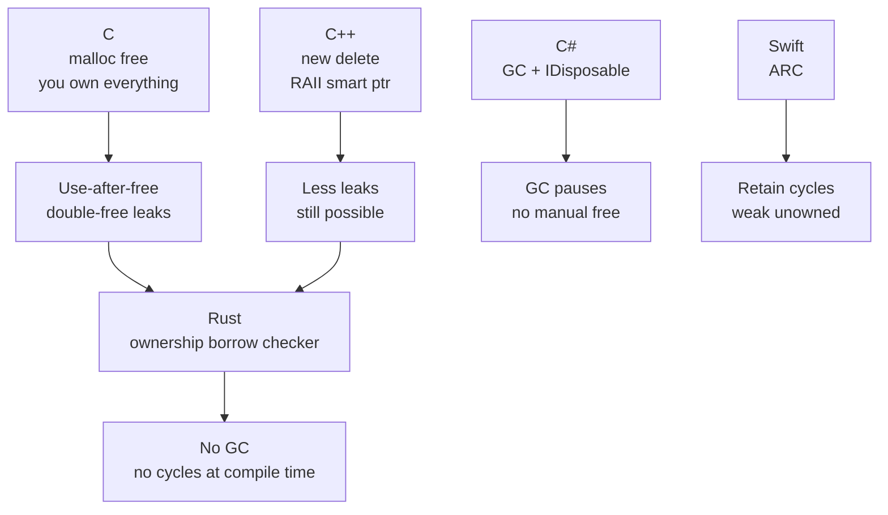
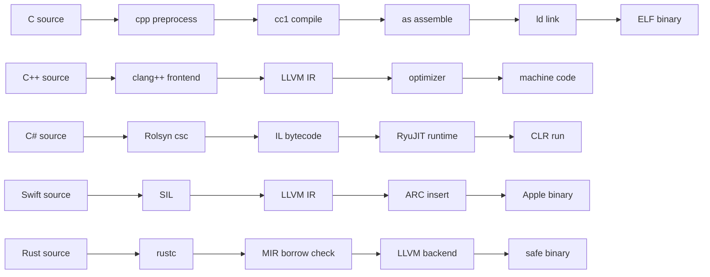
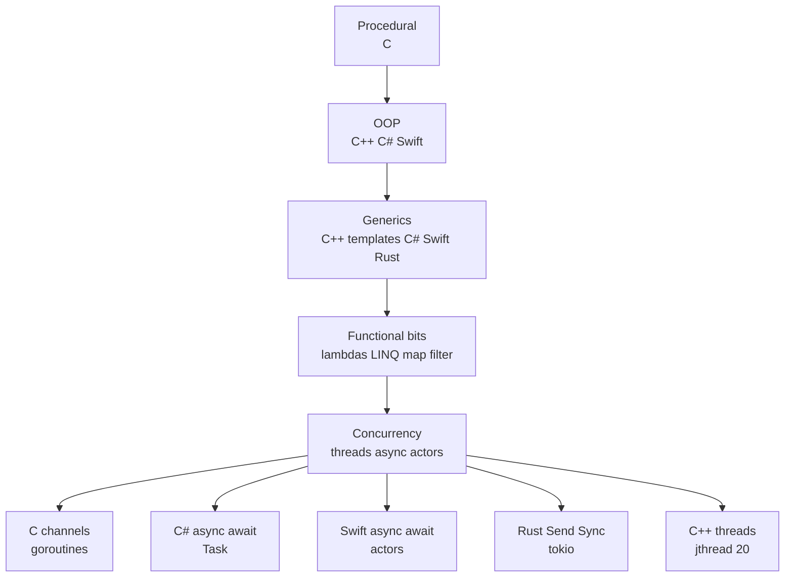
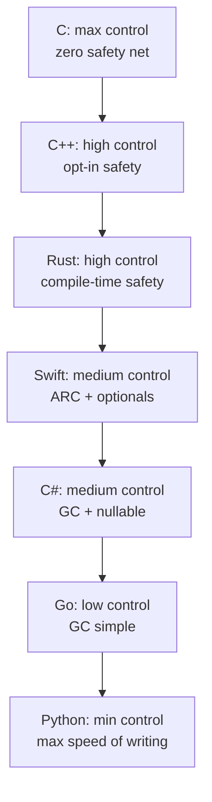
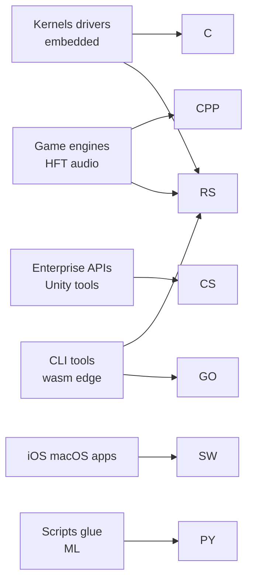
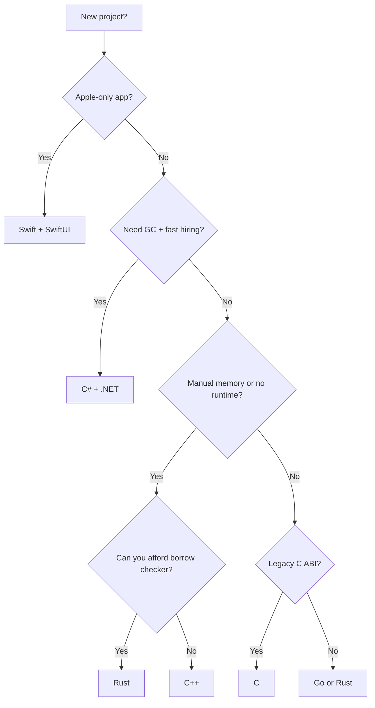
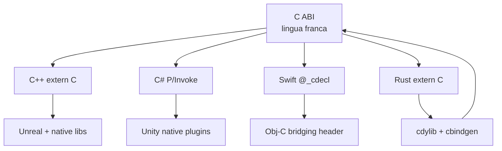

# Programming Languages Cobweb

**Created:** 2026-09-10
**Scope:** C, C++, C#, Swift, Rust + neighbors
**See also:** [[Graph-Web-Atlas]] (separate atlas, untouched), [[Web-Links-Hub]]

Random notes, comparisons, and webs. Each language is a node, edges are tradeoffs.

---

## 1. Cobweb Universe



## 2. Timeline



## 3. Memory Model Web



## 4. Ownership in 30 Seconds (Rust)

```rust
fn main() {
    let s1 = String::from("hello");
    let s2 = s1; // move, s1 invalid now
    // println!("{}", s1); // compile error
    println!("{}", s2);
    let s3 = &s2; // borrow, read-only
    println!("{} {}", s2, s3);
} // s2 dropped here, memory freed once
```

Rules: one owner, moves by default, borrow with `&`, mutable borrow `&mut` is exclusive.

## 5. Pointers in 30 Seconds (C)

```c
int x = 42;
int *p = &x;   // address of x
*p = 43;       // mutate through pointer
char *buf = malloc(64);
if (!buf) return 1;
free(buf);     // forget this = leak, do twice = crash
```

Random fact: `a[i]` is just `*(a + i)`, so `i[a]` also compiles.

## 6. RAII in 30 Seconds (C++)

```cpp
#include <memory>
struct File {
    FILE* f;
    File(const char* p) { f = fopen(p, "r"); }
    ~File() { if (f) fclose(f); } // cleanup on scope exit
};
auto p = std::make_unique<int>(42); // freed automatically
```

Random fact: destructors run in reverse order of construction. That is the whole trick.

## 7. Properties in 30 Seconds (C#)

```csharp
public class Task {
    public string Title { get; set; } = "";
    public bool Done { get; private set; }
    public void Complete() => Done = true;
}
var t = new Task { Title = "ship it" };
t.Complete();
```

Random fact: `async/await` was mainstreamed by C# 5 (2012) before JS and Python copied the pattern.

## 8. Optionals in 30 Seconds (Swift)

```swift
var name: String? = nil
name = "nazky"
if let n = name {
    print("hello \(n)")
}
// guard let, ?? default, ?. chaining, ! crash-if-nil
let upper = name?.uppercased() ?? "UNKNOWN"
```

Random fact: Swift optionals are just `enum Optional { case none, some(T) }`.

## 9. Compilation Pipeline Web



## 10. Paradigm Web



## 11. Safety vs Control Scatter (mental model)



Read: move right when bugs cost more than nanoseconds, move left when hardware or ABI forces you.

## 12. Where Each Wins



## 13. Decision Tree (random but useful)



## 14. Interop Cobweb



Random fact: almost every language can call C, almost no language can be called by everyone. C ABI is the narrow waist.

## 15. Gotcha Cards

- **C:** `strcmp` returns 0 on equal. `sizeof(array)` decays to pointer in functions. Signed overflow is UB.
- **C++:** rule of 3/5/0, slicing, `vector<bool>` is not a container, uninitialized `int x;` is garbage.
- **C#:** `==` on strings compares values, on classes compares reference unless overloaded. `IDisposable` needs `using`. Nullable `int?` needs `.Value` or `??`.
- **Swift:** value types (struct) copy, reference types (class) share. `weak` avoids ARC cycles in closures. Force unwrap `!` crashes on nil.
- **Rust:** `Clone` is explicit, `Copy` is implicit for small types. Lifetimes describe how long refs live. `Result` and `Option` replace exceptions with `?`.

## 16. One Idea Each (cheat lines)

| Lang | One-liner mental model |
|------|------------------------|
| C | Array + pointer + manual free |
| C++ | Zero-cost abstractions, pay only for what you use |
| C# | GC + LINQ + async, batteries included |
| Swift | Optionals + ARC + protocols over inheritance |
| Rust | Ownership + traits + exhaustive match |

Tags: #programming #c #cpp #csharp #swift #rust #cobweb #graph
