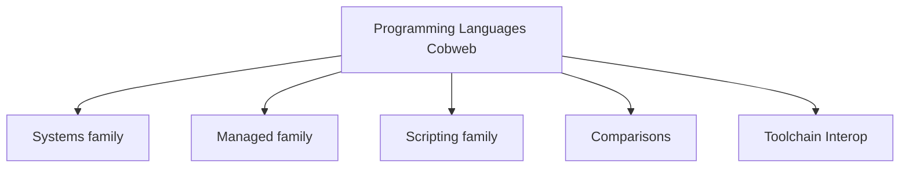

# Programming Languages Cobweb

**Created:** 2026-09-10
**Type:** top index. Atomic notes link to nothing, they carry tags only. Families below are the sub-indexes.

## Families

| Page | What is inside |
|------|----------------|
| [[Systems-Languages]] | C, Cpp, Rust, Zig, Go plus cheatsheets |
| [[Managed-Languages]] | CSharp, Java, Kotlin, Swift, Dart, TypeScript plus cheatsheets |
| [[Scripting-Languages]] | Python, PHP, Lua, Bash, SQL, Haskell plus cheatsheets |
| [[Comparisons]] | Safety vs control, use cases, decision tree |
| [[Toolchain-Interop]] | Compilation pipelines, C ABI interop web |

## Mini Map

Tags: #programming #cobweb #index
