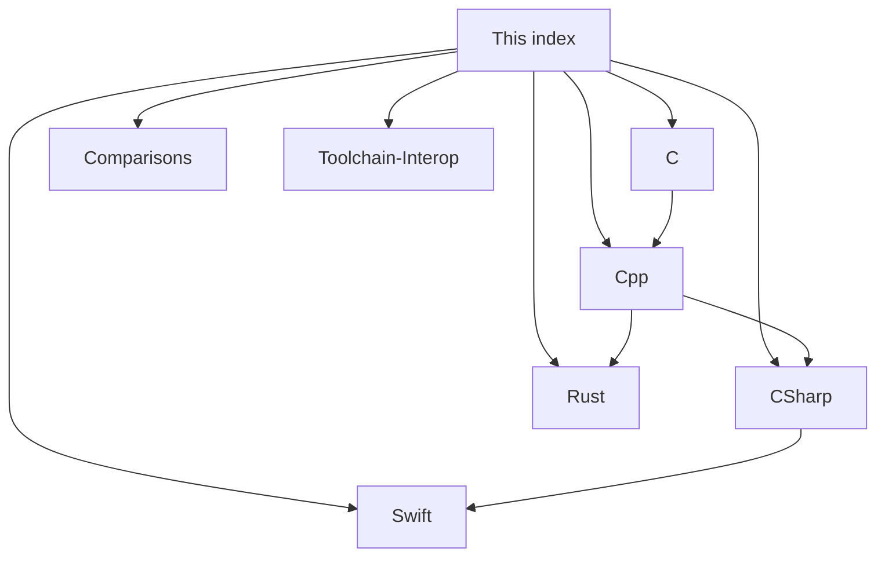

# Programming Languages Cobweb

**Created:** 2026-09-10
**Type:** index hub. Details live in separate pages below, not here.
**See also:** [[Graph-Web-Atlas]], [[Web-Links-Hub]]

## Pages

| Page | What is inside |
|------|----------------|
| [[C]] | Pointers, memory map, gotchas |
| [[Cpp]] | RAII, ownership ladder, gotchas |
| [[CSharp]] | Properties, async pipeline, gotchas |
| [[Swift]] | Optionals, ARC web, gotchas |
| [[Rust]] | Ownership, borrow rules, gotchas |
| [[Comparisons]] | Safety vs control, use cases, decision tree |
| [[Toolchain-Interop]] | Compilation pipelines, C ABI interop web |

## Mini Map

Tags: #programming #cobweb #index
