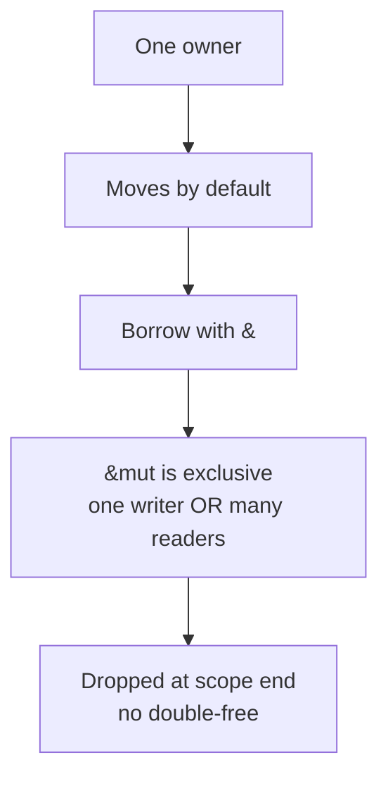

# Rust Notes

**Part of:** [[Programming-Languages-Cobweb]]
**Siblings:** [[C]], [[Cpp]], [[CSharp]], [[Swift]], [[Comparisons]], [[Toolchain-Interop]]
**Born:** 2015. Safe systems, no GC, borrow checker.

## Ownership in 30 Seconds

```rust
fn main() {
    let s1 = String::from("hello");
    let s2 = s1; // move, s1 invalid now
    // println!("{}", s1); // compile error
    println!("{}", s2);
    let s3 = &s2; // borrow, read-only
    println!("{} {}", s2, s3);
} // s2 dropped here, freed exactly once
```

## Borrow Rules



## Gotchas

- `Clone` is explicit, `Copy` is implicit for small types.
- Lifetimes describe how long refs live.
- `Result` and `Option` replace exceptions, propagate with `?`.

**Mental model:** ownership + traits + exhaustive match.

Tags: #programming #rust #cobweb
