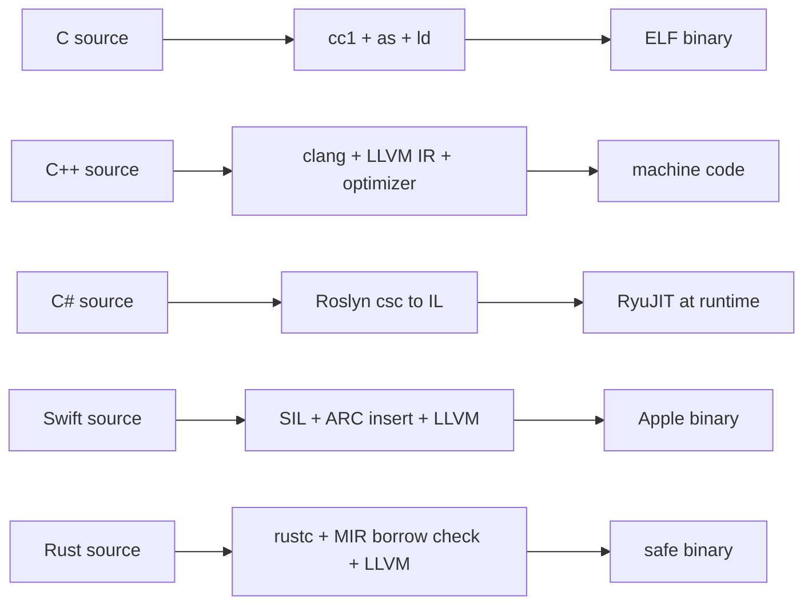
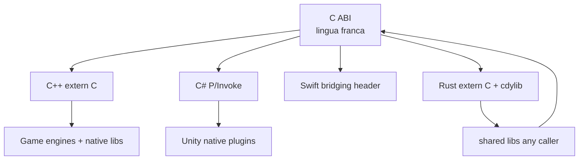

# Toolchain Interop

**Part of:** [[Programming-Languages-Cobweb]]
**Covers:** [[C]], [[Cpp]], [[CSharp]], [[Swift]], [[Rust]]
**See also:** [[Comparisons]]

## Compilation Pipelines

## C ABI Interop Web

Random fact: almost every language can call C, almost none can be called by everyone. C ABI is the narrow waist.

Tags: #programming #toolchain #ffi #cobweb
