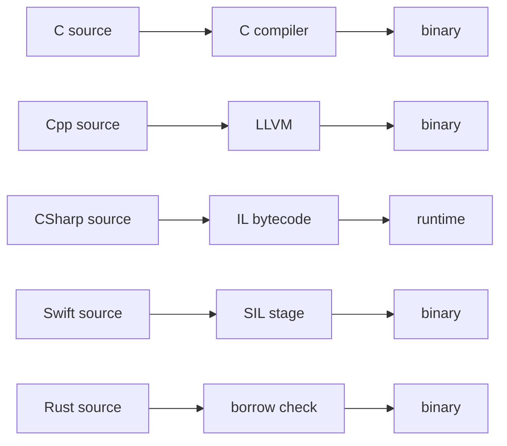
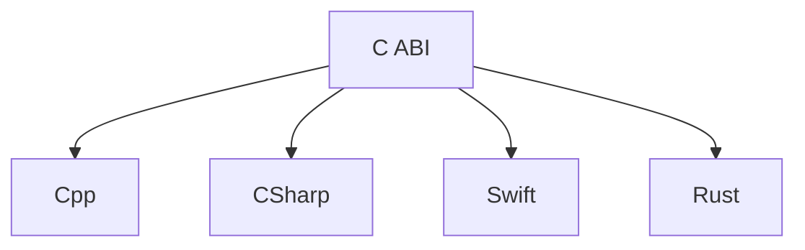

# Toolchain Interop

**Part of:** [[Programming-Languages-Cobweb]]

## Compilation Pipelines

## C ABI Interop Web

Random fact: almost every language can call C, almost none can be called by everyone. C ABI is the narrow waist.

## Tags
#note-toolchain-interop
