# Graph Web Atlas

**Last Updated:** 2026-09-10
**Vault:** 192 notes
**Purpose:** one page with all explanatory diagrams. See also [[Web-Links-Hub]], [[Map of Content]], [[README]], [[System/Fixes/Visual-Guides]], [[System/System-Architecture]].

---

## 1. Vault Universe

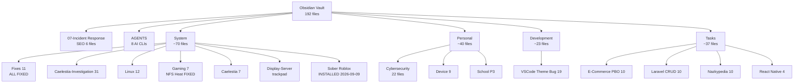

## 2. Full Boot Chain (UKI + GRUB)

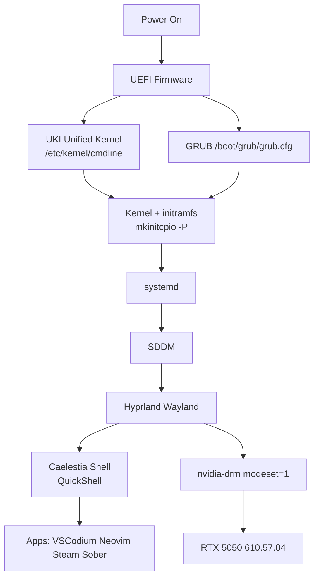

Related: [[System/System-Architecture]], [[System/Fixes/GRUB-Configuration]], [[System/Fixes/HDMI-Monitor-Fix-NVIDIA-Wayland]].

## 3. NVIDIA Driver Fix Pipeline

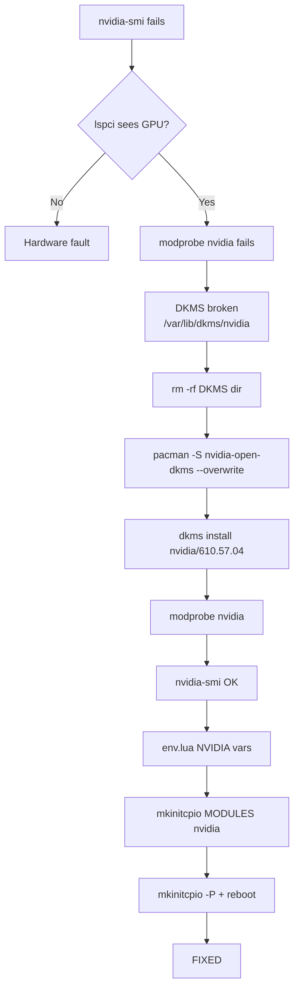

Related: [[System/Fixes/NVIDIA-RTX-5050-Investigation]], [[System/Fixes/NVIDIA-RTX-5050-Fix-Commands]], [[System/Fixes/Quick-Reference]].

## 4. HDMI Monitor Fix (UKI vs GRUB trap)

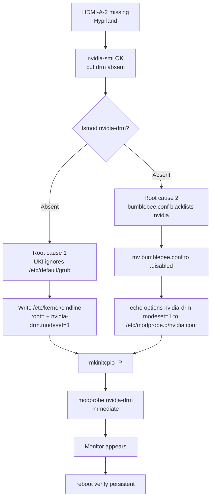

Related: [[System/Fixes/HDMI-Monitor-Fix-NVIDIA-Wayland]], [[System/Fixes/README]].

## 5. GRUB Menu Before After

```mermaid
graph LR
    subgraph BEFORE["BEFORE - 7 entries"]
        A1[UEFI first]
        A2[Arch x2 duplicate]
        A3[Advanced]
        A4[BlackArch]
        A5[Windows x2 os-prober]
    end
    subgraph FIX["FIX COMMANDS"]
        F1[chmod -x 10_linux]
        F2[DISABLE_OS_PROBER=true]
        F3[40_custom Windows entry]
        F4[30 to 41_uefi-firmware]
    end
    subgraph AFTER["AFTER - 3 entries"]
        B1[BlackArch]
        B2[Windows Boot Manager]
        B3[UEFI bottom]
    end
    BEFORE --> FIX --> AFTER
```

Related: [[System/Fixes/GRUB-Configuration]], [[System/Fixes/GRUB-Duplicate-Entries]], [[System/Fixes/GRUB-Duplicate-Entries-Fix-Commands]].

## 6. Hyprland Caelestia Config Web

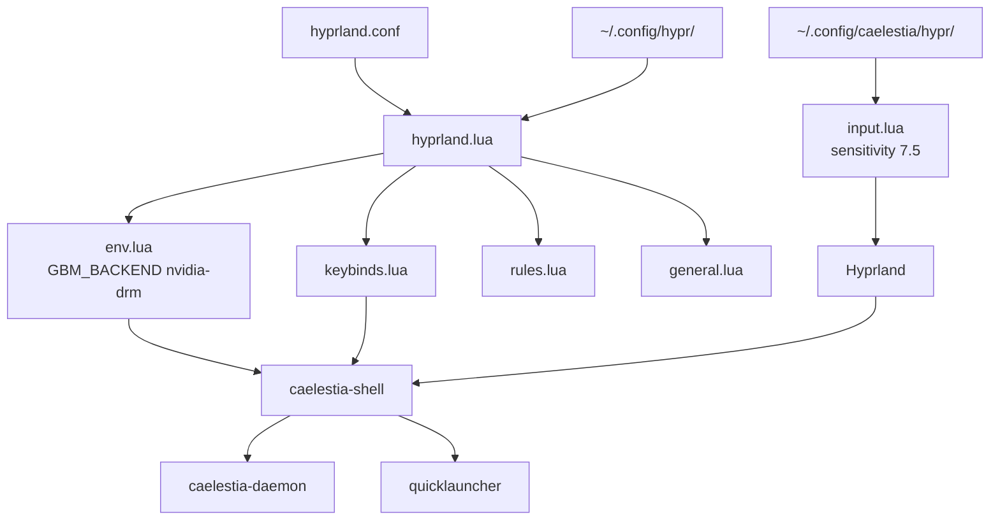

Related: [[System/Caelestia/00-Overview]], [[System/Caelestia/Caelestia-Config-Files-Reference]], [[System/Caelestia/Caelestia-Hyprland-Keybinds]], [[System/Display-Server/hyprland-trackpad-sensitivity]].

## 7. Caelestia Performance Investigation

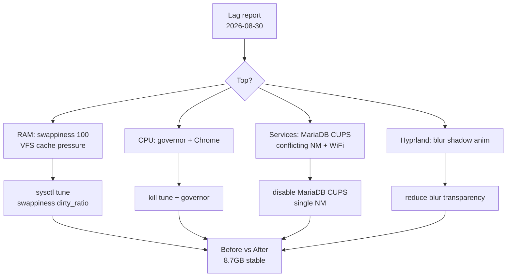

Related: [[System/Caelestia-Investigation/00 - Investigation Overview]], [[System/Caelestia-Investigation/Root Cause - Swappiness 100]], [[System/Caelestia-Investigation/Before vs After Comparison]], [[Personal/Session-Logs/2026-08-29-Caelestia-Session/00-Overview]].

## 8. Trackpad Sensitivity Fix

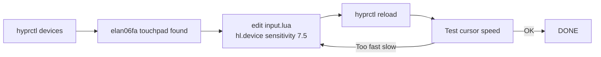

Related: [[System/Display-Server/hyprland-trackpad-sensitivity]].

## 9. NFS Heat Gaming Fix

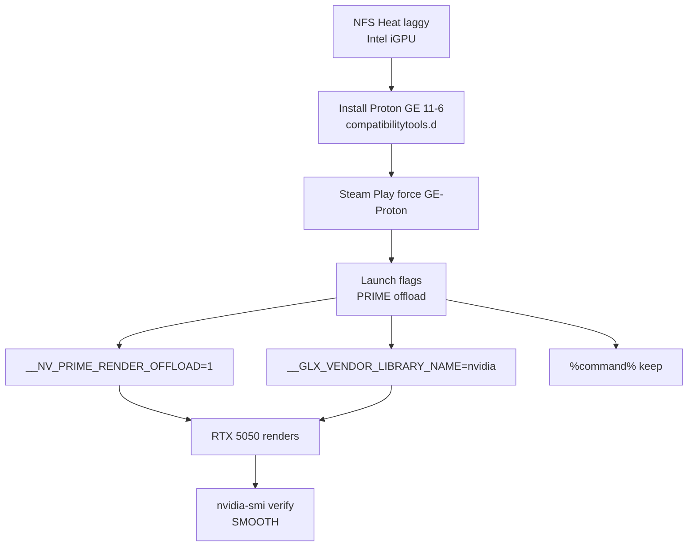

Related: [[System/Gaming/README]], [[System/Gaming/The-Problem]], [[System/Gaming/The-Solution]], [[System/Gaming/Launch-Options]], [[System/Gaming/System-Info]].

## 10. Roblox Sober Install

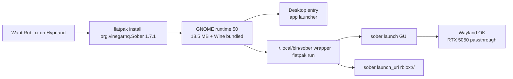

Related: [[System/roblox-sober-install]], [[System/Gaming/Troubleshooting]].

## 11. Gaming GPU Decision Tree

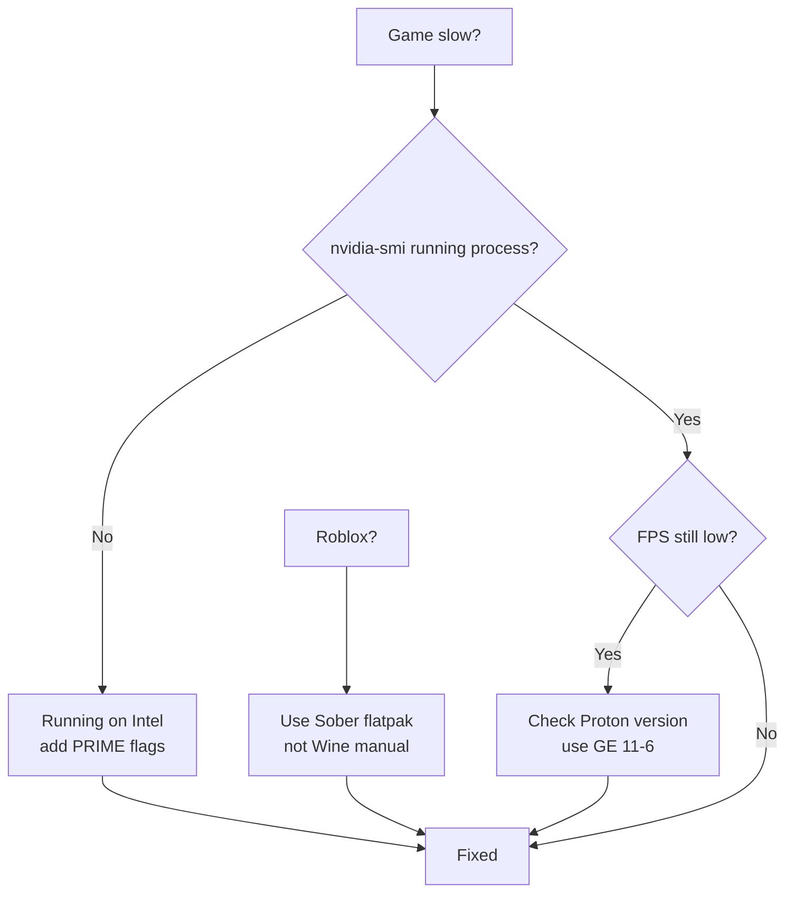

## 12. SEO Poisoning Kill Chain

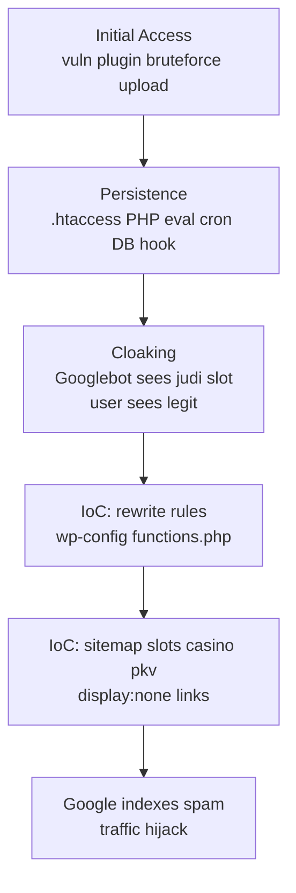

Related: [[07-Incident Response/SEO-Poisoning-Analysis/00-SEO-Poisoning-Analysis]], [[07-Incident Response/SEO-Poisoning-Analysis/01-Mod-Operandus-IoC]], [[07-Incident Response/SEO-Poisoning-Analysis/02-Investigation-Commands]].

## 13. IR Remediation Pipeline

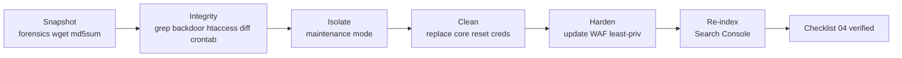

Related: [[07-Incident Response/SEO-Poisoning-Analysis/03-Remediation-Hardening]], [[07-Incident Response/SEO-Poisoning-Analysis/04-Checklist]].

## 14. kurmamedia Case Verdict

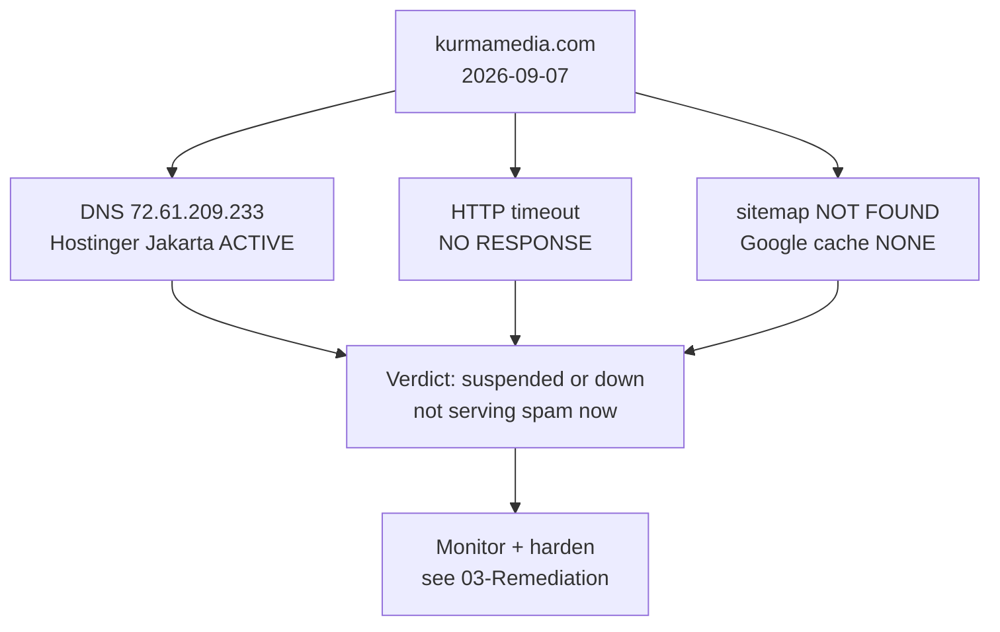

Related: [[07-Incident Response/SEO-Poisoning-Analysis/05-Case-Study-kurmamedia]].

## 15. Cybersecurity Toolkit Pipeline

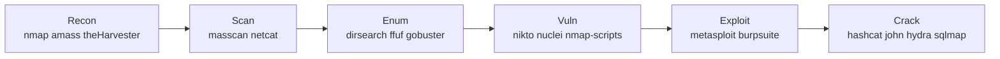

Related: [[Personal/Cybersecurity/Tools/Nmap]], [[Personal/Cybersecurity/Tools/Dirsearch]], [[Personal/Cybersecurity/Tools/Nuclei]], [[Personal/Cybersecurity/Tools/Sqlmap]], [[Personal/Cybersecurity/Tools/Burpsuite]].

## 16. Web Vuln Tool Web

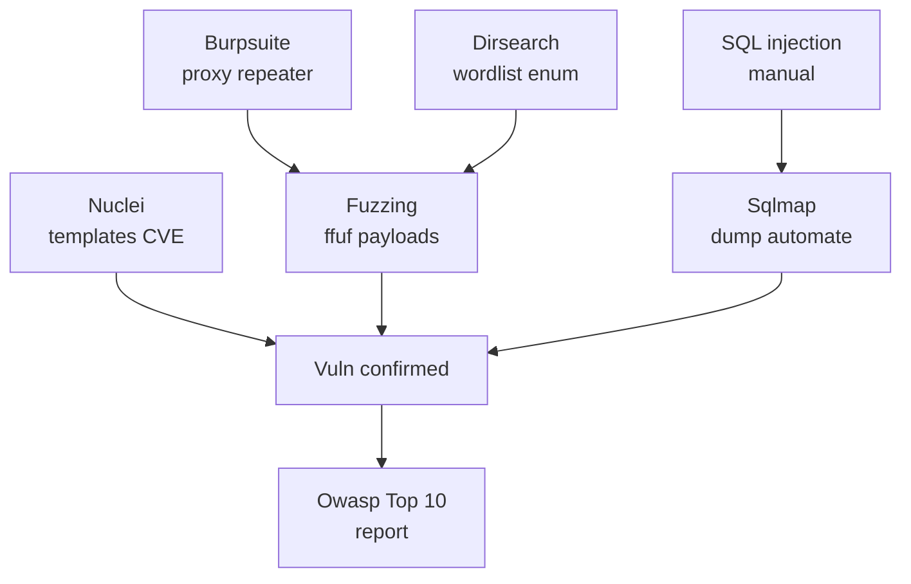

Related: [[Personal/Cybersecurity/Tools/cheatsheet]], [[Personal/Cybersecurity/Tools/Fuzzing]], [[Personal/Cybersecurity/Tools/Dirsearch pt2]], [[Personal/Cybersecurity/Tools/SQL injection]], [[Personal/Cybersecurity/Requierements/Owasp]], [[Personal/Cybersecurity/Requierements/Penetration testing]].

## 17. Laravel CRUD MVC Loop

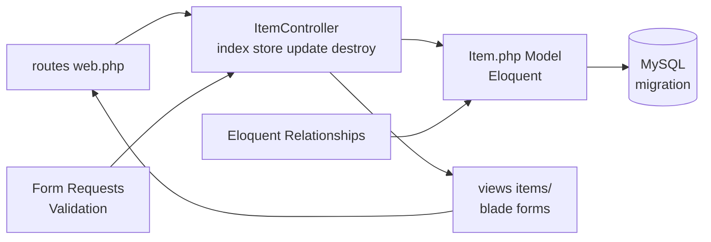

Related: [[Tasks/Laravel-CRUD/Laravel CRUD]], [[Tasks/Laravel-CRUD/Routes]], [[Tasks/Laravel-CRUD/Controller]], [[Tasks/Laravel-CRUD/Model]], [[Tasks/Laravel-CRUD/Migration]], [[Tasks/Laravel-CRUD/Views]], [[Tasks/Laravel-CRUD/Validation]], [[Tasks/Laravel-CRUD/Form Requests]], [[Tasks/Laravel-CRUD/Eloquent Relationships]].

## 18. E-Commerce PBO Error Map

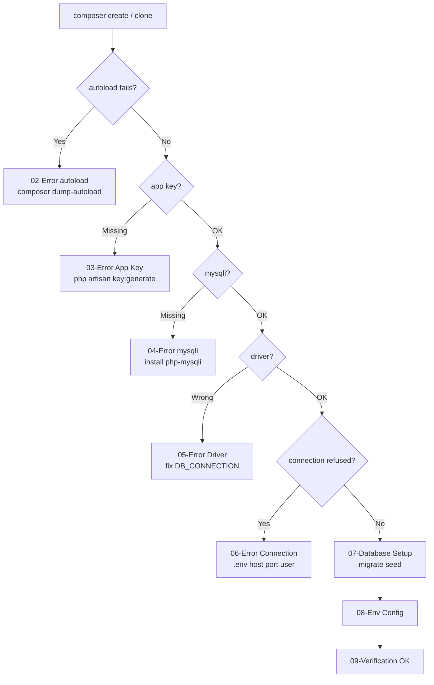

Related: [[Tasks/E-Commerce PBO/00 - Index]], [[Tasks/E-Commerce PBO/01 - Quick Start]], [[Tasks/E-Commerce PBO/07 - Database Setup]], [[Tasks/E-Commerce PBO/09 - Verification]], [[Tasks/Laravel-CRUD/E-Commerce PBO - Debugging Guide]].

## 19. Nazkypedia UI Sessions

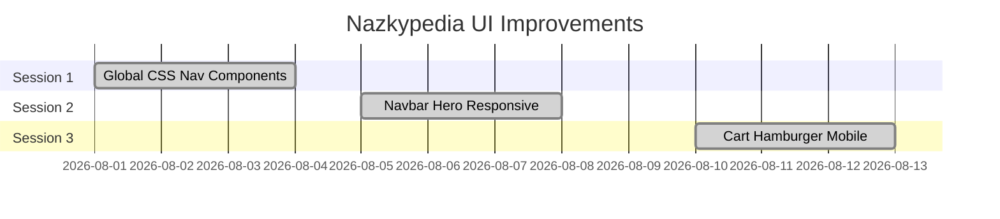

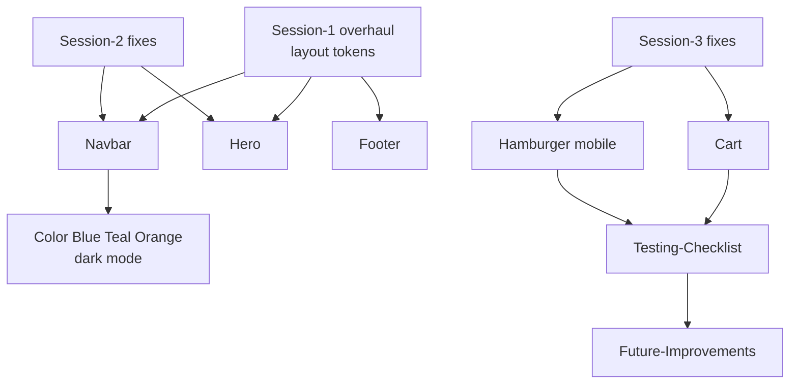

Related: [[Tasks/Nazkypedia-UI-Improvements/README]], [[Tasks/Nazkypedia-UI-Improvements/Session-1-UI-Overhaul]], [[Tasks/Nazkypedia-UI-Improvements/Session-2-Navbar-Hero-Fixes]], [[Tasks/Nazkypedia-UI-Improvements/Session-3-Cart-Hamburger-Fixes]], [[Tasks/Nazkypedia-UI-Improvements/Color-Scheme]], [[Tasks/Nazkypedia-UI-Improvements/Testing-Checklist]].

## 20. React Native Taskmanager

```mermaid
flowchart TD
    A[create-expo-app TaskManager] --> B[npm start]
    B --> C[Navigation<br/>stack tabs]
    C --> D[CRUD tasks]
    D --> E[AsyncStorage persist]
    D --> F[categories due-dates priority]
    F --> G[Animations]
    G --> H[Backlog done]
```

Related: [[Tasks/React-Native-Taskmanager/PEMBUATAN APLIKASI TASKMANAGER]], [[Tasks/React-Native-Taskmanager/Developer Project Hub & Backlog]], [[Tasks/React-Native-Taskmanager/Animations]], [[Tasks/React-Native-Taskmanager/Technical Cheat Sheet & Command Engine]].

## 21. VSCode Theme Bug Chain

```mermaid
flowchart TD
    A[APC Customize UI++<br/>alpha color edits] --> B[settings.json broken<br/>colorCustomizations]
    B --> C[Theme renders wrong<br/>transparent unreadable]
    C --> D[Snapshot extensions]
    D --> E[Manual fix guide<br/>remove APC keys restore]
    E --> F[Backup strategy]
    F --> G[Prevention checklist]
    G --> H[Compatibility matrix]
```

Related: [[Development/VSCode Theme Bug/00 - Map of Content]], [[Development/VSCode Theme Bug/Bug Report - VSCode Theme Rendering Issue]], [[Development/VSCode Theme Bug/03 - Manual Fix Guide]], [[Development/VSCode Theme Bug/13 - Backup Strategy]].

## 22. Spreadsheets Auth Decision

```mermaid
flowchart TD
    A[Need Sheets API?] --> B{Server to server?}
    B -->|Yes| C[Service Account<br/>no user consent]
    B -->|No| D{Read public only?}
    D -->|Yes| E[API Key<br/>simplest]
    D -->|No| F[OAuth 2.0<br/>user login]
    F --> G[Laravel Eloquent compare<br/>IP throttling]
```

Related: [[Personal/Spreadsheets-Auth/Spreadsheets Auth]], [[Personal/Spreadsheets-Auth/Google Sheets Login API Setup]], [[Personal/Spreadsheets-Auth/Laravel Eloquent Comparison]], [[Personal/Spreadsheets-Auth/IP Throttling]].

## 23. Device Hardware Map

```mermaid
graph TB
    CPU[i7-13650HX<br/>20 cores] --> OS[BlackArch Arch<br/>Hyprland]
    RAM[15GB DDR5] --> OS
    GPU1[Intel UHD<br/>iGPU default] --> PRIME[PRIME offload]
    GPU2[RTX 5050 8GB<br/>610.57.04] --> PRIME
    PRIME --> GAME[NFS Heat + Sober]
    NVME1[nvme1n1 238GB<br/>BlackArch btrfs] --> BOOT[GRUB UKI]
    NVME2[nvme0n1 477GB<br/>Windows NTFS] --> BOOT
    BOOT --> OS
```

Related: [[Personal/Device/00 - Device Overview]], [[Personal/Device/01 - Hardware Specifications]], [[Personal/Device/08 - Boot Configuration]], [[System/Linux/System Specifications]].

## 24. School P3 Build Order

```mermaid
flowchart LR
    A[What-to-Create spec] --> B[DB schema migrate seed]
    B --> C[Laravel auth]
    C --> D[Product CRUD]
    D --> E[Orders + API]
    E --> F[Frontend layout listing detail cart checkout]
    F --> G[P3 docs]
```

Related: [[Personal/School/What-to-Create]], [[Personal/School/P3]], [[Tasks/E-Commerce PBO/00 - Index]].

## 25. Timeline Web

```mermaid
gantt
    dateFormat  YYYY-MM-DD
    title Vault Timeline
    section Aug
    Caelestia session + lag fix :done, 2026-08-29, 2d
    section Sep 07
    Niri setup            :done, 2026-09-07, 1d
    HDMI fix + SEO IR     :done, 2026-09-07, 1d
    section Sep 09
    Terminal backup + Sober :done, 2026-09-09, 1d
    section Sep 10
    Atlas + index refresh   :done, 2026-09-10, 1d
```

## 26. Tag Web

```mermaid
graph TD
    ARCH[#archlinux] --> BLACK[#blackarch]
    BLACK --> HYP[#hyprland]
    HYP --> WAY[#wayland]
    WAY --> CAE[#caelestia]
    PERF[#performance] --> OPT[#optimization]
    OPT --> FIX[#troubleshooting]
    PENT[#pentesting] --> CYB[#cybersecurity]
    CYB --> SEC[#security]
    LAR[#laravel] --> PHP[#php]
    PHP --> BACK[#backend]
    BACK --> API[#api]
    GAME[#gaming] --> NV[#nvidia]
    NV --> PROTON[#proton]
    IR[#incident-response] --> SEO[#seo-poisoning]
```

## 27. Fix Status Pie (2026-09-10)

```mermaid
pie title Fix completion
    "NVIDIA driver" : 20
    "GRUB menu" : 20
    "HDMI drm" : 20
    "Gaming PRIME" : 15
    "Sober install" : 15
    "SEO investigated" : 10
```

Tags: #graph #moc #atlas #diagram #web
