# Graph Web Atlas

**Last Updated:** 2026-09-10
**Vault:** 202 notes
**Purpose:** one page with all explanatory diagrams. Index: [[Map of Content]].

Diagram rules used here: strict trees or stars, max 4 outgoing edges per node, plain word labels, flow only downstream.

---

## 1. Vault Map Top

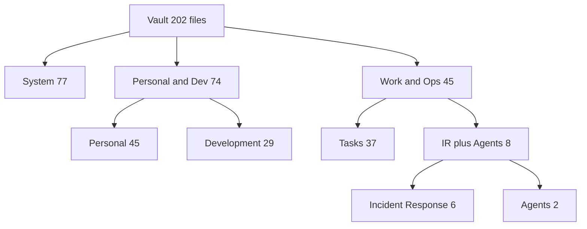

## 2. System Folders

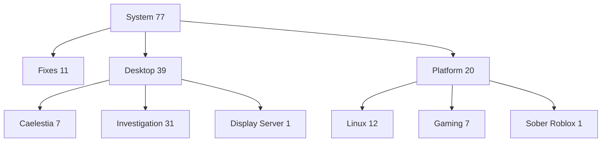

## 3. Other Folders

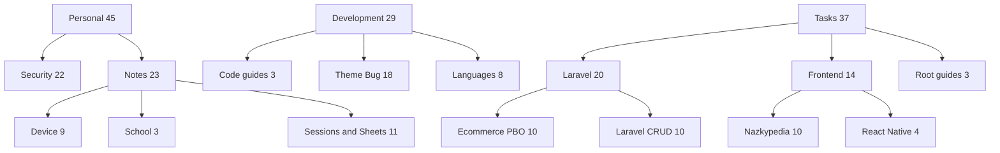

## 4. Full Boot Chain

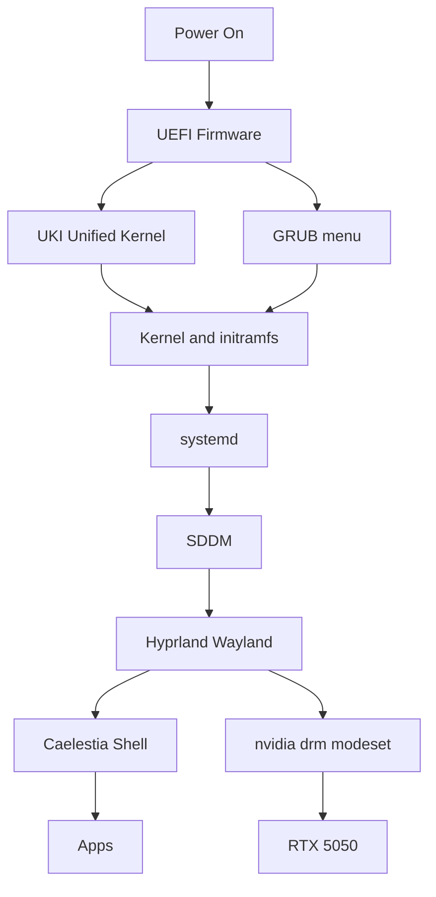

## 5. NVIDIA Driver Fix Pipeline

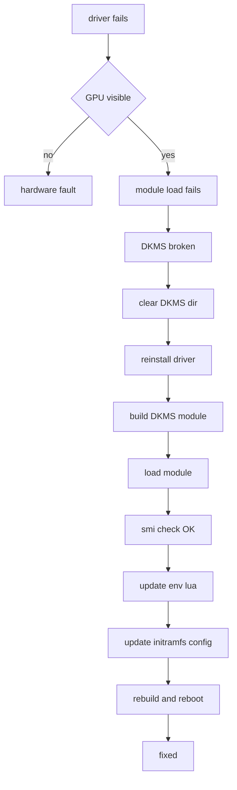

## 6. HDMI Monitor Fix

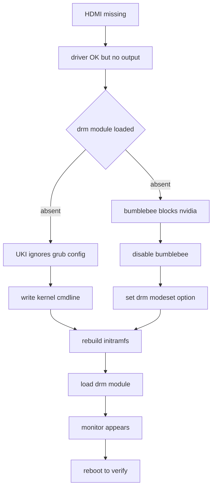

Detail: cmdline gets the modeset flag, bumblebee conf is disabled, then modprobe loads drm at once.

## 7. GRUB Menu Before After

```mermaid
graph LR
    subgraph BEFORE["Before seven entries"]
        A1["UEFI first"]
        A2["Arch duplicate"]
        A3["Advanced"]
        A4["BlackArch"]
        A5["Windows duplicate"]
    end
    subgraph FIXG["Fix commands"]
        F1["disable duplicate script"]
        F2["disable os prober"]
        F3["custom Windows entry"]
        F4["move UEFI last"]
    end
    subgraph AFTER["After three entries"]
        B1["BlackArch"]
        B2["Windows Boot Manager"]
        B3["UEFI last"]
    end
    BEFORE --> FIXG
    FIXG --> AFTER
```

## 8. Hyprland Caelestia Config

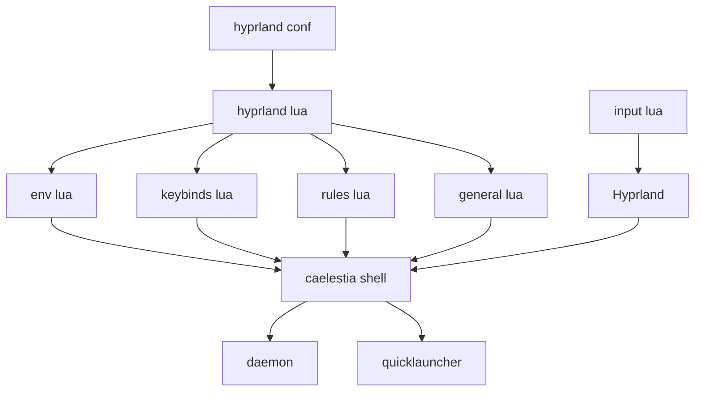

Config lives under the hypr and caelestia config dirs. Trackpad sensitivity is set in input lua.

## 9. Caelestia Performance Investigation

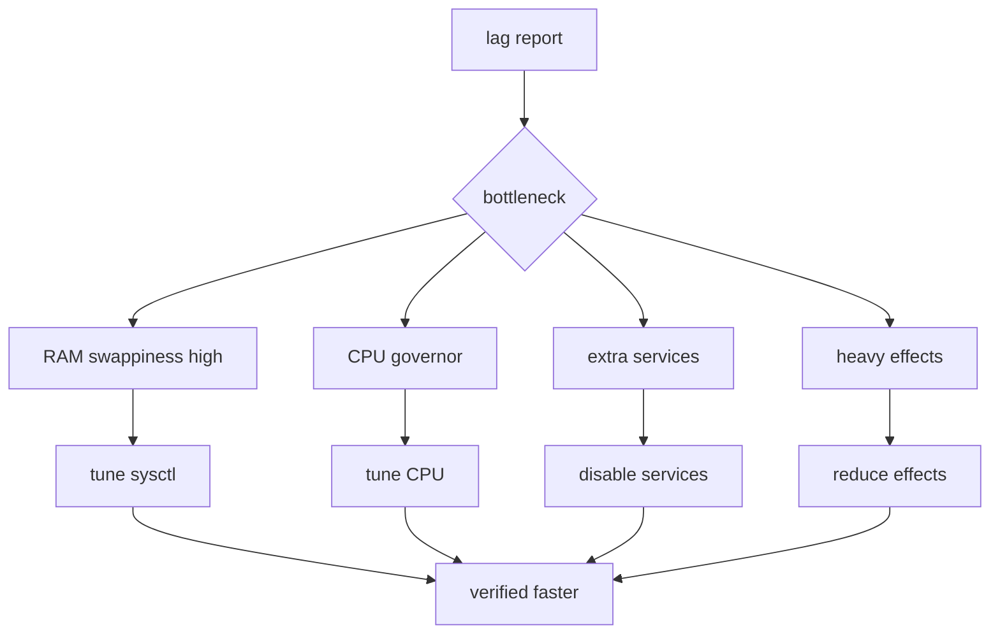

Root causes found: swappiness 100, VFS cache pressure, MariaDB and CUPS running, conflicting network managers.

## 10. Trackpad Sensitivity Fix

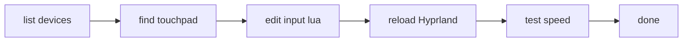

Repeat edit plus reload until the speed feels right.

## 11. NFS Heat Gaming Fix

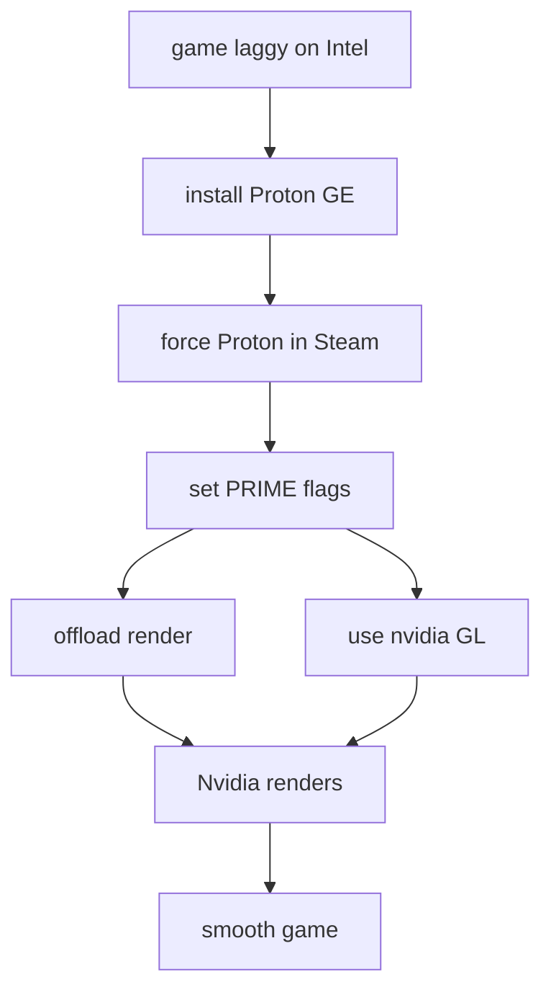

Flags used: PRIME offload plus nvidia GL vendor, verified with smi.

## 12. Roblox Sober Install

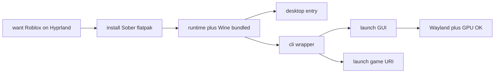

Sober 1 point 7 point 1, 18 point 5 MB, RTX passthrough confirmed.

## 13. Gaming GPU Decision Tree

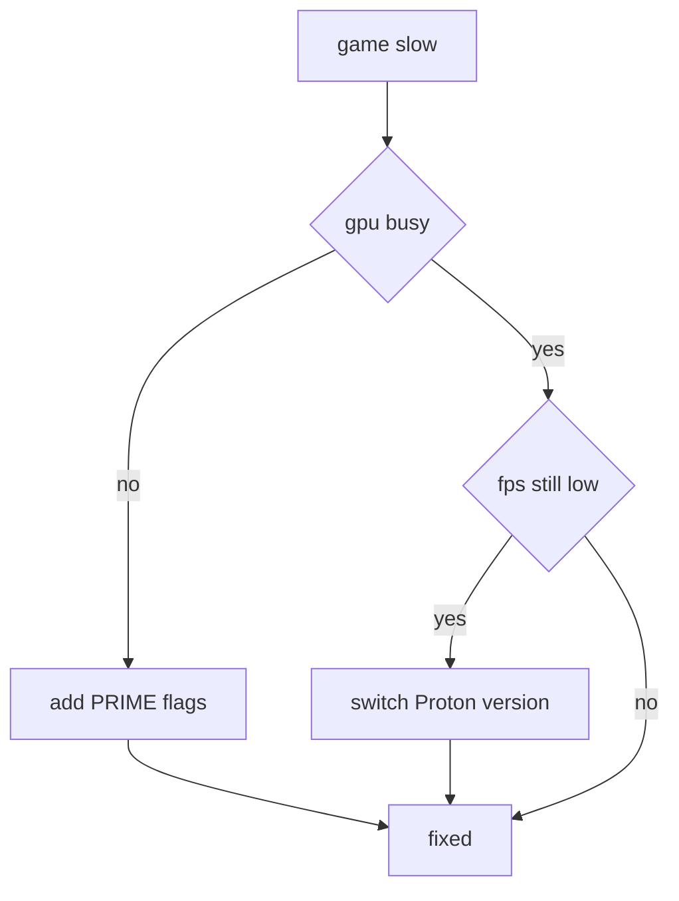

Roblox path is covered in section 12.

## 14. SEO Poisoning Kill Chain

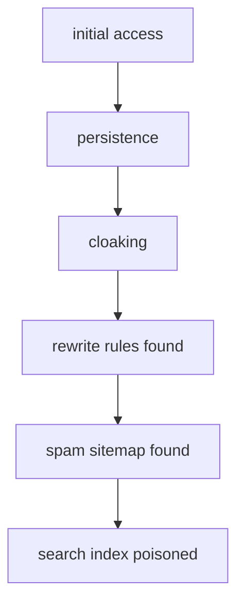

Vectors: vulnerable plugin, brute force, malicious upload. Persistence via htaccess, PHP backdoor, cron job, DB hook. Cloaking shows gambling content to Googlebot only.

## 15. IR Remediation Pipeline

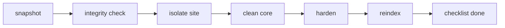

## 16. kurmamedia Case Verdict

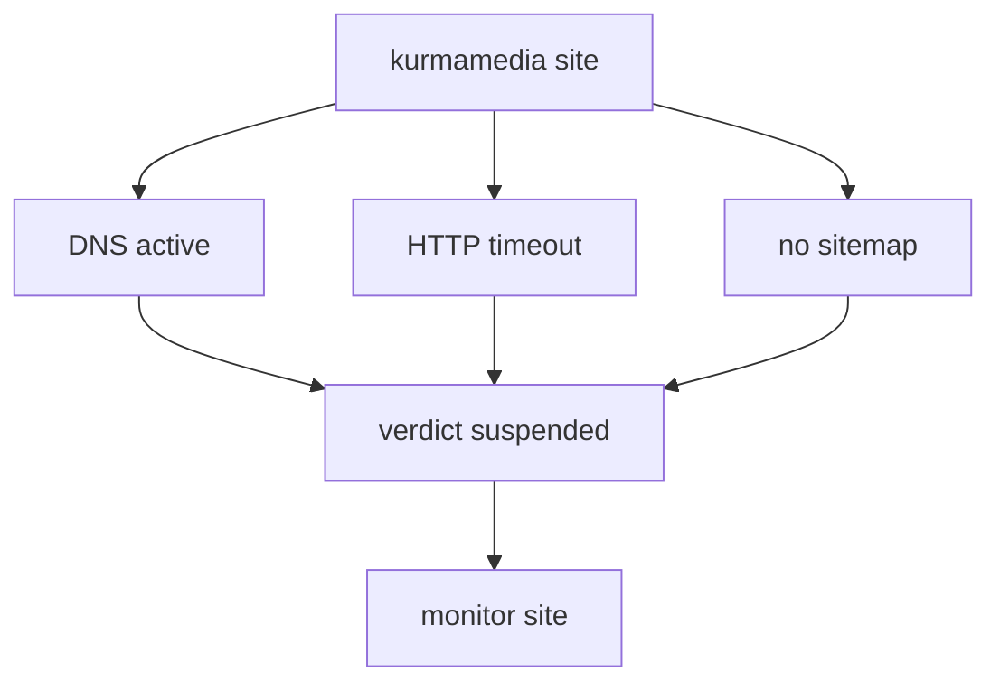

Hosted on Hostinger Jakarta, DNS resolves but the server serves nothing. Likely suspended or taken down.

## 17. Cybersecurity Toolkit Pipeline

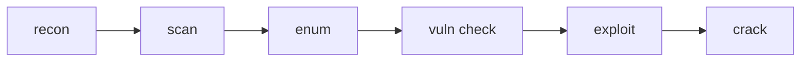

Tools per stage: nmap and amass, masscan, dirsearch and ffuf, nikto and nuclei, metasploit and burpsuite, hashcat and john and sqlmap.

## 18. Web Vuln Tool Web

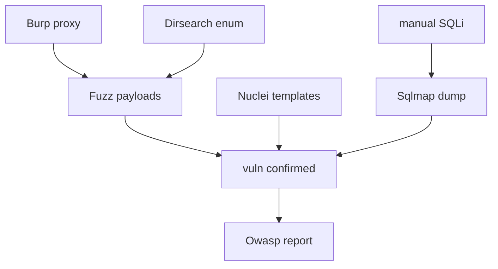

## 19. Laravel CRUD MVC

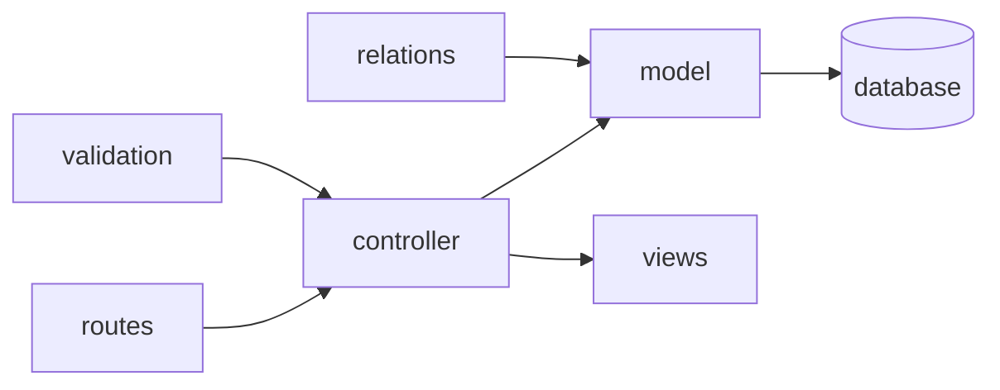

Views render from controller data and link back to routes.

## 20. E-Commerce PBO Error Map

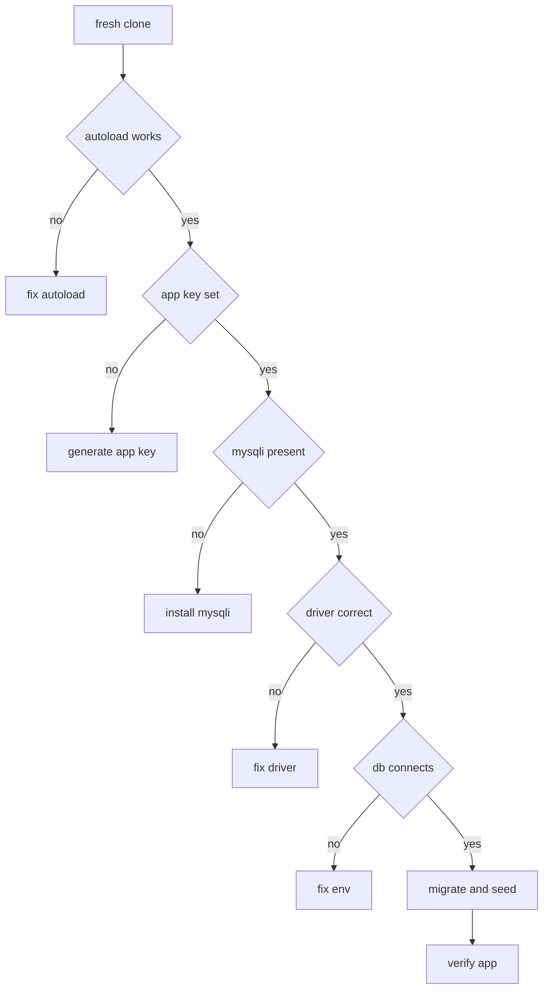

## 21. Nazkypedia UI Sessions

```mermaid
gantt
    dateFormat  YYYY-MM-DD
    title Nazkypedia UI Improvements
    section Session 1
    Global CSS Nav Components :done, 2026-08-01, 3d
    section Session 2
    Navbar Hero Responsive    :done, 2026-08-05, 3d
    section Session 3
    Cart Hamburger Mobile     :done, 2026-08-10, 3d
```

```mermaid
graph TD
    S1["Session one"] --> NAV["Navbar"]
    S1 --> HERO["Hero"]
    S1 --> FOOT["Footer"]
```

```mermaid
graph TD
    S2["Session two"] --> NAV2["Navbar polish"]
    S2 --> HERO2["Hero polish"]
```

```mermaid
graph TD
    S3["Session three"] --> CART["Cart"]
    S3 --> MOB["Mobile menu"]
    CART --> TEST["Testing"]
    MOB --> TEST
    TEST --> FUT["Future work"]
```

Each session restyles the shared Navbar and Hero components. Colors are Blue Teal Orange plus dark mode.

## 22. React Native Taskmanager

```mermaid
flowchart TD
    A["create expo app"] --> B["start dev server"]
    B --> C["add navigation"]
    C --> D["task CRUD"]
    D --> E["persist storage"]
    E --> F["categories plus priority"]
    F --> G["animations"]
    G --> H["done"]
```

## 23. VSCode Theme Bug Chain

```mermaid
flowchart TD
    A["bad theme plugin"] --> B["settings broken"]
    B --> C["theme renders wrong"]
    C --> D["snapshot extensions"]
    D --> E["manual fix"]
    E --> F["backup plan"]
    F --> G["prevention list"]
    G --> H["compat matrix"]
```

Cause was the APC Customize plugin writing bad alpha colors.

## 24. Spreadsheets Auth Decision

```mermaid
flowchart TD
    A["need sheets API"] --> B{"server to server"}
    B -->|"yes"| C["service account"]
    B -->|"no"| D{"public read only"}
    D -->|"yes"| E["API key"]
    D -->|"no"| F["OAuth login"]
    F --> G["compare and throttle"]
```

## 25. Device Hardware Map

```mermaid
graph TB
    CPU["fast Intel CPU"] --> OS["BlackArch Hyprland"]
    RAM["15GB DDR5"] --> OS
    GPU1["Intel iGPU"] --> PRIME["PRIME offload"]
    GPU2["RTX 5050 8GB"] --> PRIME
    PRIME --> GAME["games render"]
    NV1["Linux NVMe"] --> BOOT["boot menu"]
    NV2["Windows NVMe"] --> BOOT
    BOOT --> OS
```

## 26. School P3 Build Order

```mermaid
flowchart LR
    A["spec"] --> B["database"]
    B --> C["auth"]
    C --> D["product CRUD"]
    D --> E["orders and API"]
    E --> F["frontend pages"]
    F --> G["docs"]
```

## 27. Timeline Web

```mermaid
gantt
    dateFormat  YYYY-MM-DD
    title Vault Timeline
    section Aug
    Caelestia session and lag fix :done, 2026-08-29, 2d
    section Sep 07
    Niri setup            :done, 2026-09-07, 1d
    HDMI fix and SEO IR   :done, 2026-09-07, 1d
    section Sep 09
    Terminal backup and Sober :done, 2026-09-09, 1d
    section Sep 10
    Atlas and index refresh   :done, 2026-09-10, 1d
```

## 28. Tag Web

```mermaid
graph TD
    ARCH["arch"] --> BLACK["blackarch"]
    BLACK --> HYP["hyprland"]
    HYP --> WAY["wayland"]
    WAY --> CAE["caelestia"]
    PERF["perf"] --> OPT["opt"]
    OPT --> FIXG["fix"]
    PENT["pentest"] --> CYB2["cyber"]
    CYB2 --> SEC["sec"]
    LAR["laravel"] --> PHP["php"]
    PHP --> BACK["backend"]
    BACK --> API2["api"]
    GAME2["gaming"] --> NV2["nvidia"]
    NV2 --> PROTON["proton"]
    IR2["incident"] --> SEO2["seo"]
```

## 29. Fix Status Pie

```mermaid
pie title Fix completion
    "NVIDIA driver" : 20
    "GRUB menu" : 20
    "HDMI drm" : 20
    "Gaming PRIME" : 15
    "Sober install" : 15
    "SEO investigated" : 10
```

Tags: #graph #moc #atlas #diagram #web
