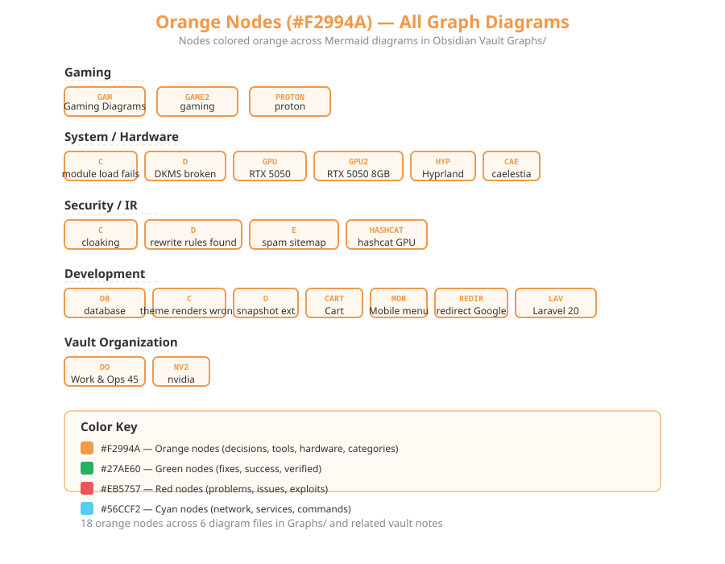
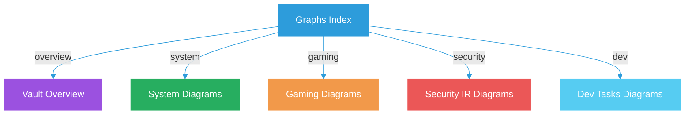

# Graphs Index

**Type:** hub. One topic per page, nothing merged.

## Pages

| Page | Topic |
|------|-------|
| [[Vault-Overview]] | Vault maps, fix dashboard, timeline, tags |
| [[System-Diagrams]] | Boot, drivers, GRUB, desktop, device |
| [[Gaming-Diagrams]] | NFS Heat, Sober, GPU decisions |
| [[Security-IR-Diagrams]] | Kill chain, remediation, toolkit |
| [[Dev-Tasks-Diagrams]] | Laravel, UI sessions, apps, guides |

## Orange Nodes Visual

> See [[System/WiFi Troubleshooting/00-Overview\|WiFi Investigation]] for details on the Intel AX211 fix.

## Tags
#note-graph-index
