# Dev Tasks Diagrams

**Part of:** [[00-Graph-Index]]

## Laravel CRUD MVC

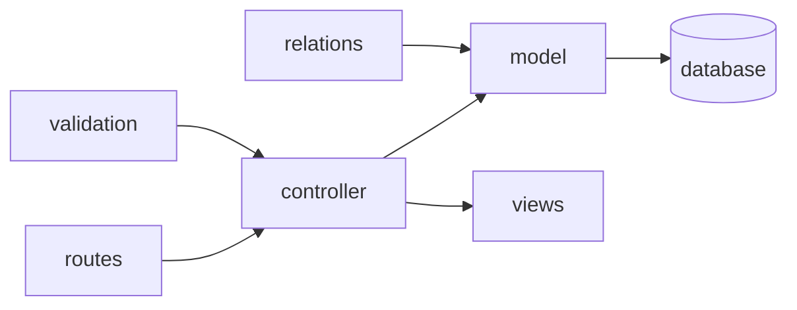

Views render from controller data and link back to routes.

## E-Commerce PBO Error Map

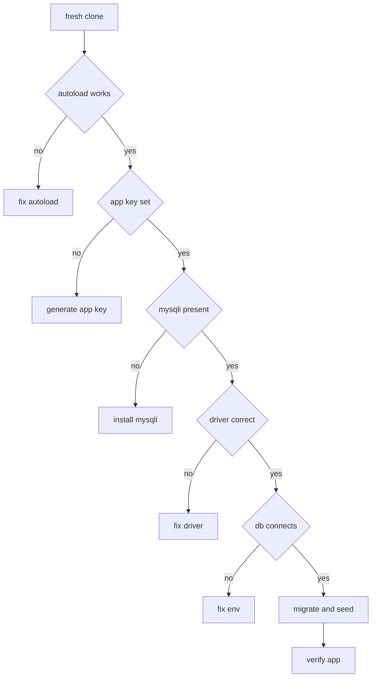

## Nazkypedia UI Sessions

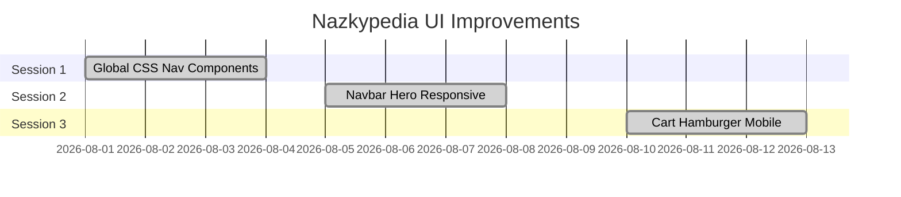

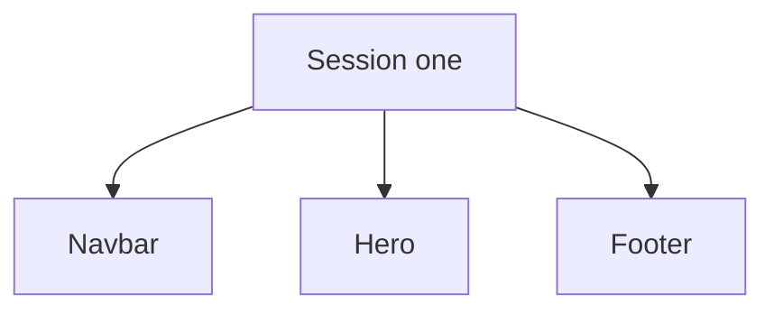

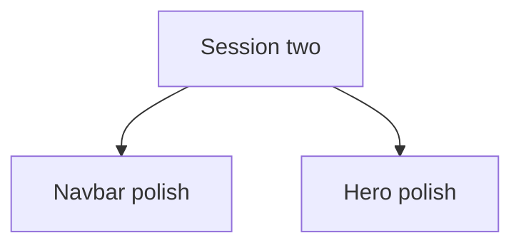

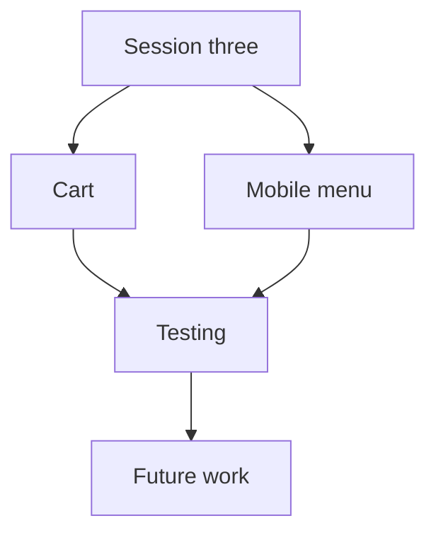

Each session restyles the shared Navbar and Hero components. Colors are Blue Teal Orange plus dark mode.

## React Native Taskmanager

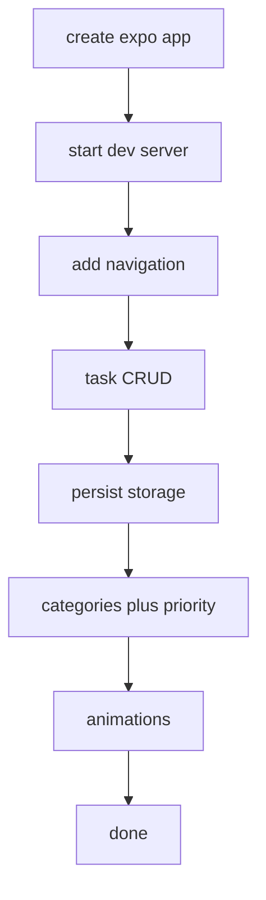

## VSCode Theme Bug Chain

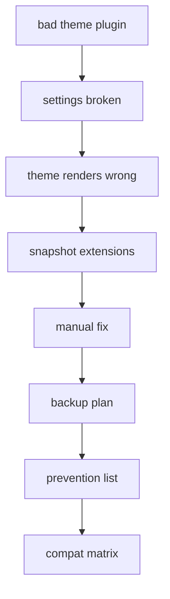

Cause was the APC Customize plugin writing bad alpha colors.

## Spreadsheets Auth Decision

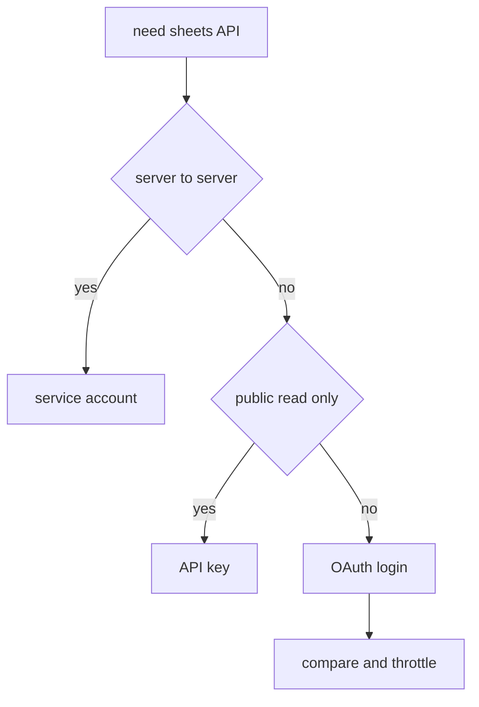

## School P3 Build Order

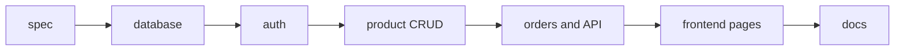

## Git Branch Flow

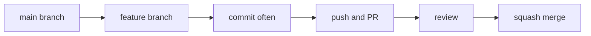

## Eloquent Relation Map

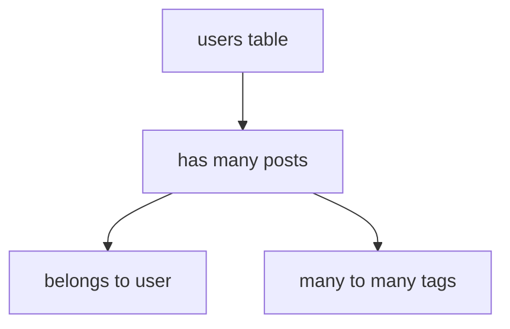

## Sheets OAuth Flow

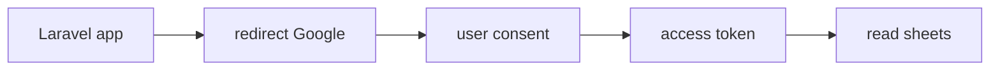

Tags: #graph #development
