# Dev Tasks Diagrams

## Laravel CRUD MVC

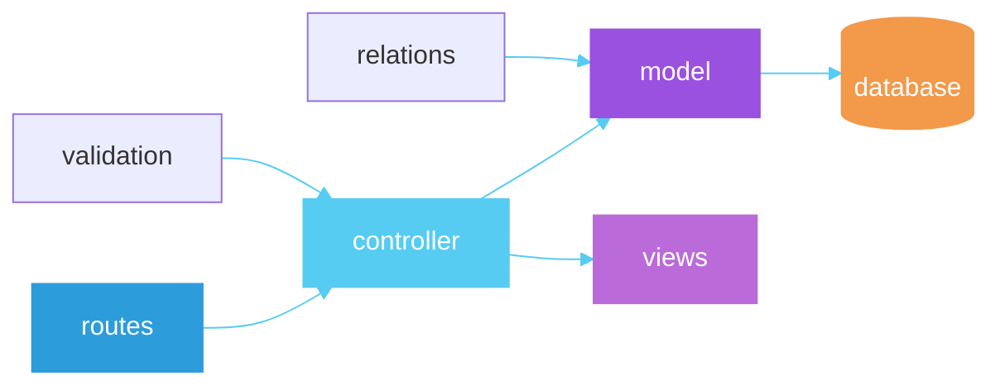

## E-Commerce PBO Error Map

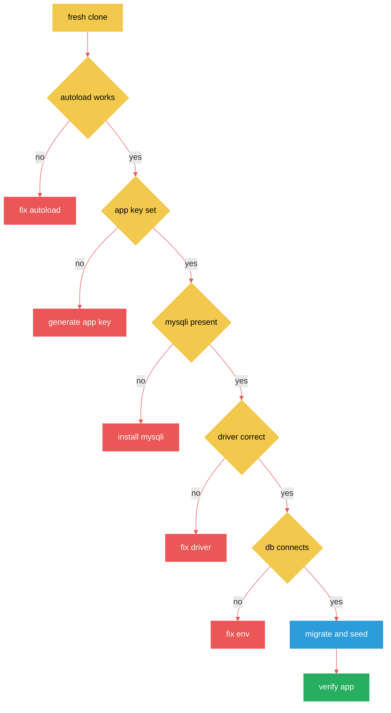

## Nazkypedia UI Sessions

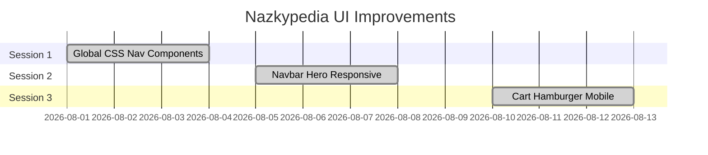

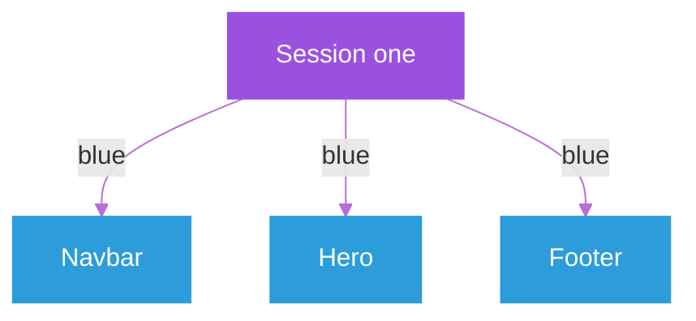

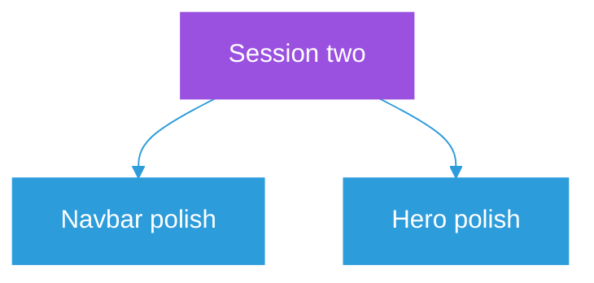

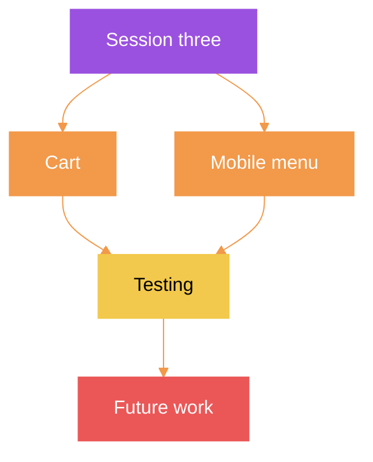

## React Native Taskmanager

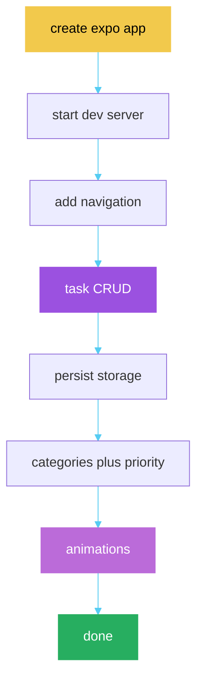

## VSCode Theme Bug Chain

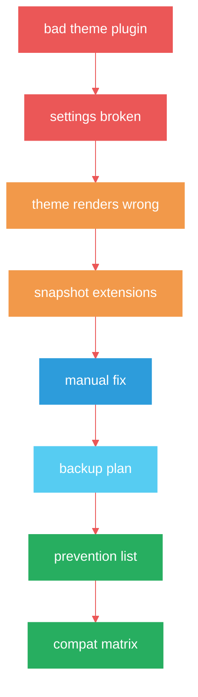

## Spreadsheets Auth Decision

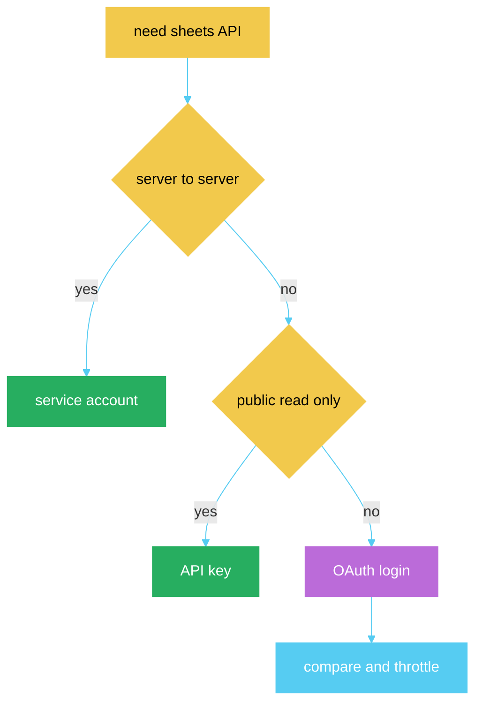

## School P3 Build Order

```mermaid
%%{init: {'theme': 'default', 'themeVariables': { 'primaryColor': '#56CCF2', 'lineColor': '#56CCF2'}}}%%
flowchart LR
 A["spec"] --> B["database"]
 B --> C["auth"]
 C --> D["product CRUD"]
 D --> E["orders and API"]
 E --> F["frontend pages"]
 F --> G["docs"]
 style A fill:#F2C94C,stroke:#F2C94C,color:#000
 style B fill:#9B51E0,stroke:#9B51E0,color:#fff
 style C fill:#9B51E0,stroke:#9B51E0,color:#fff
 style D fill:#56CCF2,stroke:#56CCF2,color:#fff
 style E fill:#56CCF2,stroke:#56CCF2,color:#fff
 style F fill:#BB6BD9,stroke:#BB6BD9,color:#fff
 style G fill:#2D9CDB,stroke:#2D9CDB,color:#fff
```

## Git Branch Flow

```mermaid
%%{init: {'theme': 'default', 'themeVariables': { 'primaryColor': '#2D9CDB', 'lineColor': '#2D9CDB'}}}%%
flowchart LR
 MAIN["main branch"] --> FEAT["feature branch"]
 FEAT --> COMMIT2["commit often"]
 COMMIT2 --> PUSH2["push and PR"]
 PUSH2 --> REVIEW["review"]
 REVIEW --> MERGE2["squash merge"]
 style MAIN fill:#27AE60,stroke:#27AE60,color:#fff
 style FEAT fill:#56CCF2,stroke:#56CCF2,color:#fff
 style COMMIT2 fill:#56CCF2,stroke:#56CCF2,color:#fff
 style PUSH2 fill:#56CCF2,stroke:#56CCF2,color:#fff
 style REVIEW fill:#F2C94C,stroke:#F2C94C,color:#000
 style MERGE2 fill:#2D9CDB,stroke:#2D9CDB,color:#fff
```

## Eloquent Relation Map

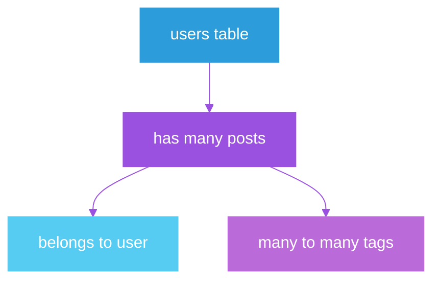

## Sheets OAuth Flow

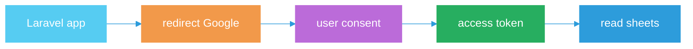

## Tags
#note-dev-tasks-diagrams
