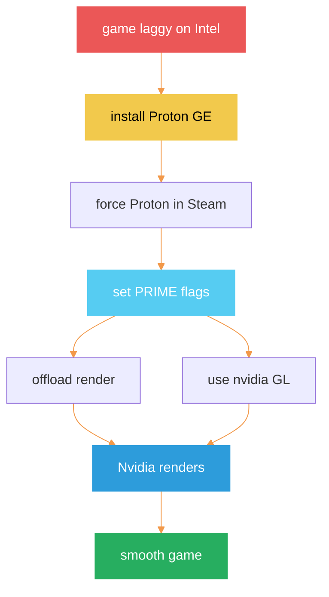
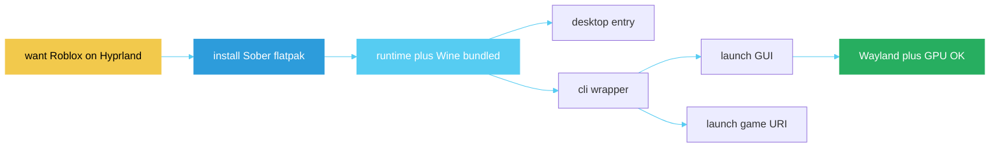
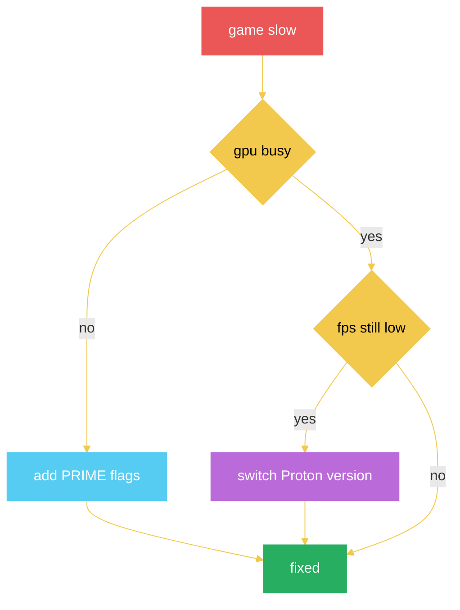
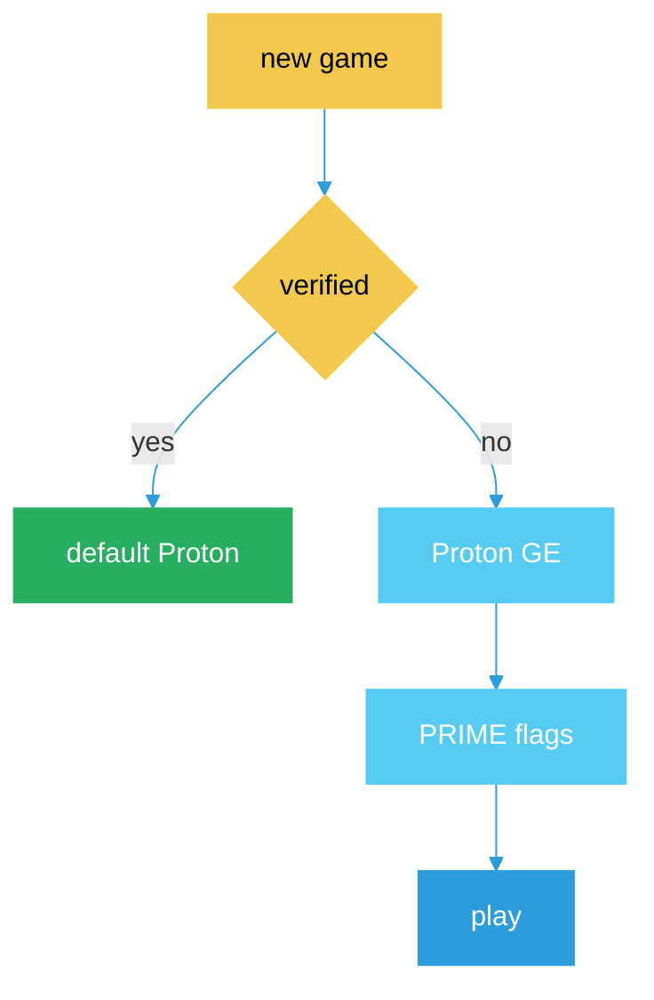
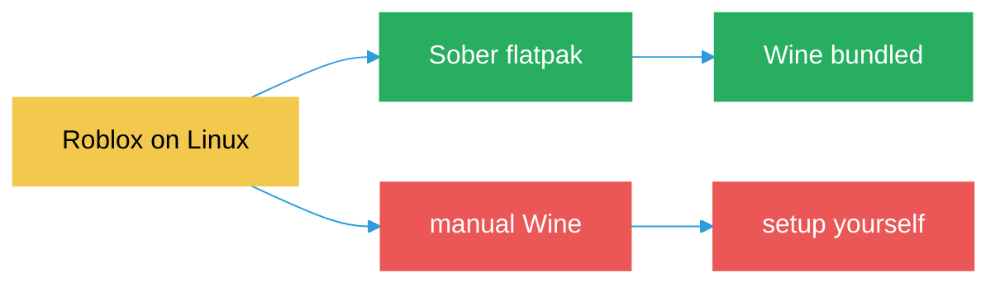

# Gaming Diagrams

## NFS Heat Gaming Fix

```mermaid
%%{init: {'theme': 'default', 'themeVariables': { 'primaryColor': '#F2994A', 'lineColor': '#F2994A'}}}%%
flowchart TD
 A["game laggy on Intel"] --> B["install Proton GE"]
 B --> C["force Proton in Steam"]
 C --> D["set PRIME flags"]
 D --> E["offload render"]
 D --> F["use nvidia GL"]
 E --> H["Nvidia renders"]
 F --> H
 H --> I["smooth game"]
 style A fill:#EB5757,stroke:#EB5757,color:#fff
 style B fill:#F2C94C,stroke:#F2C94C,color:#000
 style D fill:#56CCF2,stroke:#56CCF2,color:#fff
 style H fill:#2D9CDB,stroke:#2D9CDB,color:#fff
 style I fill:#27AE60,stroke:#27AE60,color:#fff
```

## Roblox Sober Install

```mermaid
%%{init: {'theme': 'default', 'themeVariables': { 'primaryColor': '#56CCF2', 'lineColor': '#56CCF2'}}}%%
flowchart LR
 A["want Roblox on Hyprland"] --> B["install Sober flatpak"]
 B --> C["runtime plus Wine bundled"]
 C --> D["desktop entry"]
 C --> E["cli wrapper"]
 E --> F["launch GUI"]
 E --> G["launch game URI"]
 F --> H["Wayland plus GPU OK"]
 style A fill:#F2C94C,stroke:#F2C94C,color:#000
 style B fill:#2D9CDB,stroke:#2D9CDB,color:#fff
 style C fill:#56CCF2,stroke:#56CCF2,color:#fff
 style H fill:#27AE60,stroke:#27AE60,color:#fff
```

## Gaming GPU Decision Tree

```mermaid
%%{init: {'theme': 'default', 'themeVariables': { 'primaryColor': '#F2C94C', 'lineColor': '#F2C94C'}}}%%
flowchart TD
 A["game slow"] --> B{"gpu busy"}
 B -->|"no"| C["add PRIME flags"]
 B -->|"yes"| D{"fps still low"}
 D -->|"yes"| E["switch Proton version"]
 D -->|"no"| F["fixed"]
 C --> F
 E --> F
 style A fill:#EB5757,stroke:#EB5757,color:#fff
 style B fill:#F2C94C,stroke:#F2C94C,color:#000
 style D fill:#F2C94C,stroke:#F2C94C,color:#000
 style F fill:#27AE60,stroke:#27AE60,color:#fff
 style C fill:#56CCF2,stroke:#56CCF2,color:#fff
 style E fill:#BB6BD9,stroke:#BB6BD9,color:#fff
```

## Proton Choice Flow

```mermaid
%%{init: {'theme': 'default', 'themeVariables': { 'primaryColor': '#2D9CDB', 'lineColor': '#2D9CDB'}}}%%
flowchart TD
 GAME2["new game"] --> VER2{"verified"}
 VER2 -->|"yes"| DEFP["default Proton"]
 VER2 -->|"no"| GE2["Proton GE"]
 GE2 --> FLAGS2["PRIME flags"]
 FLAGS2 --> PLAY["play"]
 style GAME2 fill:#F2C94C,stroke:#F2C94C,color:#000
 style VER2 fill:#F2C94C,stroke:#F2C94C,color:#000
 style DEFP fill:#27AE60,stroke:#27AE60,color:#fff
 style GE2 fill:#56CCF2,stroke:#56CCF2,color:#fff
 style FLAGS2 fill:#56CCF2,stroke:#56CCF2,color:#fff
 style PLAY fill:#2D9CDB,stroke:#2D9CDB,color:#fff
```

## Sober vs Manual Wine

```mermaid
%%{init: {'theme': 'default', 'themeVariables': { 'primaryColor': '#2D9CDB', 'lineColor': '#2D9CDB'}}}%%
graph LR
 WANT["Roblox on Linux"] --> SOBER["Sober flatpak"]
 WANT --> WINE["manual Wine"]
 SOBER --> EASY["Wine bundled"]
 WINE --> HARD["setup yourself"]
 style WANT fill:#F2C94C,stroke:#F2C94C,color:#000
 style SOBER fill:#27AE60,stroke:#27AE60,color:#fff
 style EASY fill:#27AE60,stroke:#27AE60,color:#fff
 style WINE fill:#EB5757,stroke:#EB5757,color:#fff
 style HARD fill:#EB5757,stroke:#EB5757,color:#fff
```

## Tags
#note-gaming-diagrams
