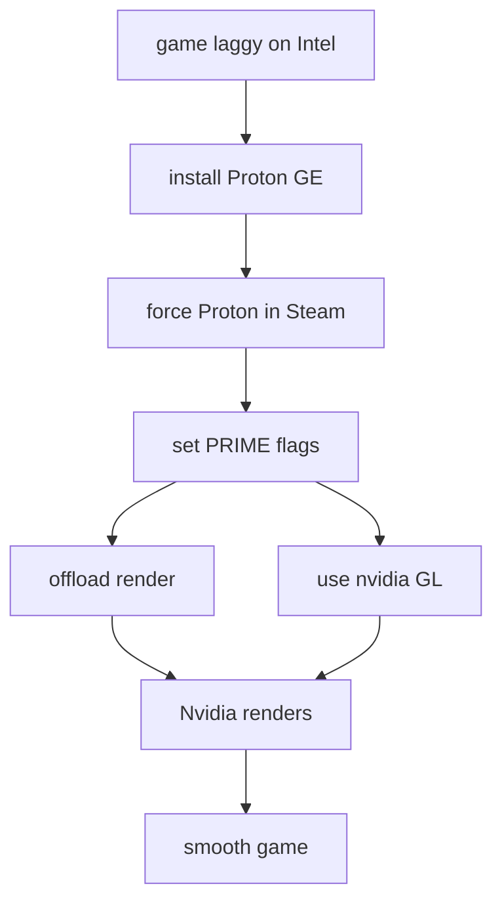
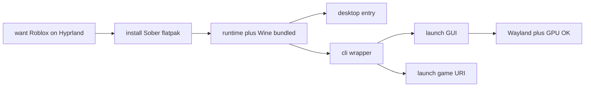
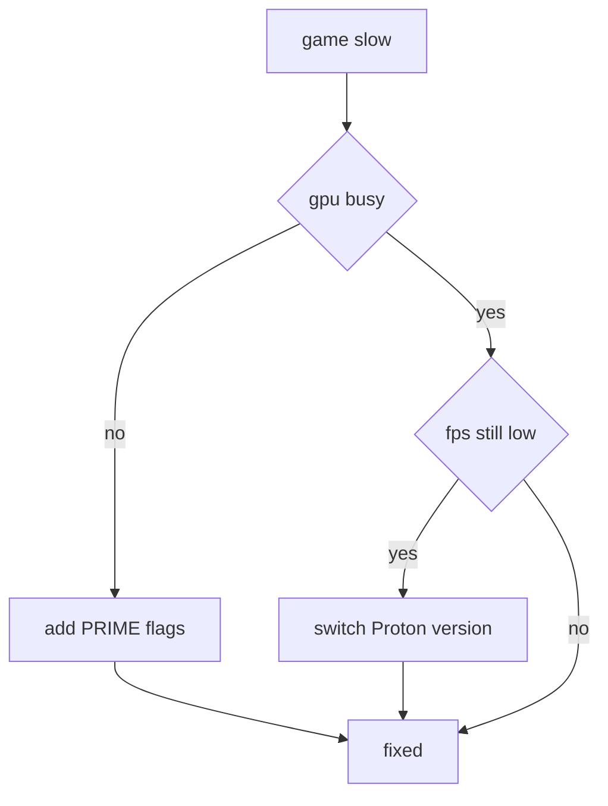

# Gaming Diagrams

**Part of:** [[00-Graph-Index]]

## NFS Heat Gaming Fix

Flags used: PRIME offload plus nvidia GL vendor, verified with smi.

## Roblox Sober Install

Sober 1 point 7 point 1, 18 point 5 MB, RTX passthrough confirmed.

## Gaming GPU Decision Tree

Roblox path is covered in the Sober diagram above.

Tags: #graph #gaming
