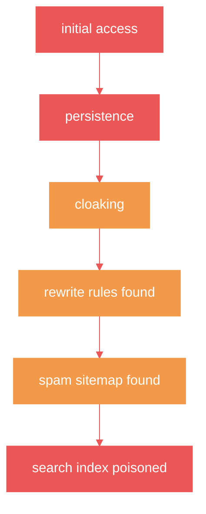
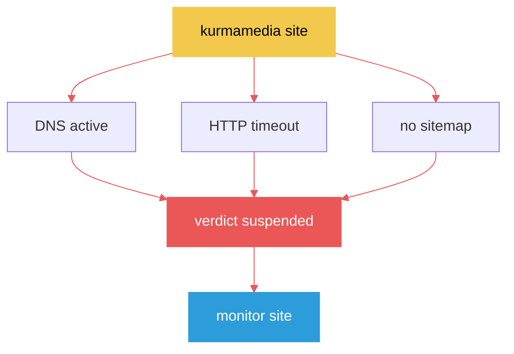
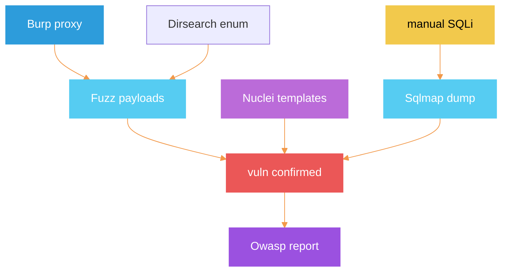
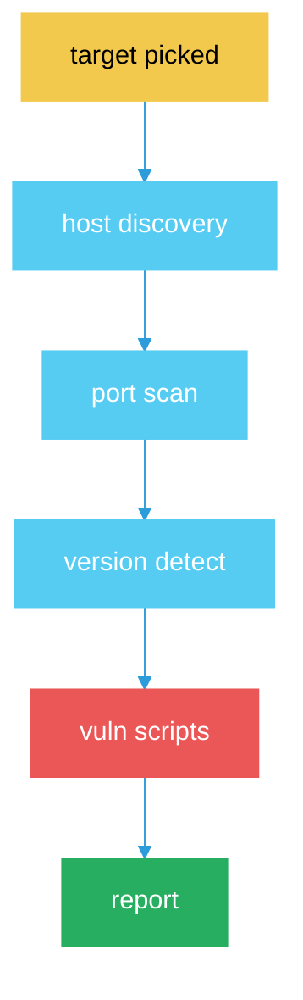
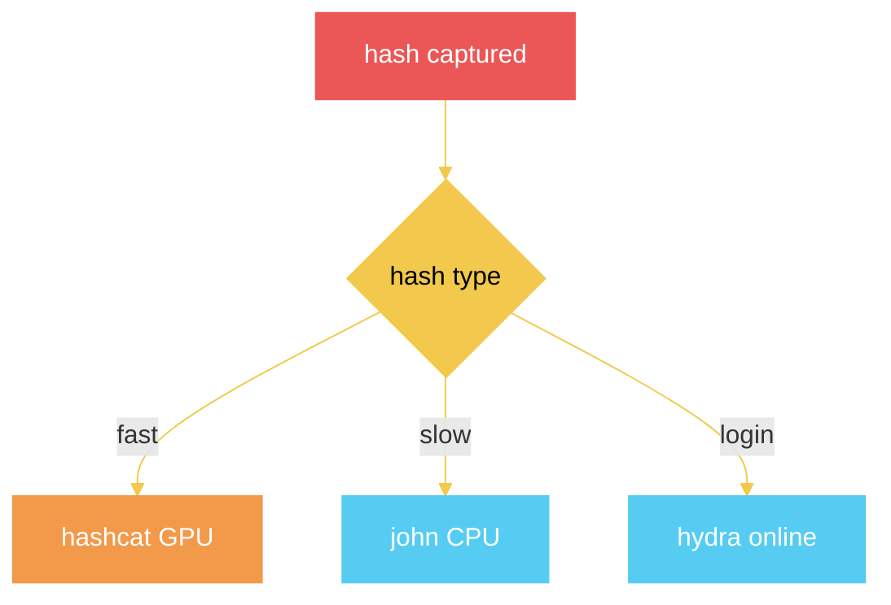

# Security IR Diagrams

## SEO Poisoning Kill Chain

## IR Remediation Pipeline

## kurmamedia Case Verdict

## Cybersecurity Toolkit Pipeline

## Web Vuln Tool Web

## Nmap Scan Flow

## Password Attack Choice

## Burp Intercept Flow

## Tags
#note-security-ir-diagrams
