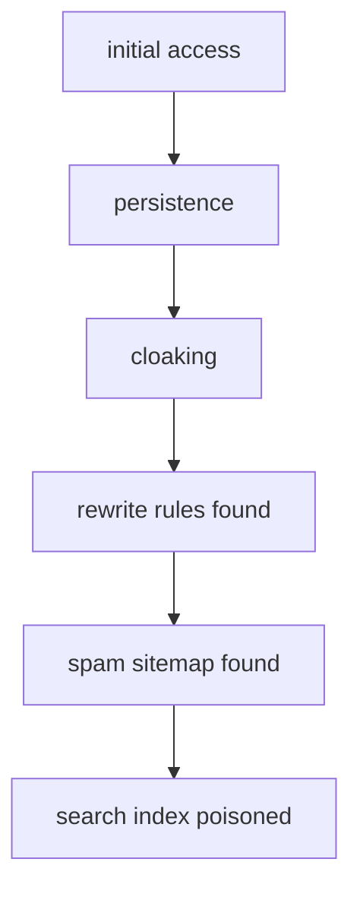
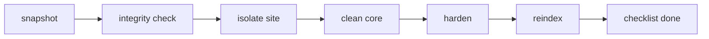
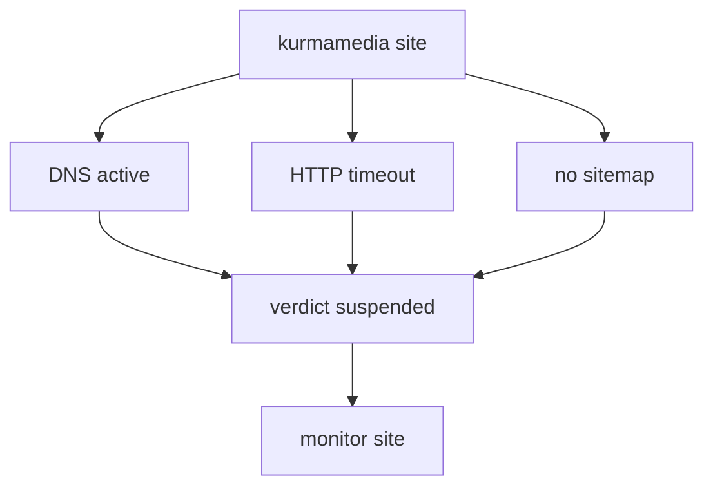
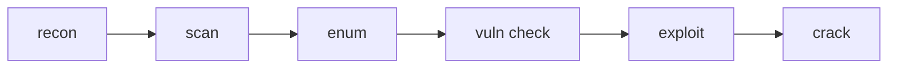
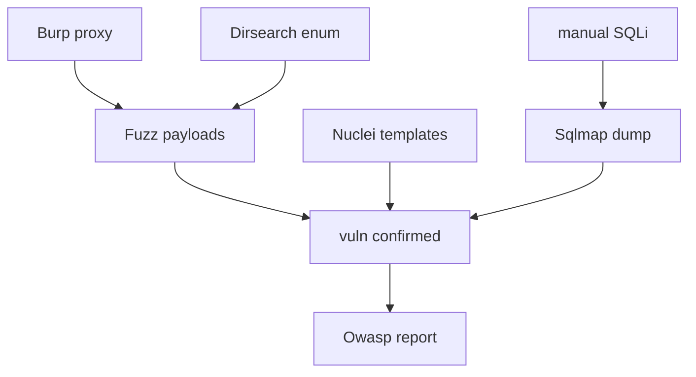
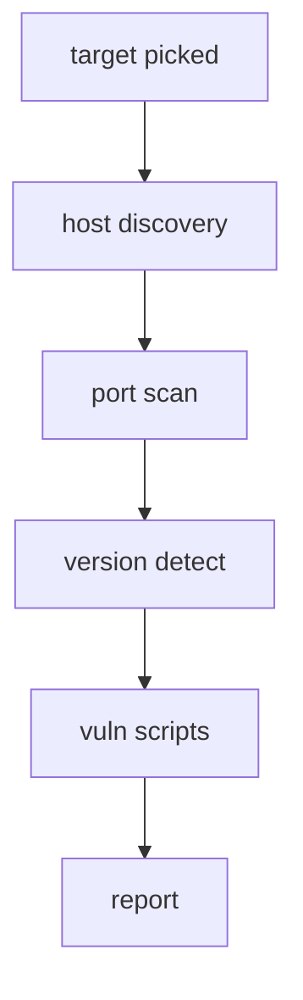
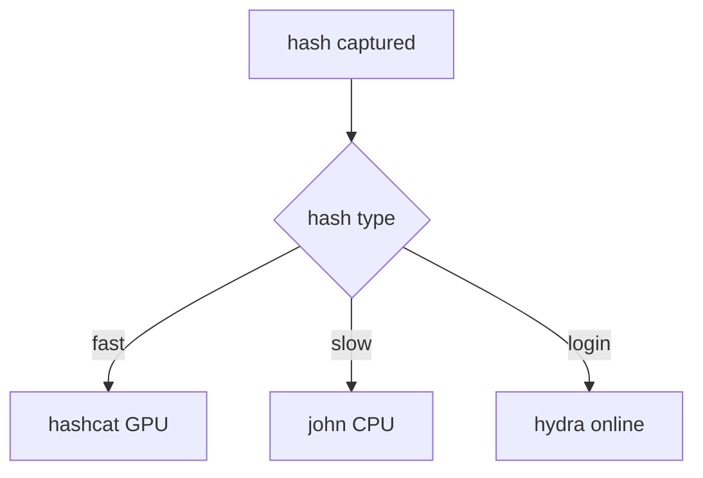
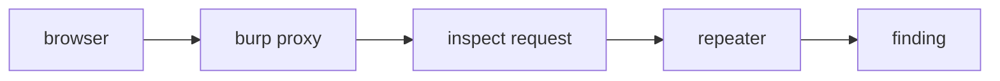

# Security IR Diagrams

**Part of:** [[00-Graph-Index]]

## SEO Poisoning Kill Chain

Vectors: vulnerable plugin, brute force, malicious upload. Persistence via htaccess, PHP backdoor, cron job, DB hook. Cloaking shows gambling content to Googlebot only.

## IR Remediation Pipeline

## kurmamedia Case Verdict

Hosted on Hostinger Jakarta, DNS resolves but the server serves nothing. Likely suspended or taken down.

## Cybersecurity Toolkit Pipeline

Tools per stage: nmap and amass, masscan, dirsearch and ffuf, nikto and nuclei, metasploit and burpsuite, hashcat and john and sqlmap.

## Web Vuln Tool Web

## Nmap Scan Flow

## Password Attack Choice

## Burp Intercept Flow

Tags: #graph #security
