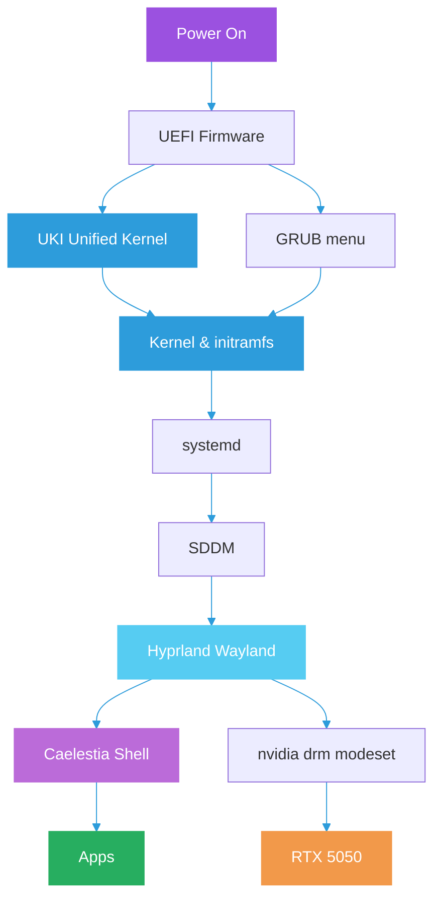
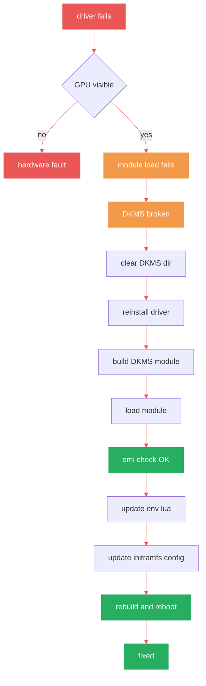
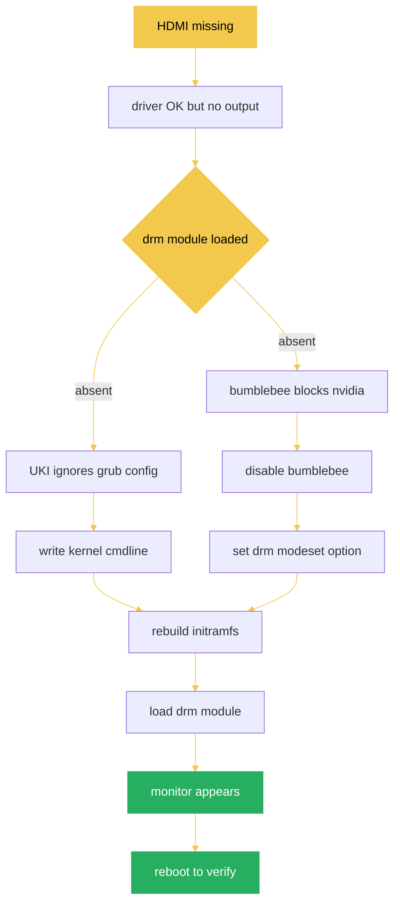
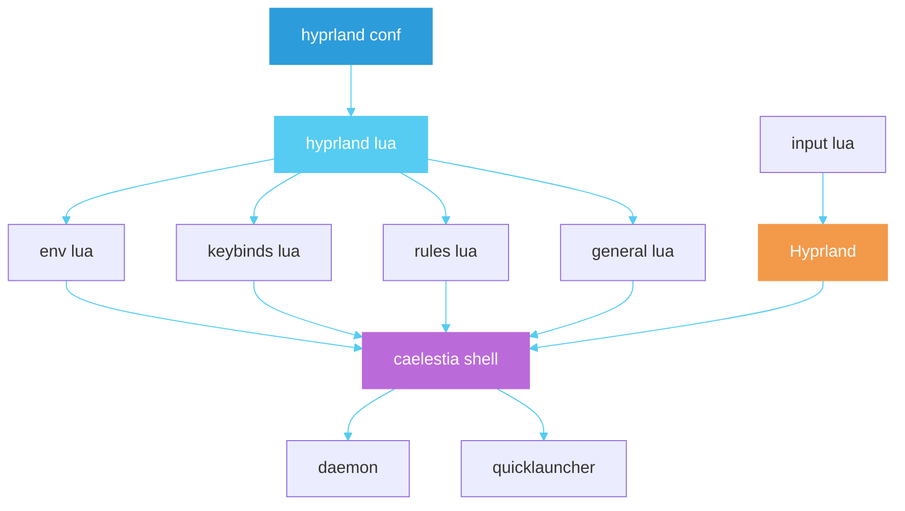
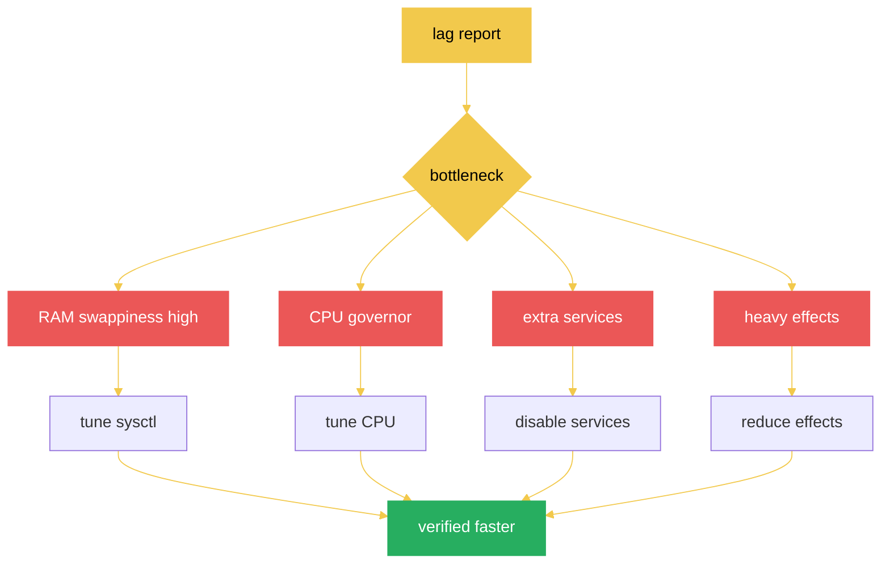
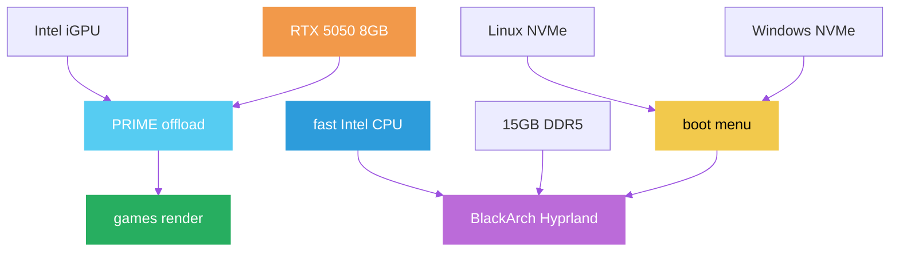
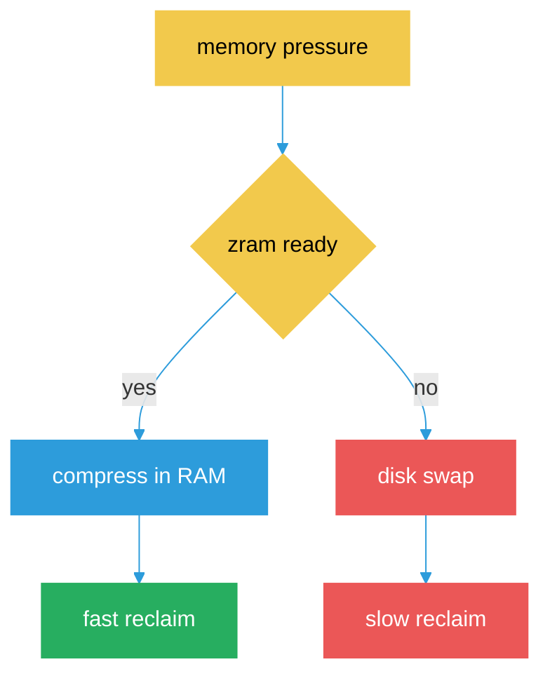
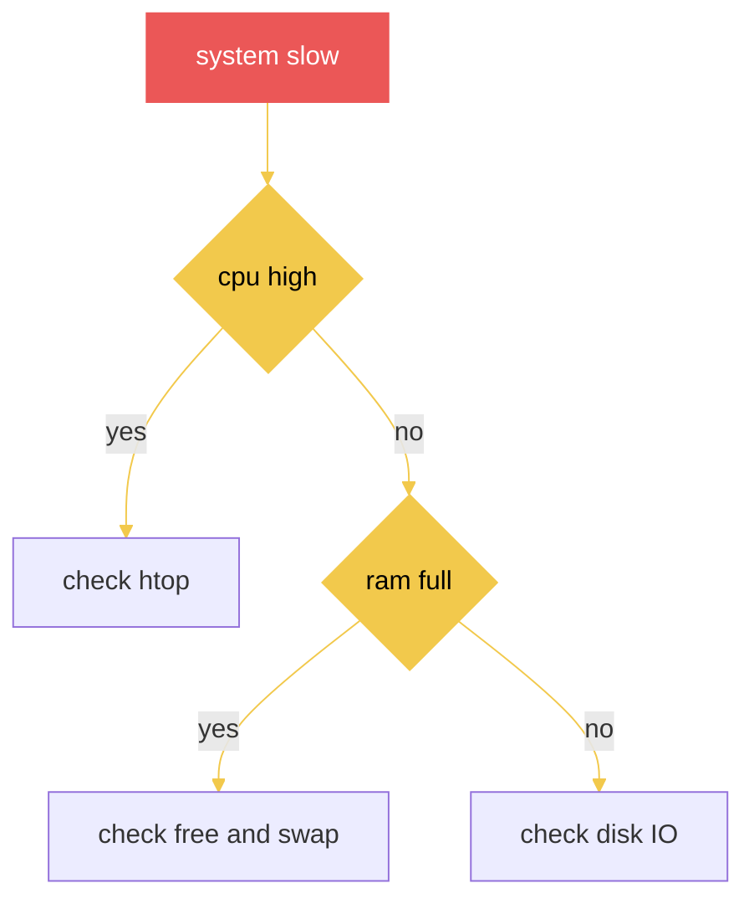
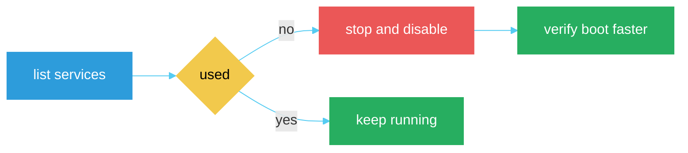

# System Diagrams

## Full Boot Chain

## NVIDIA Driver Fix Pipeline

## HDMI Monitor Fix

## GRUB Menu Before After

```mermaid
%%{init: {'theme': 'default', 'themeVariables': { 'primaryColor': '#2D9CDB', 'lineColor': '#2D9CDB'}}}%%
graph LR
 subgraph BEFORE["Before - 7 entries"]
 A1["UEFI first"]
 A2["Arch duplicate"]
 A3["Advanced"]
 A4["BlackArch"]
 A5["Windows duplicate"]
 end
 subgraph FIXG["Fix commands"]
 F1["disable duplicate script"]
 F2["disable os prober"]
 F3["custom Windows entry"]
 F4["move UEFI last"]
 end
 subgraph AFTER["After - 3 entries"]
 B1["BlackArch"]
 B2["Windows Boot Manager"]
 B3["UEFI last"]
 end
 BEFORE -->|apply| FIXG
 FIXG -->|result| AFTER
 style BEFORE fill:#EB5757,stroke:#EB5757,color:#fff
 style FIXG fill:#F2C94C,stroke:#F2C94C,color:#000
 style AFTER fill:#27AE60,stroke:#27AE60,color:#fff
```

## Hyprland Caelestia Config

## Caelestia Performance Investigation

## Trackpad Sensitivity Fix

## Device Hardware Map

## ZRAM Swap Flow

## Slow System Triage

## Service Cleanup

## Tags
#note-system-diagrams
