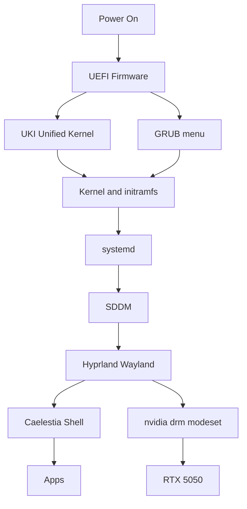
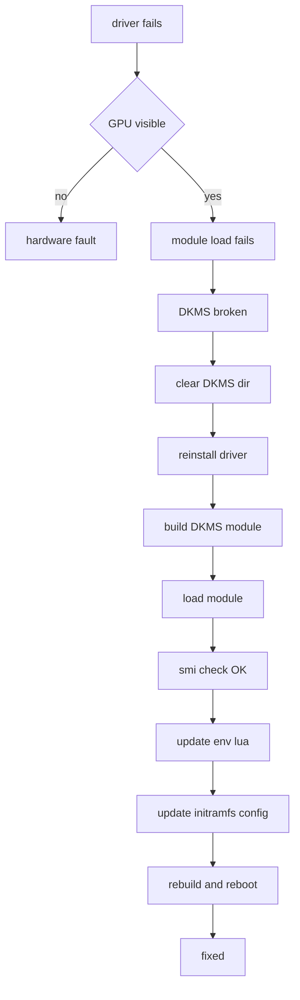
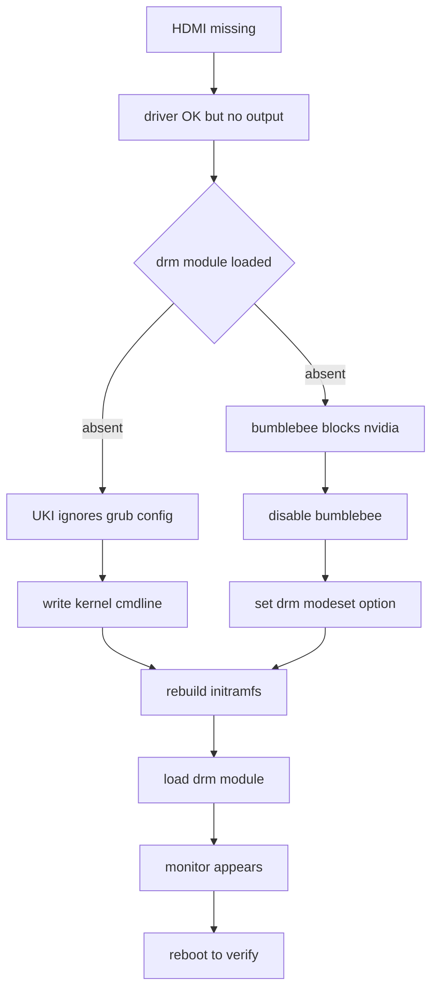
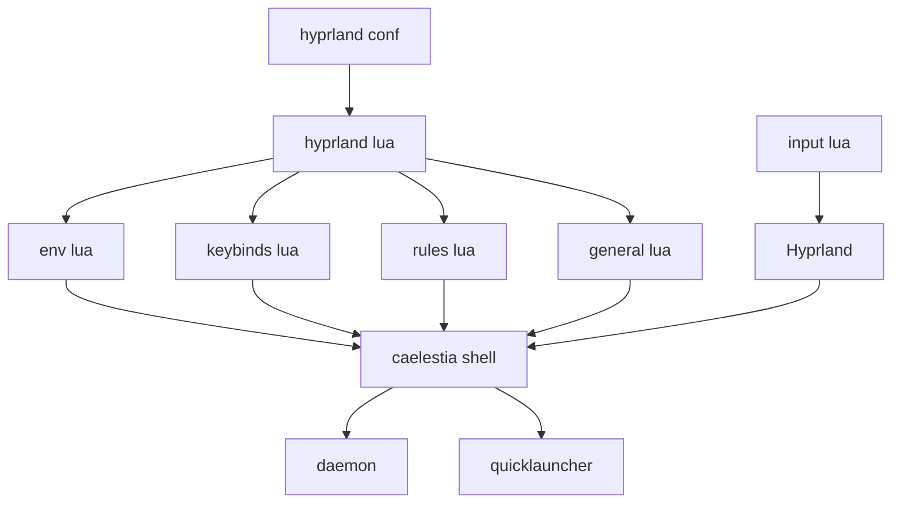
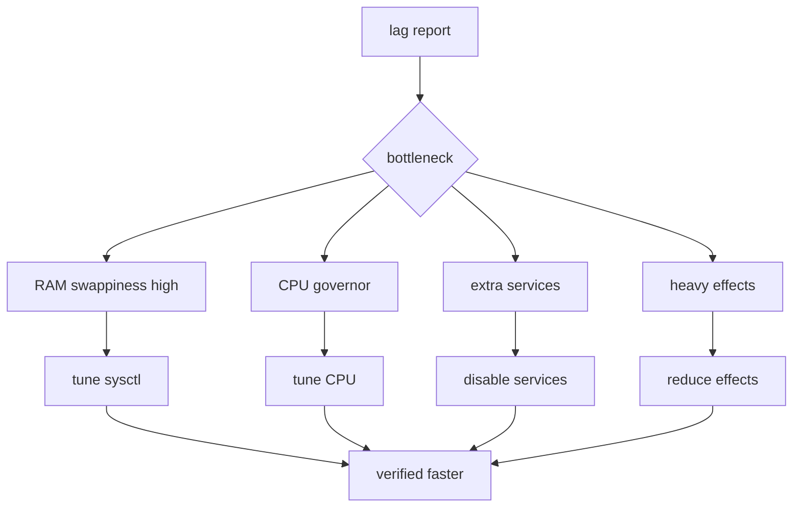
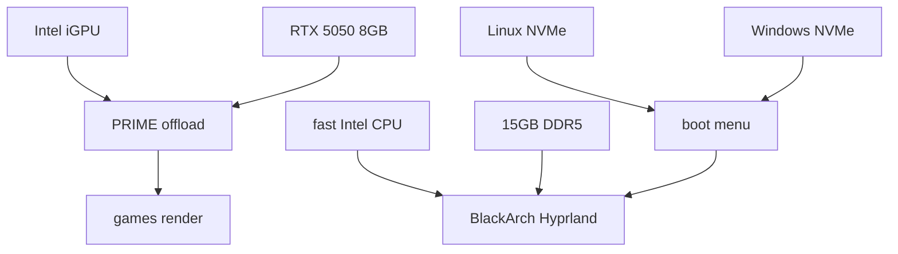

# System Diagrams

**Part of:** [[00-Graph-Index]]

## Full Boot Chain

## NVIDIA Driver Fix Pipeline

## HDMI Monitor Fix

Detail: cmdline gets the modeset flag, bumblebee conf is disabled, then modprobe loads drm at once.

## GRUB Menu Before After

```mermaid
graph LR
    subgraph BEFORE["Before seven entries"]
        A1["UEFI first"]
        A2["Arch duplicate"]
        A3["Advanced"]
        A4["BlackArch"]
        A5["Windows duplicate"]
    end
    subgraph FIXG["Fix commands"]
        F1["disable duplicate script"]
        F2["disable os prober"]
        F3["custom Windows entry"]
        F4["move UEFI last"]
    end
    subgraph AFTER["After three entries"]
        B1["BlackArch"]
        B2["Windows Boot Manager"]
        B3["UEFI last"]
    end
    BEFORE --> FIXG
    FIXG --> AFTER
```

## Hyprland Caelestia Config

Config lives under the hypr and caelestia config dirs. Trackpad sensitivity is set in input lua.

## Caelestia Performance Investigation

Root causes found: swappiness 100, VFS cache pressure, MariaDB and CUPS running, conflicting network managers.

## Trackpad Sensitivity Fix

Repeat edit plus reload until the speed feels right.

## Device Hardware Map

Tags: #graph #system
