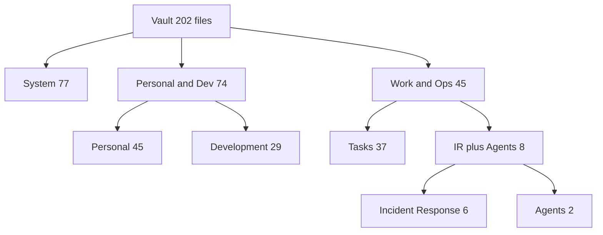
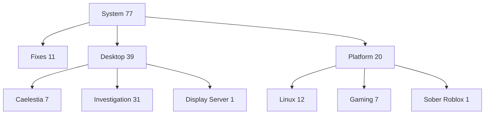
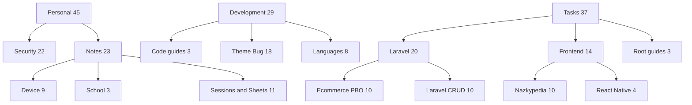
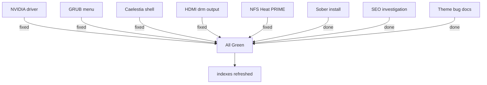
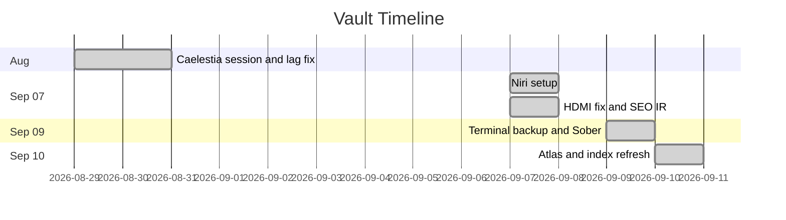
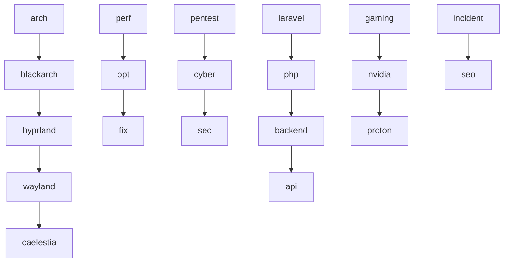
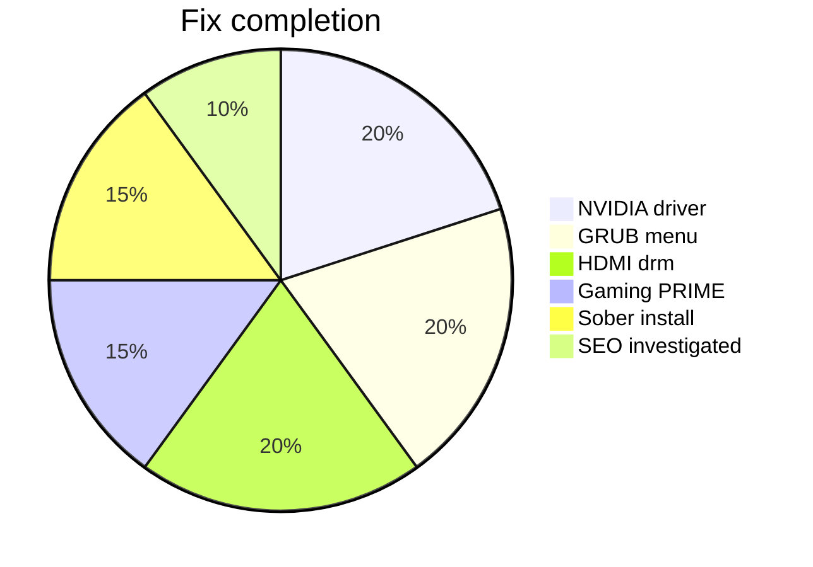
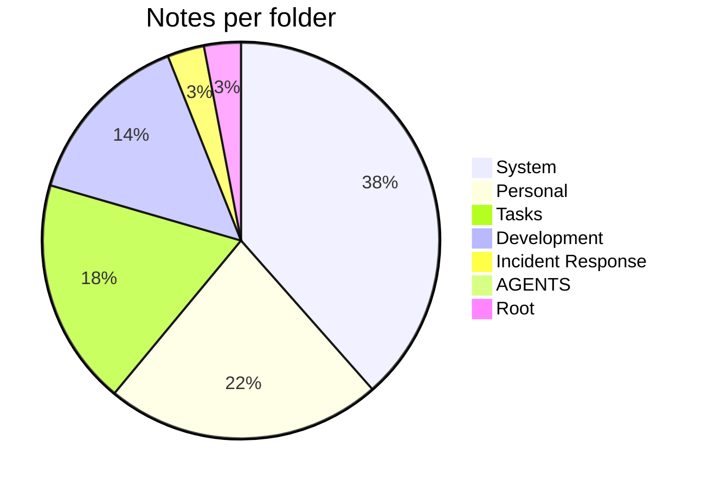
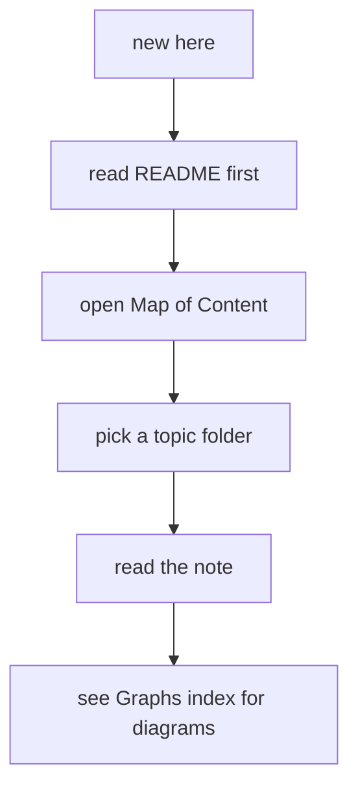

# Vault Overview Diagrams

**Part of:** [[00-Graph-Index]]

## Vault Map Top

## System Folders

## Other Folders

## Fix Status Dashboard

## Timeline

## Tag Web

## Fix Status Pie

## Notes Per Folder

## How to Navigate

Tags: #graph #overview
