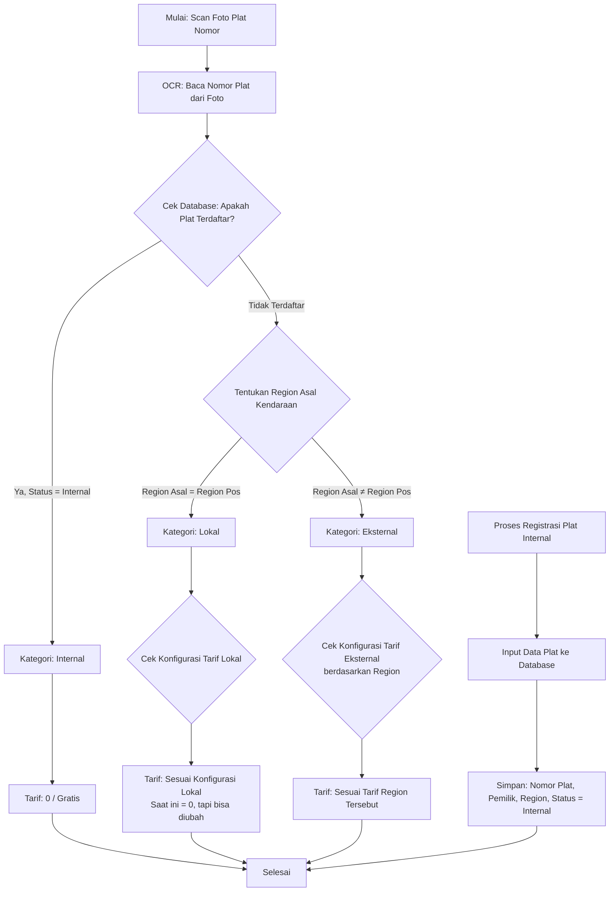

Cara pakai di Obsidian:

1. Pastikan plugin **Mermaid** sudah aktif.
2. Buat catatan baru, lalu tempel kode di atas di dalam blok:

> Diagram di atas sudah dalam format Mermaid. Aktifkan plugin Mermaid di Obsidian lalu tempel blok kode di atas ke catatan baru.

---

## Opsi 2: Teks Deskriptif Alur (untuk digambar manual)

Jika Anda ingin menggambar flowchart sendiri di draw.io / Excalidraw, berikut alur nodenya:

1. **Mulai: Scan Foto Plat Nomor**
2. → **OCR: Baca Nomor Plat dari Foto**
3. → **Keputusan: Apakah Plat Terdaftar di Database?**
    
    - Jika **Ya** dan status = Internal:
        
        - → **Kategori: Internal**
        - → **Tarif: 0 / Gratis**
        - → **Selesai**
    - Jika **Tidak Terdaftar**:
        
        - → **Tentukan Region Asal Kendaraan**
            
            - Jika **Region Asal = Region Pos**:
                
                - → **Kategori: Lokal**
                - → **Cek Konfigurasi Tarif Lokal**
                - → **Tarif: Sesuai Konfigurasi Lokal** (saat ini 0, bisa diubah)
                - → **Selesai**
            - Jika **Region Asal ≠ Region Pos**:
                
                - → **Kategori: Eksternal**
                - → **Cek Konfigurasi Tarif Eksternal (per Region)**
                - → **Tarif: Sesuai Tarif Region Tersebut**
                - → **Selesai**

Alur terpisah (registrasi):

1. **Proses Registrasi Plat Internal**
2. → **Input Data Plat ke Database**
3. → **Simpan: Nomor Plat, Pemilik, Region, Status = Internal**
4. → **Selesai**

---

Jika Anda ingin, saya bisa bantu buatkan versi yang lebih detail (misalnya termasuk keputusan validasi OCR gagal, atau alur admin mengubah konfigurasi tarif).