# Step-by-Step Data Flow: Dari Mobile ke Admin Dashboard

Dokumen ini menjelaskan alur data lengkap dari input petugas lapangan di mobile hingga data terlihat di dashboard admin.

---

## Overview Sistem

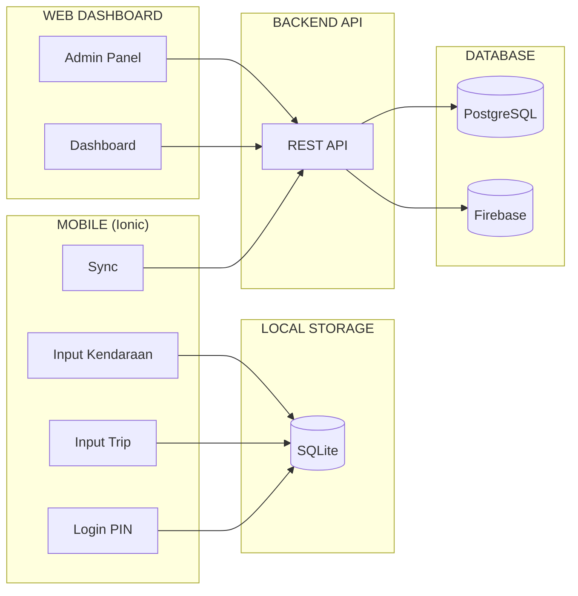

---

## Fase 1: Admin Setup Master Data

### 1.1 Admin Membuat Region

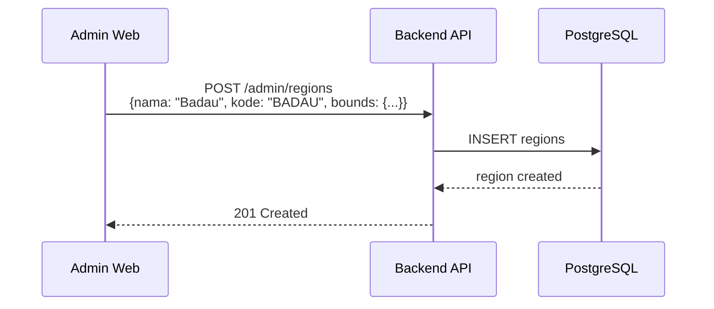

### 1.2 Admin Membuat Tarif

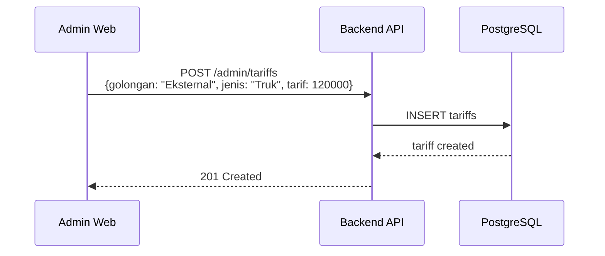

### 1.3 Admin Membuat User Petugas

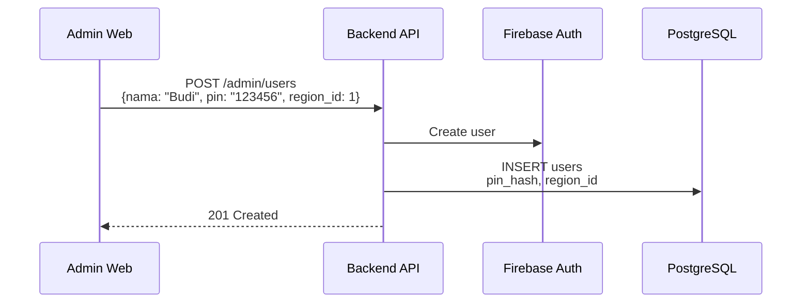

---

## Fase 2: Petugas Login Mobile

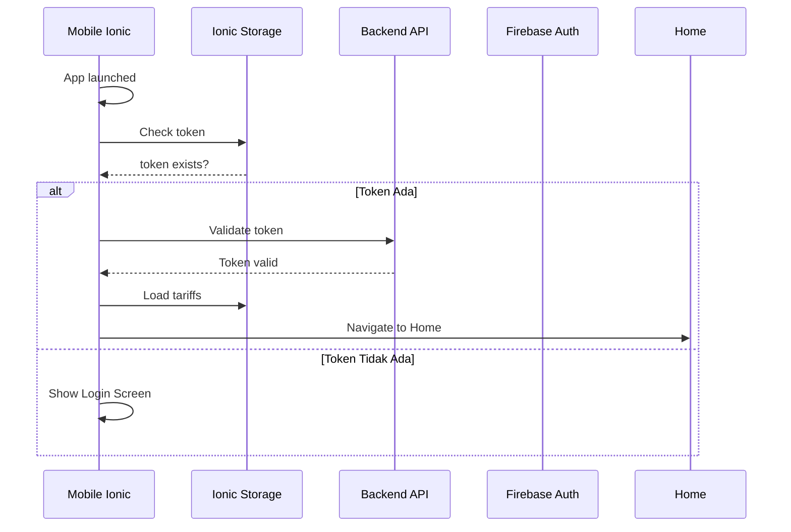

### Input PIN Login

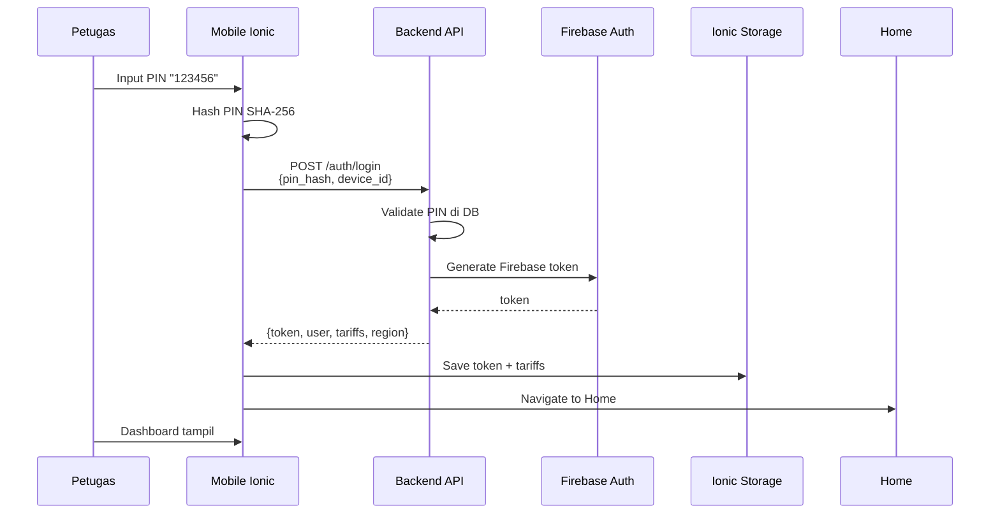

---

## Fase 3: Membuat Trip Baru

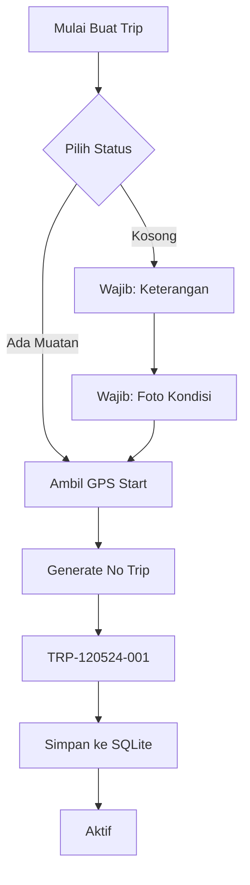

### Detail Input Trip

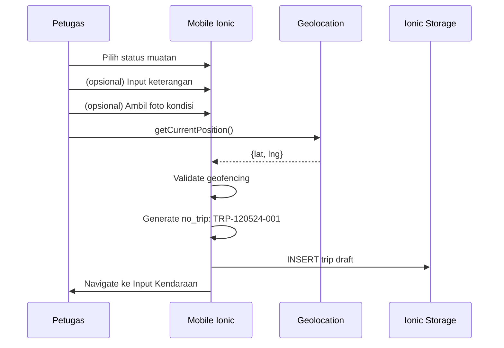

---

## Fase 4: Input Kendaraan

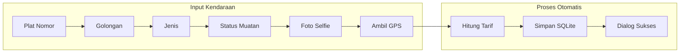

### Detail Input Kendaraan

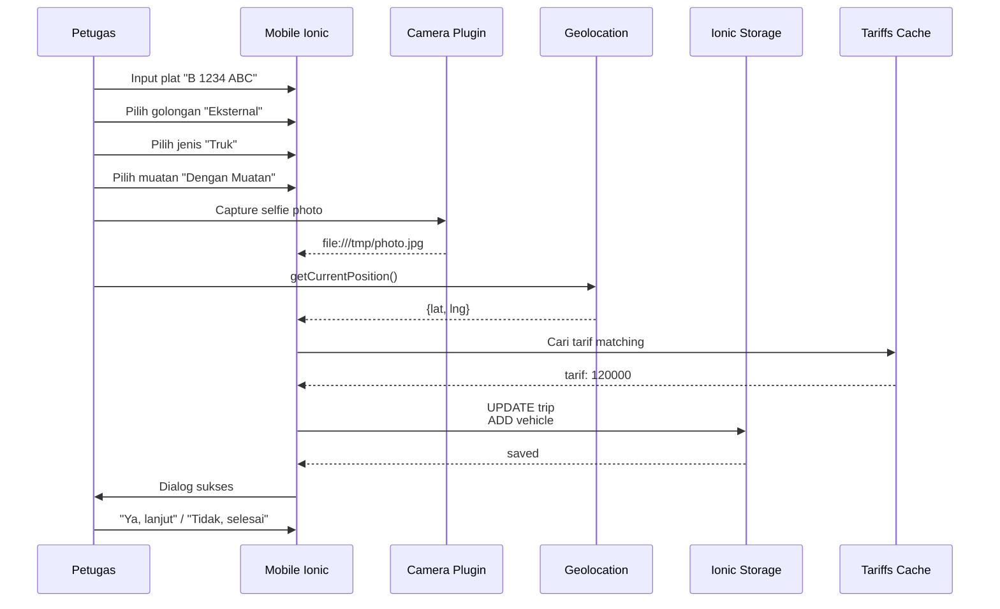

---

## Fase 5: Penyelesaian Trip

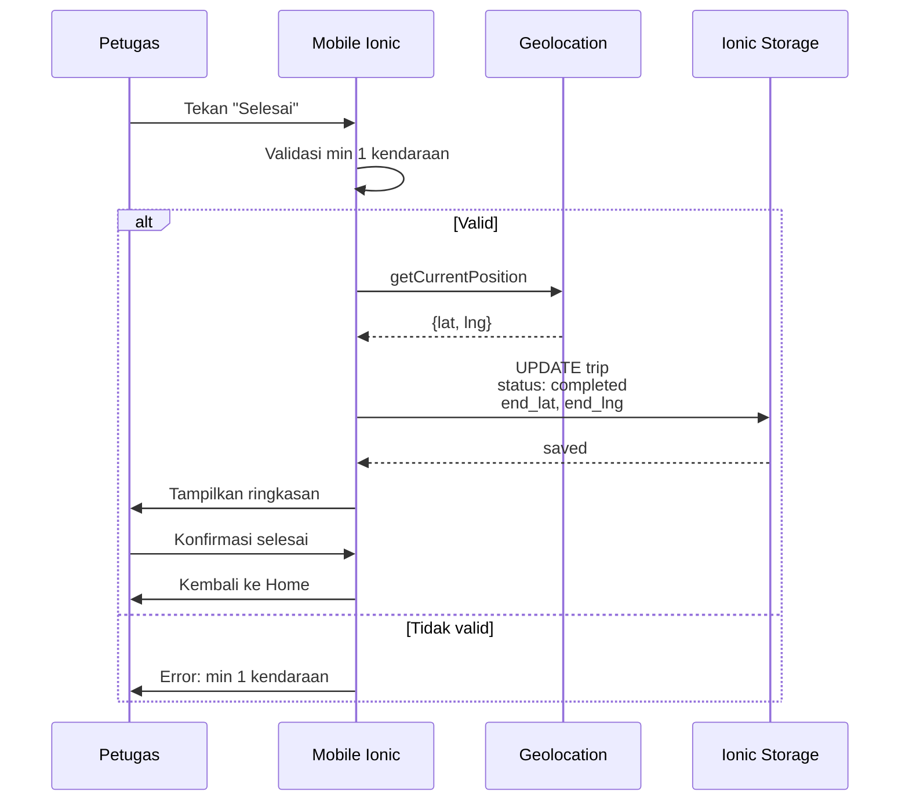

---

## Fase 6: Sinkronisasi Data

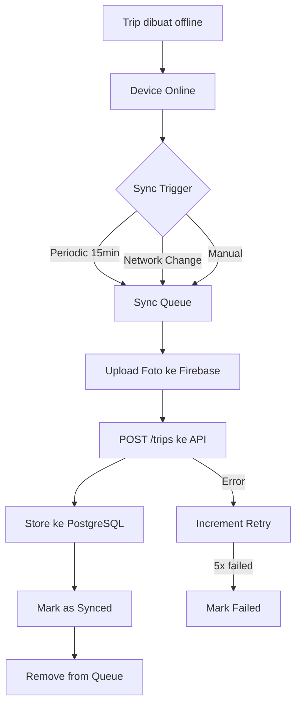

### Detail Sync Process

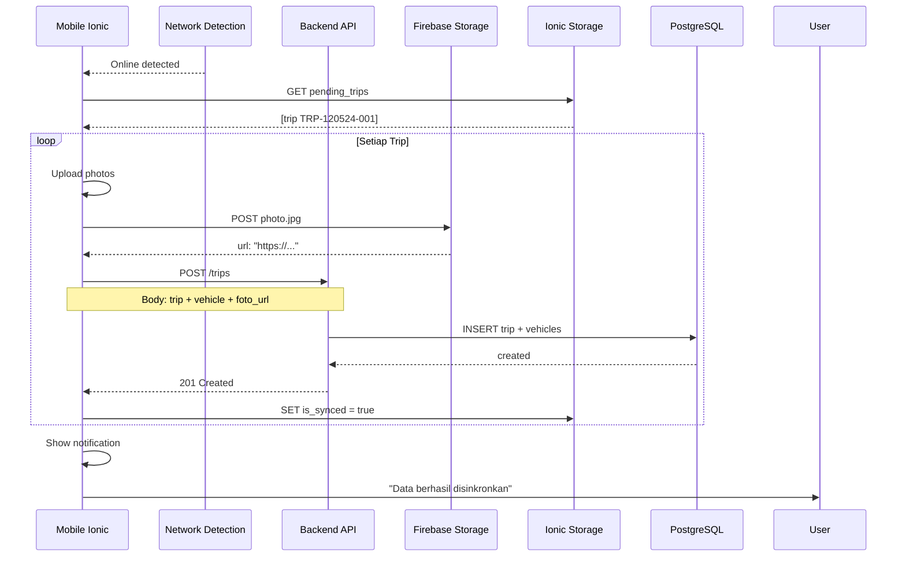

---

## Fase 7: Supervisor Dashboard

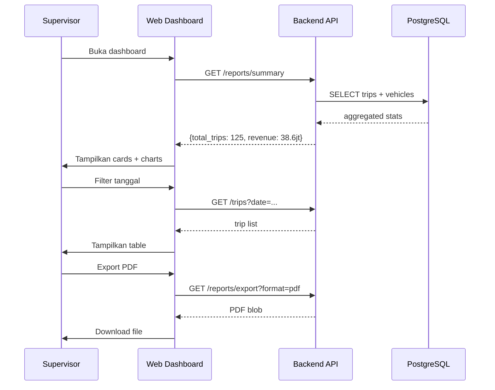

---

## Fase 8: Admin Kelola Data

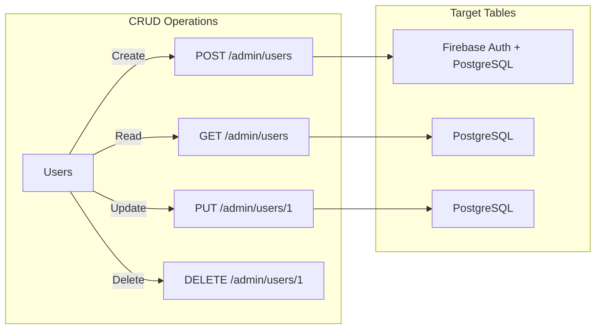

---

## Timeline Contoh

```mermaid
gantt
    title Timeline Contoh操作
    dateFormat HH:mm
    section Mobile
    Login petugas           :08:00, 5m
    Buat trip TRP-120524-001 :08:15, 3m
    Input kendaraan 1       :08:18, 2m
    Input kendaraan 2       :08:20, 2m
    Selesaikan trip        :08:25, 1m
    Sync data (offline)    :08:26, 30s
    section Dashboard
    Supervisor login      :15:00, 2m
    Lihat statistics      :15:02, 3m
```

---

## Ringkasan Alur

```
PETAKS HANDLER:
Mobile App                    Backend                    Database
    |                           |                          |
1. LOGIN                      |                          |
   PIN ──────> API ──────> Firebase Auth                |
                    <──── Token + Tariffs ──── Ionic Storage

2. BUAT TRIP                 |                          |
   Form + GPS ──> Ionic Storage ──> draft_trip
                          |                          |
3. INPUT KENDARAAN            |                          |
   Plat + Foto ──> Ionic Storage ──> trip + vehicles
                          |                          |
4. SELESAI                   |                          |
   Konfirmasi ──> Ionic Storage ──> status: completed
                          |                          |
5. SYNC (saat online)        |                          |
   Queue ───────────────> API ──────────────────────> PostgreSQL
                          | Firebase Storage <─────── Upload foto
                          |                          |
6. DASHBOARD                 |                          |
   GET /summary ─────────────────────────> PostgreSQL
                    <────────────────── Stats + Charts

7. ADMIN CRUD                 |                          |
   PUT /tariffs/1 ───────────────────────────────> PostgreSQL
```

---

## Error Handling

| Fase | Error | Handling |
|------|-------|----------|
| Login | PIN salah | Tampilkan "PIN salah" |
| Login | Device mismatch | Tampilkan "Device tidak terdaftar" |
| GPS | Unavailable | Warning + allow proceed |
| GPS | Outside region | Warning + proceed option |
| Sync | Network timeout | Retry dengan backoff |
| Sync | 5x failed | Mark failed + notify user |
| Dashboard | API error | Error state + retry button |
