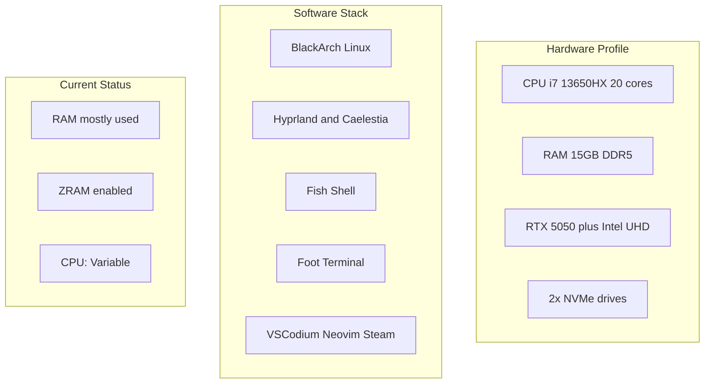
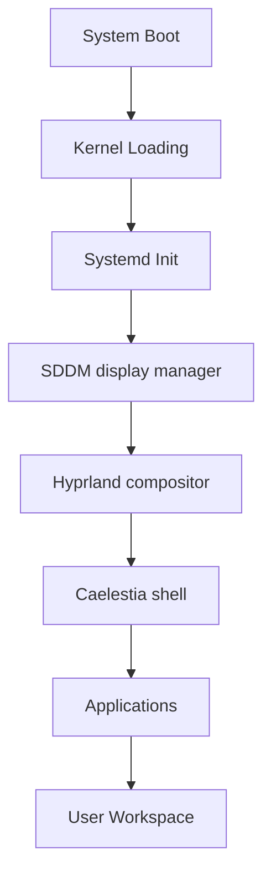
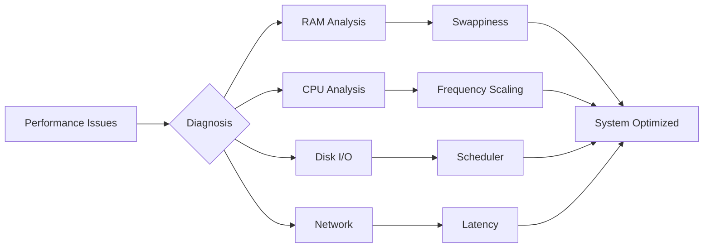
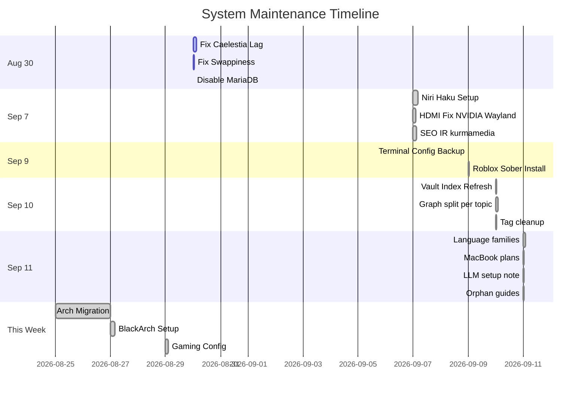
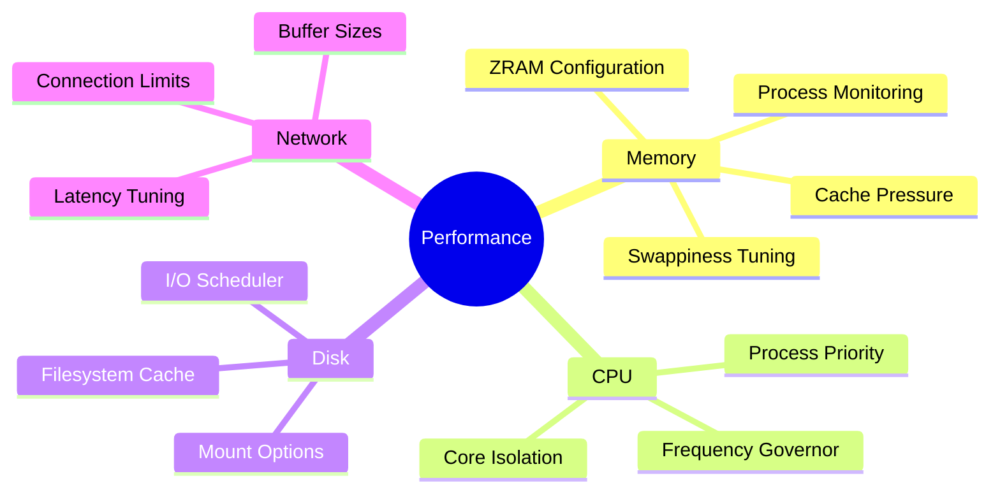
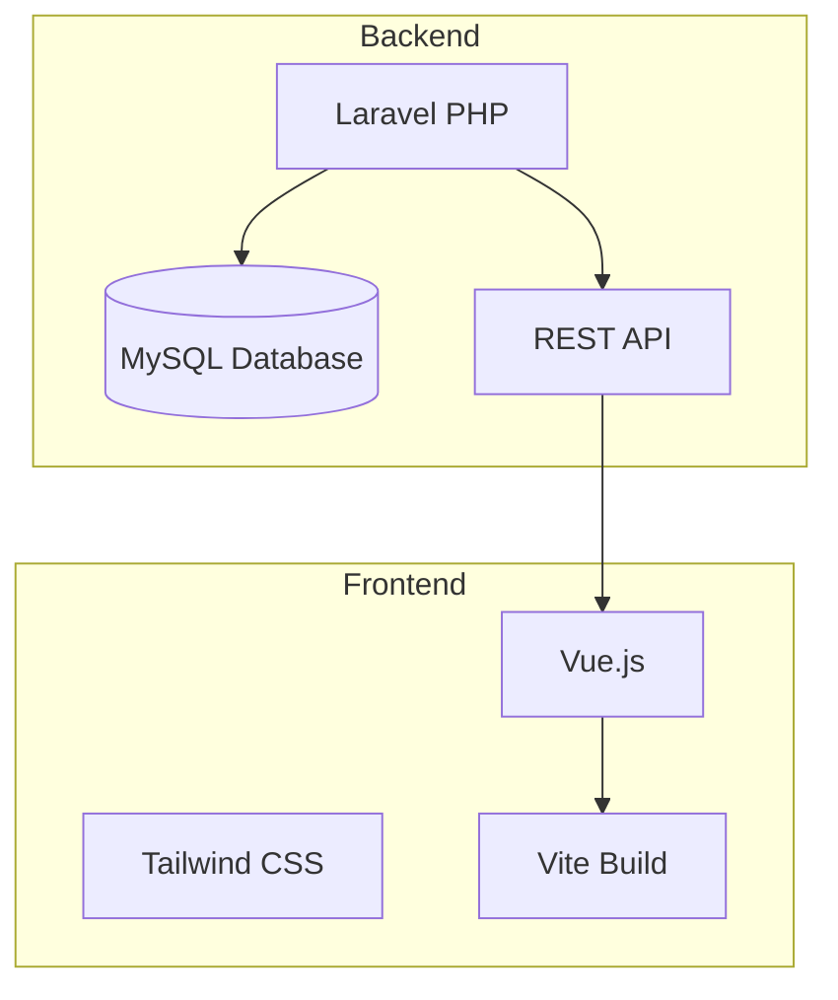
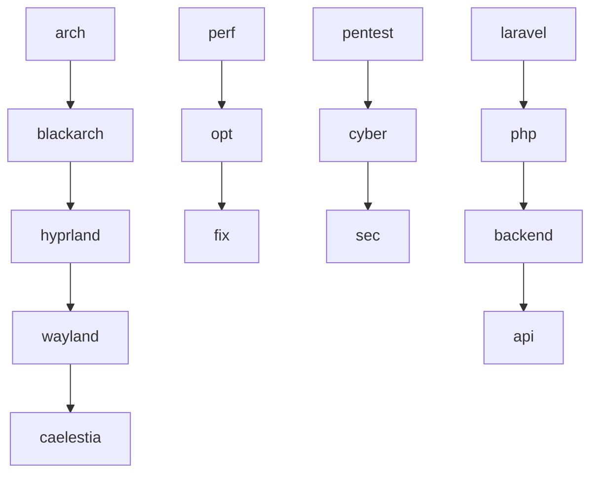
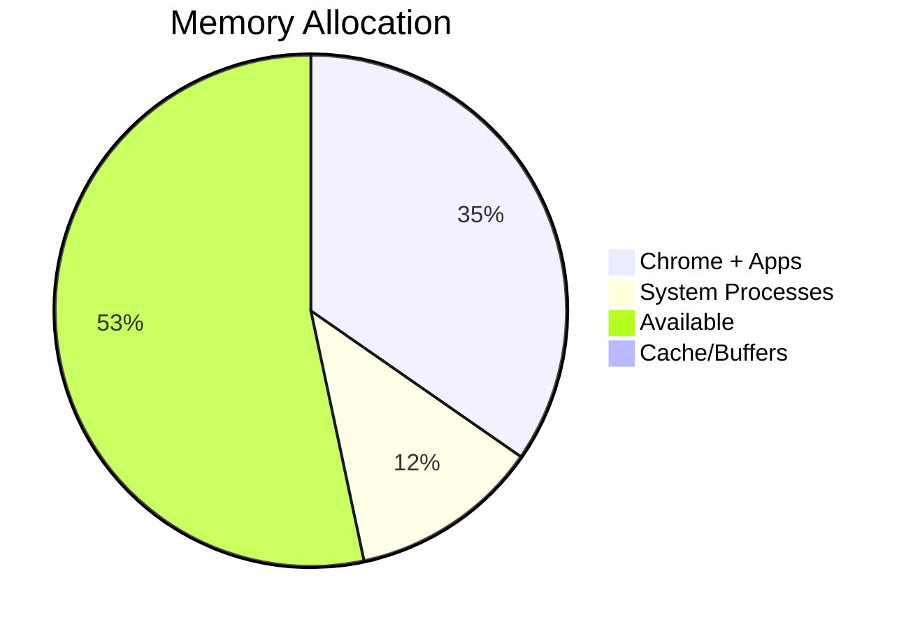

# Master Map of Content

> **Vault:** Nazky's Knowledge Base
> **Last Updated:** September 12, 2026
> **Total Notes:** 283 markdown files
> **System:** Lenovo 83LY - Arch Linux

---

## Quick Navigation

| Section                          | Description                    | Key Notes                                                        |
| -------------------------------- | ------------------------------ | ---------------------------------------------------------------- |
| System/Linux/                      | System admin, CLI, BlackArch   | System Specifications, CLI Cheatsheet - 12 files                 |
| System/Caelestia/                  | Hyprland + Caelestia shell     | Caelestia System Architecture, Caelestia Config Files - 7 files  |
| System/Caelestia-Investigation/    | Performance debugging          | 00 - Investigation Overview, Root Cause - Swappiness 100 - 31 files |
| System/Fixes/                      | System fixes and guides        | NVIDIA-RTX-5050-Investigation, GRUB-Configuration, HDMI-Monitor-Fix-NVIDIA-Wayland - 11 files |
| System/Gaming/                     | NFS Heat Proton GE + PRIME     | System-Info, The-Problem, README - 7 files                       |
| System/WiFi Troubleshooting/       | WiFi investigation notes       | 00-Overview to 06-Quick-Reference - 7 files                     |
| System/Display-Server/             | Wayland/Hyprland input         | hyprland-trackpad-sensitivity                                    |
| 07-Incident Response/SEO-Poisoning-Analysis/ | SEO Judi Slot IR   | 00-SEO-Poisoning-Analysis, 05-Case-Study-kurmamedia - 6 files, complete 2026-09-07 |
| Personal/Cybersecurity/            | Pentesting tools and methodology | Blackarch 7, Tools 9, Requierements 6, Guides 8 - 30 files       |
| Personal/Device/                   | Device-specific notes          | 00 - Device Overview to 08 - Boot Configuration - 9 files        |
| Personal/School/                   | School project docs            | P3, What-to-Create                                               |
| Personal/Session-Logs/             | Troubleshooting sessions       | 2026-08-29-Caelestia-Session - 7 files                           |
| Personal/Spreadsheets-Auth/        | Google Sheets API auth         | Spreadsheets Auth, Google Sheets Login API Setup - 4 files       |
| Development/Database/              | Laravel database management    | Database Management and phpMyAdmin Guide - 2 files               |
| Development/Github/                | Git tutorials                  | GitHub - Connect Repository Tutorial                             |
| Development/VSCode Theme Bug/      | VSCode theme debugging         | Bug Report, 00 - Map of Content - 18 files                       |
| Tasks/E-Commerce PBO/              | Laravel E-Commerce errors      | 00 - Index to 09 - Verification - 10 files                       |
| Tasks/Laravel-CRUD/                | Laravel CRUD guide             | Laravel CRUD, E-Commerce PBO - Debugging Guide - 10 files        |
| Tasks/Nazkypedia-UI-Improvements/  | Wiki UI overhaul          | README, Session-1-UI-Overhaul to Session-3 - 10 files            |
| Tasks/React-Native-Taskmanager/    | Mobile taskmanager         | PEMBUATAN APLIKASI TASKMANAGER - 4 files                         |
| Tasks/ root                        | Migration guides               | Arch Migration, Arch Linux System Fixes, Automated tools         |
| AGENTS/                            | AI CLI agents                  | AI-CLI-Agents, README, LLM-Setup - 3 files                       |
| Graphs/                            | Per-topic diagrams             | 00-Graph-Index (all colored), orange-nodes visual - 6 files    |
| macbook-plans/                     | MacBook purchase and mod plans | 00-Plan-Index plus comparison, mod, battery, verdict - 10 files  |
| Development/Programming-Languages/ | 17 languages plus cheatsheets  | Systems, Managed, Scripting families - 40 files                  |
| Development/Guides/                | Coding guides, zero links      | Regex, HTTP API, Data Structures, Git, Docker, JQ, Tmux, CSS - 8 files |
| Personal/Cybersecurity/Guides/     | Security guides, zero links    | Methodology, Privesc, Passwords, Reporting, Enum, Shells, OSINT, AD - 8 files |
| System/Ricing/                     | Desktop ricing guides          | 00-Index plus Base, Caelestia, Hyprland, Terminal, Restore - 6 files |
| Root files                         | Vault indexes and cheatsheets  | GitHub-Cheatsheet, Tags-Index, Web-Links-Hub stub                |

---

## System Overview



## Architecture Flow

### System Components


### Performance Pipeline


## Recent Activity

### Timeline


## Cross-Reference Hubs

### Performance & Optimization


### Cybersecurity Toolkit
```mermaid
graph TD
    Recon["Recon tools"] --> Scan["Scan tools"]
    Scan --> Enum["Enum tools"]
    Enum --> Vuln["Vuln check"]
    Vuln --> Exploit["Exploit tools"]
    Exploit --> Cracking["Password tools"]

Tools per stage: nmap and amass, masscan, dirsearch and ffuf, nikto and nuclei, metasploit and burpsuite, hashcat and john.
```

### Development Stack


## Topic Diagrams

Diagrams now live per topic in Graphs/00-Graph-Index, not merged here.

## Folder Structure

```
Obsidian Vault/ (275 md files, updated 2026-09-11)
├── Map of Content.md     <-- YOU ARE HERE
├── README.md / Path.md / PROMPTS.md
├── GitHub-Cheatsheet.md / Tags-Index.md / Web-Links-Hub.md (stub)
│
├── 07-Incident Response/
│   └── SEO-Poisoning-Analysis/  # 6 files: 00-Overview to 05-Case-Study
├── AGENTS/                # 3 files: AI-CLI-Agents, README, LLM-Setup
├── Graphs/                # 6 files: 00-Index + 5 colored diagram pages
├── attachments/           # visual assets, SVG diagrams (orange-nodes-overview.png/svg + subfolders)
├── macbook-plans/         # 10 files: 00-Index + comparison to price (Bahasa Indonesia)
│
├── System/                # 90 files
│   ├── Linux/            # Arch-Perf, BlackArch, Hyprland, ZRAM, CLI, Monitoring
│   ├── Caelestia/        # 7 files: 00-Overview, Architecture, Keybinds, Lock, Mod-Guide, Config-Ref
│   ├── Caelestia-Investigation/  # 31 files: perf debugging
│   ├── Fixes/            # 11 files: NVIDIA x2, GRUB x3, HDMI, Secure-Boot, Quick-Ref, Visuals, README
│   ├── Gaming/           # 7 files: NFS Heat on Proton GE + NVIDIA PRIME
│   ├── WiFi Troubleshooting/   # 7 files: 00-Overview to 06-Quick-Reference (2026-09-12)
│   ├── Display-Server/   # hyprland-trackpad-sensitivity.md
│   ├── Ricing/           # 6 files: 00-Index to Restore-Guide
│   ├── Starship Installation.md
│   ├── Shell Startup Order.md
│   ├── System-Architecture.md
│   ├── Troubleshooting Steps.md
│   ├── Caelestia Dotfiles Context.md
│   ├── KDE-Plasma-Ricing.md
│   ├── hakuspace-niri-setup-2026-09-07.md
│   ├── terminal-config-backup-2026-09-09.md
│   ├── roblox-sober-install.md  # 2026-09-09
│
├── Personal/
│   ├── Cybersecurity/
│   │   ├── Blackarch/    # 7 files
│   │   ├── Tools/        # 9 files: Burp, Nmap, Nuclei, Sqlmap, Dirsearch, Fuzzing
│   │   ├── Requierements/ # 6 files: Owasp, Pentest, Auth, DB
│   │   └── Guides/       # 8 files: zero-link orphans
│   ├── Device/           # 9 files: 00-Overview to 08-Boot
│   ├── School/           # P3, P3-2, What-to-Create
│   ├── Session-Logs/     # 2026-08-29-Caelestia-Session (7 files)
│   └── Spreadsheets-Auth/ # 4 files
│
├── Development/           # 69 files
│   ├── Database/         # 2 files
│   ├── Github/           # 1 file
│   ├── Prompts/          # empty
│   ├── VSCode/           # empty
│   ├── VSCode Theme Bug/ # 18 files
│   ├── Guides/           # 8 files: zero-link orphans
│   └── Programming-Languages/  # 40 files
│       ├── Systems/      # C, Cpp, Rust, Zig, Go (note + cheatsheet each)
│       ├── Managed/      # CSharp, Java, Kotlin, Swift, Dart, TypeScript
│       ├── Scripting/    # Python, PHP, Lua, Bash, SQL, Haskell
│       ├── Programming-Languages-Cobweb.md (slim top index)
│       ├── Comparisons.md / Toolchain-Interop.md
│
└── Tasks/                 # 37 files
    ├── Arch Migration.md / Arch Linux System Fixes.md / Automated tools.md
    ├── E-Commerce PBO/   # 10 files
    ├── Laravel-CRUD/     # 10 files
    ├── Nazkypedia-UI-Improvements/  # 10 files
    └── React-Native-Taskmanager/    # 4 files
```

## Tag Ecosystem

### Related Tags


## Resource Usage



**Tags:** #index #moc #navigation