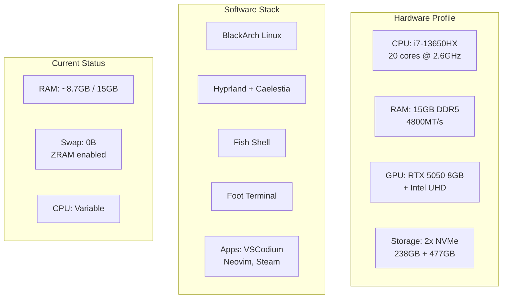
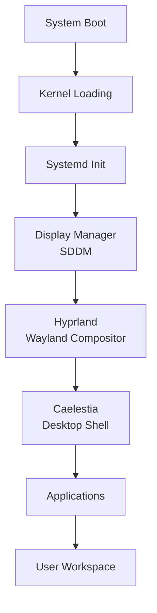
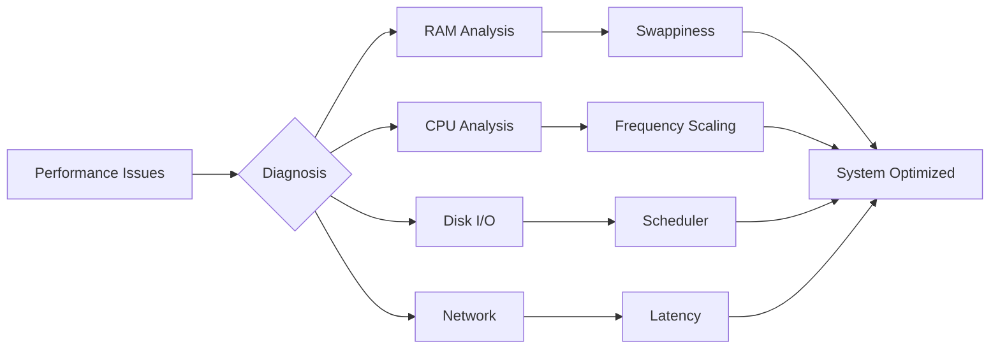
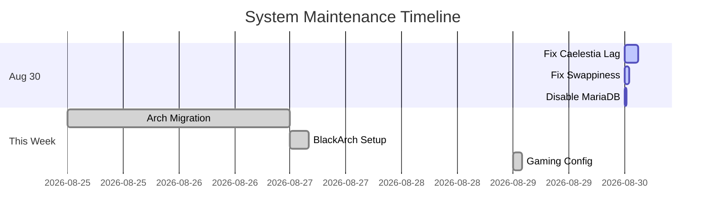
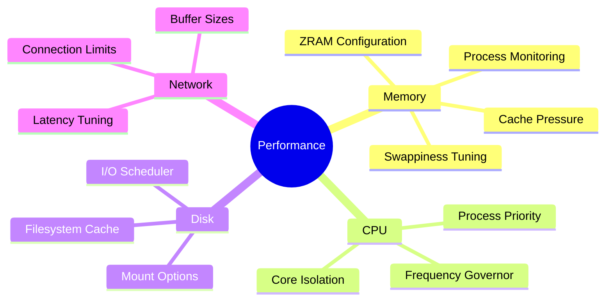
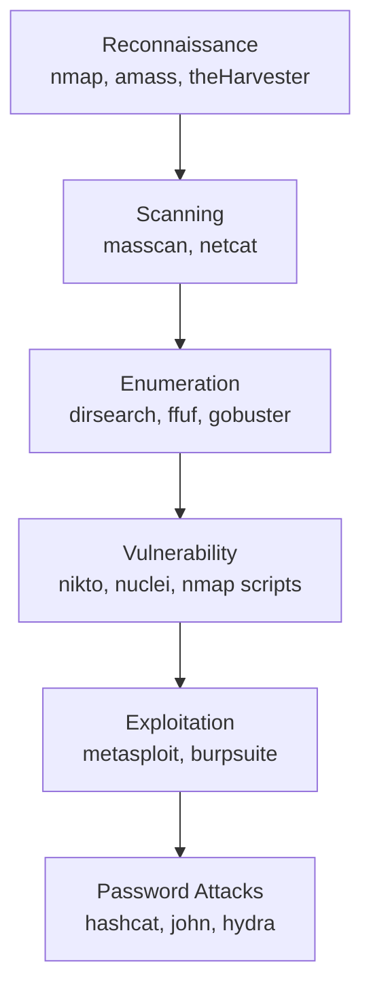
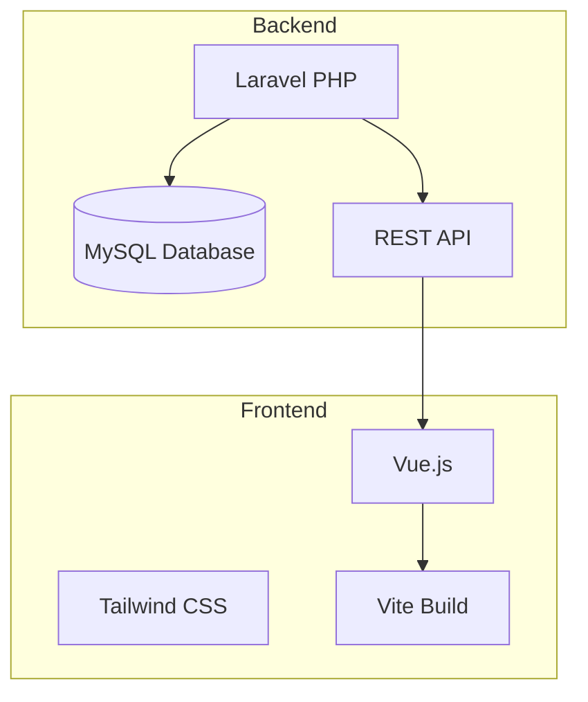
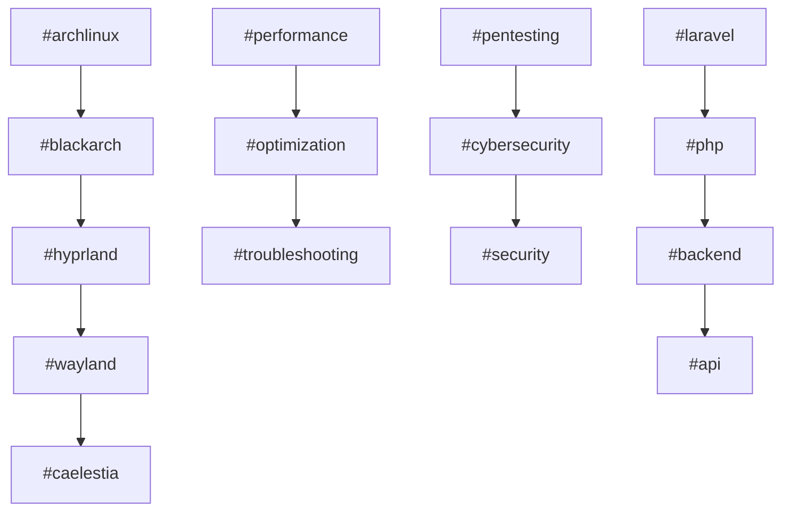
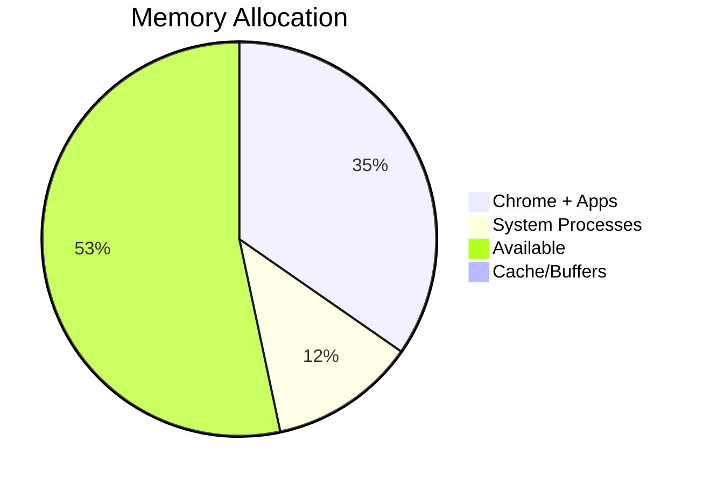

# Master Map of Content

> **Vault:** Nazky's Knowledge Base
> **Last Updated:** September 2026
> **System:** [[System Hardware Profile|Lenovo 83LY - Arch Linux]]

---

## Quick Navigation

| Section                          | Description                    | Key Notes                                                        |
| -------------------------------- | ------------------------------ | ---------------------------------------------------------------- |
| [[Linux/]]                       | System admin, CLI, BlackArch   | [[System Specifications]], [[CLI Cheatsheet]]                    |
| [[Caelestia-Configuration/]]     | Hyprland + Caelestia shell     | [[Caelestia System Architecture]], [[Caelestia Config Files]]    |
| [[Caelestia-Lag-Investigation/]] | Performance debugging          | [[00 - Investigation Overview]], [[Root Cause - Swappiness 100]] |
| [[Cybersecurity/]]               | Pentesting tools & methodology | [[BlackArch Tools]], [[Blackarch]]                               |
| [[Spreadsheets Auth/]]           | Google Sheets API auth         | [[Spreadsheets Auth]], [[Google Sheets Login API Setup]]         |
| [[Database/]]                    | Laravel database management    | [[Database Management & phpMyAdmin Guide]]                       |
| [[Github/]]                      | Git tutorials                  | [[GitHub - Connect Repository Tutorial]]                         |
| [[Todo/]]                        | Tasks & migration guides       | [[Arch Migration]], [[Arch Linux System Fixes]]                  |
| [[SchoolEvent/]]                 | School project docs            | [[P3]], [[What-to-Create]]                                       |
| [[This Device/]]                 | Device-specific notes          | [[00 - Device Overview]]                                         |
| [[VSCode Theme Bug/]]            | VSCode theme debugging         | [[Bug Report - VSCode Theme Rendering Issue]]                    |
| [[Session-Logs/]]                | Troubleshooting sessions       | [[2026-08-29-Caelestia-Session/]]                                |

---

## System Overview



## Architecture Flow

### System Components


### Performance Pipeline


## Recent Activity

### Timeline


## Cross-Reference Hubs

### Performance & Optimization


### Cybersecurity Toolkit


### Development Stack


## Folder Structure

```
Obsidian Vault/
├── 00 - Master Map of Content.md     <-- YOU ARE HERE
│
├── Linux/
│   ├── System Specifications.md      # Hardware details
│   ├── BlackArch Tools.md            # Security toolkit
│   ├── Hyprland-Optimization.md     # Compositor tuning
│   ├── Chrome-Performance-Guide.md  # Browser optimization
│   ├── ZRAM-Swap-Guide.md          # Memory management
│   └── System-Monitoring-Guide.md   # Resource tracking
│
├── Caelestia-Configuration/          # Desktop environment
│   ├── Caelestia-System-Architecture.md
│   ├── Caelestia-Config-Files-Reference.md
│   └── Hyprland-Keybinds.md
│
├── Cybersecurity/
│   ├── Blackarch/
│   │   ├── BlackArch-Audit.md
│   │   └── BlackArch-Tool-Usage-Cheat-Sheet.md
│   ├── Tools/
│   │   ├── Nmap.md
│   │   ├── Sqlmap.md
│   │   └── Burpsuite.md
│   └── Requierements/
│       └── Owasp.md
│
├── Agent Tasks/
│   ├── Nazkypedia-UI-Improvements/
│   ├── E-Commerce PBO/
│   ├── Laravel-CRUD/
│   └── React-Native-Taskmanager/
│
└── This Device/
    ├── Hardware Specifications.md
    ├── Network Configuration.md
    └── Boot Configuration.md
```

## Tag Ecosystem

### Related Tags


## Resource Usage



**Tags:** #moc #index #navigation #vault #knowledge-base