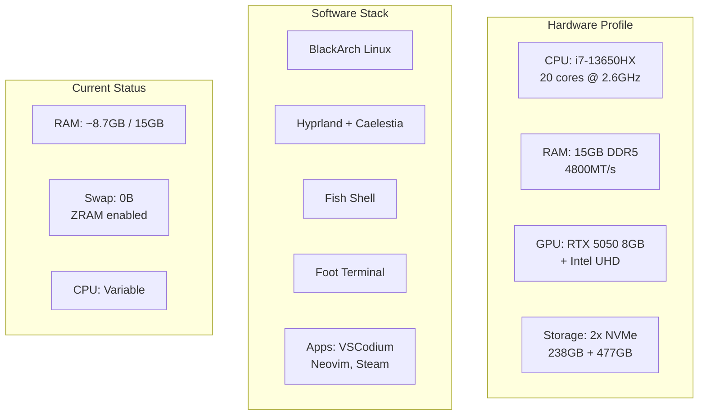
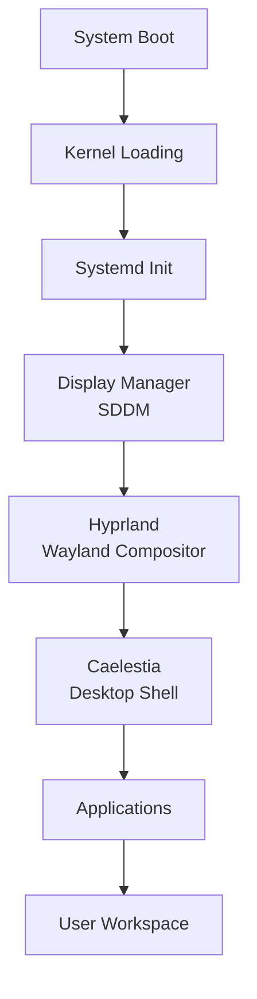
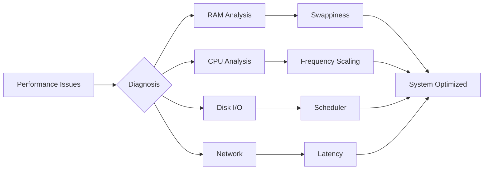
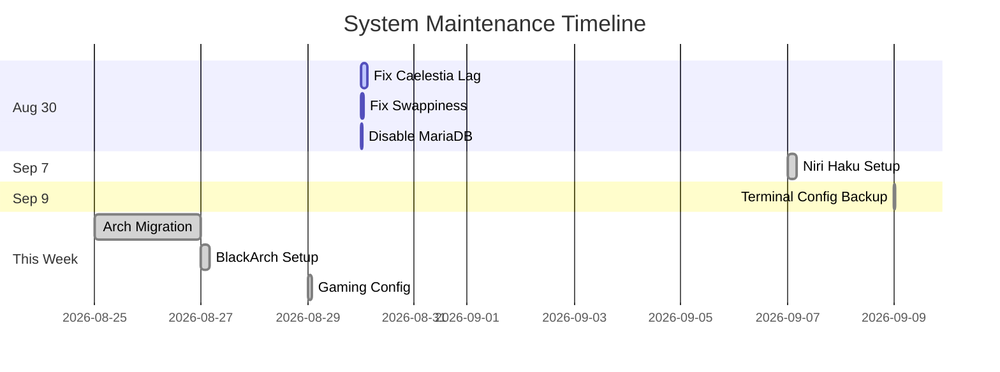
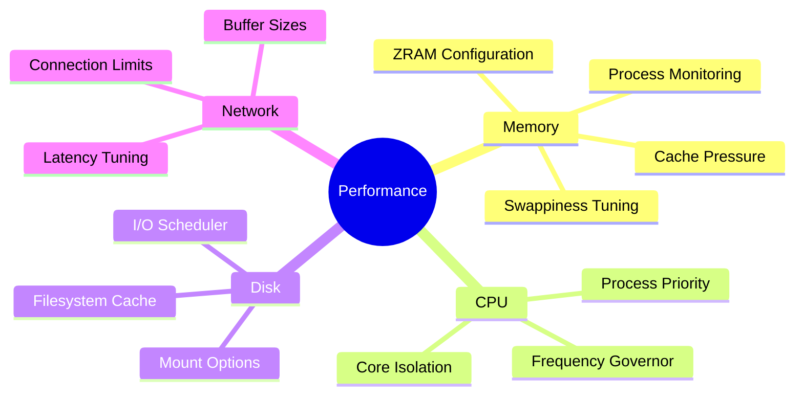
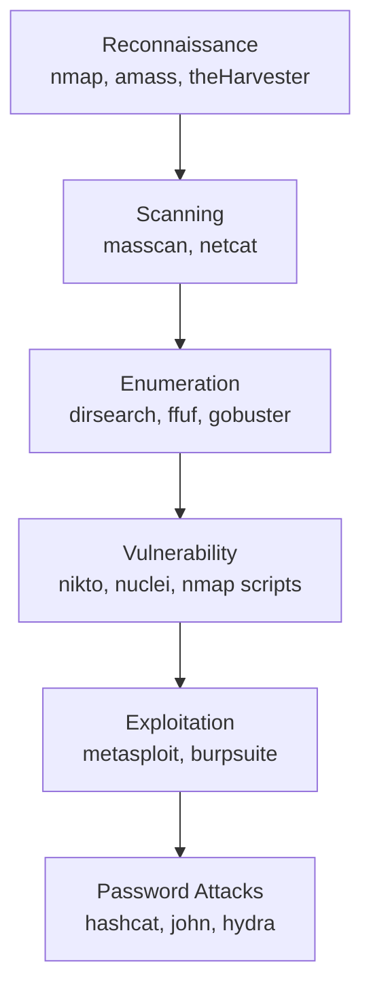
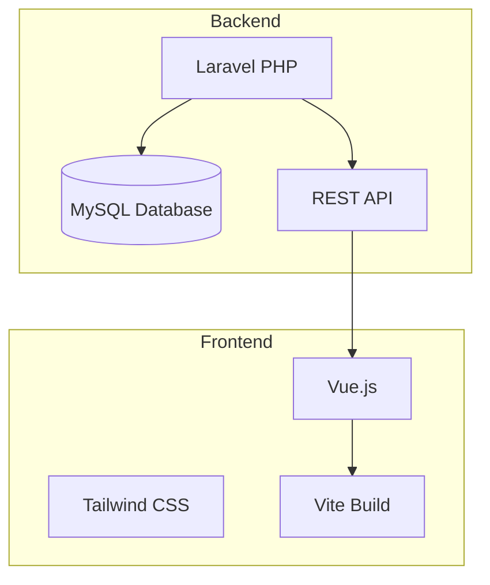
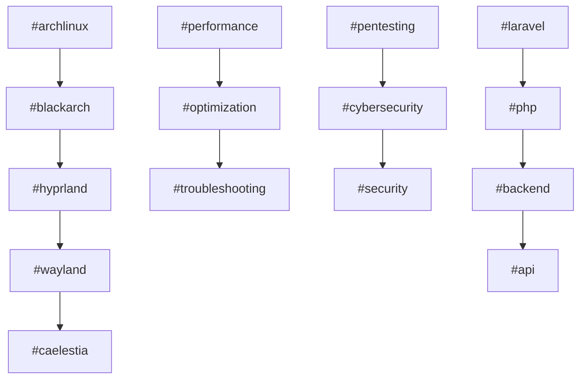
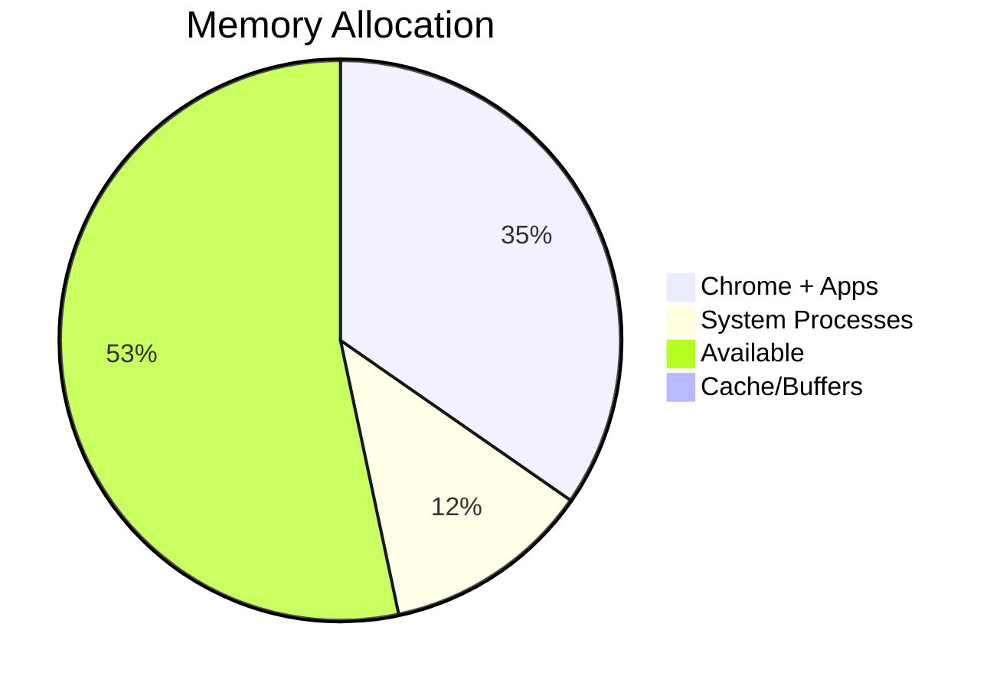

# Master Map of Content

> **Vault:** Nazky's Knowledge Base
> **Last Updated:** September 2026
> **System:** [[System Hardware Profile|Lenovo 83LY - Arch Linux]]

---

## Quick Navigation

| Section                          | Description                    | Key Notes                                                        |
| -------------------------------- | ------------------------------ | ---------------------------------------------------------------- |
| [[System/Linux/]]                | System admin, CLI, BlackArch   | [[System Specifications]], [[CLI Cheatsheet]]                    |
| [[System/Caelestia/]]            | Hyprland + Caelestia shell     | [[Caelestia System Architecture]], [[Caelestia Config Files]]    |
| [[System/Caelestia-Investigation/]] | Performance debugging          | [[00 - Investigation Overview]], [[Root Cause - Swappiness 100]] |
| [[Personal/Cybersecurity/]]      | Pentesting tools & methodology | [[BlackArch Tools]], [[Blackarch]]                               |
| [[Personal/Spreadsheets-Auth/]]  | Google Sheets API auth         | [[Spreadsheets Auth]], [[Google Sheets Login API Setup]]         |
| [[Development/Database/]]        | Laravel database management    | [[Database Management & phpMyAdmin Guide]]                       |
| [[Development/Github/]]          | Git tutorials                  | [[GitHub - Connect Repository Tutorial]]                         |
| [[Tasks/]]                       | Tasks & migration guides       | [[Arch Migration]], [[Arch Linux System Fixes]]                  |
| [[Personal/School/]]             | School project docs            | [[P3]], [[What-to-Create]]                                       |
| [[Personal/Device/]]             | Device-specific notes          | [[00 - Device Overview]]                                         |
| [[Development/VSCode Theme Bug/]] | VSCode theme debugging         | [[Bug Report - VSCode Theme Rendering Issue]]                    |
| [[Personal/Session-Logs/]]       | Troubleshooting sessions       | [[2026-08-29-Caelestia-Session/]]                                |
| [[System/Fixes/]]                | System fixes & guides          | [[NVIDIA-RTX-5050-Investigation]], [[GRUB-Configuration]]        |
| [[System/Gaming/]]               | Gaming setup & troubleshooting | [[System-Info]], [[The-Problem]]                                  |

---

## System Overview



## Architecture Flow

### System Components


### Performance Pipeline


## Recent Activity

### Timeline


## Cross-Reference Hubs

### Performance & Optimization


### Cybersecurity Toolkit


### Development Stack


## Folder Structure

```
Obsidian Vault/
├── Map of Content.md     <-- YOU ARE HERE
│
├── System/
│   ├── Linux/            # System admin, CLI, BlackArch
│   │   ├── System Specifications.md
│   │   ├── BlackArch Tools.md
│   │   ├── Hyprland-Optimization.md
│   │   ├── Chrome-Performance-Guide.md
│   │   ├── ZRAM-Swap-Guide.md
│   │   ├── System-Monitoring-Guide.md
│   │   └── CLI Cheatsheet.md
│   ├── Caelestia/        # Desktop environment
│   │   ├── Caelestia System Architecture.md
│   │   ├── Caelestia Config Files.md
│   │   ├── Hyprland Keybinds.md
│   │   ├── Caelestia Lock Settings.md
│   │   ├── Caelestia Modification Guide.md
│   │   └── Hyprland - Reduce Transparency.md
│   ├── Caelestia-Investigation/  # Performance debugging
│   ├── Fixes/            # System fixes
│   ├── Gaming/
│   ├── Display-Server/
│   ├── Starship Installation.md
│   ├── Shell Startup Order.md
│   ├── System-Architecture.md
│   ├── Troubleshooting Steps.md
│   ├── Caelestia Dotfiles Context.md
│   ├── KDE-Plasma-Ricing.md
│   ├── hakuspace-niri-setup-2026-09-07.md
│   └── terminal-config-backup-2026-09-09.md
│
├── Personal/
│   ├── Cybersecurity/
│   │   ├── Blackarch/
│   │   ├── Tools/
│   │   └── Requierements/
│   ├── Device/
│   ├── School/
│   ├── Session-Logs/
│   └── Spreadsheets-Auth/
│
├── Development/
│   ├── Database/
│   ├── Github/
│   ├── VSCode Theme Bug/
│   └── Prompts/
│
└── Tasks/
    ├── Arch Migration.md
    ├── Arch Linux System Fixes.md
    ├── Automated tools.md
    ├── E-Commerce PBO/
    ├── Laravel-CRUD/
    ├── Nazkypedia-UI-Improvements/
    └── React-Native-Taskmanager/
```

## Tag Ecosystem

### Related Tags


## Resource Usage



**Tags:** #moc #index #navigation #vault #knowledge-base