# Master Map of Content

> **Vault:** Nazky's Knowledge Base
> **Last Updated:** September 10, 2026
> **Total Notes:** 192 markdown files
> **System:** [[System Hardware Profile|Lenovo 83LY - Arch Linux]]

---

## Quick Navigation

| Section                          | Description                    | Key Notes                                                        |
| -------------------------------- | ------------------------------ | ---------------------------------------------------------------- |
| [[System/Linux/]]                | System admin, CLI, BlackArch   | [[System Specifications]], [[CLI Cheatsheet]] - 12 files         |
| [[System/Caelestia/]]            | Hyprland + Caelestia shell     | [[Caelestia System Architecture]], [[Caelestia Config Files]] - 7 files |
| [[System/Caelestia-Investigation/]] | Performance debugging       | [[00 - Investigation Overview]], [[Root Cause - Swappiness 100]] - 31 files |
| [[System/Fixes/]]                | System fixes and guides        | [[NVIDIA-RTX-5050-Investigation]], [[GRUB-Configuration]], [[HDMI-Monitor-Fix-NVIDIA-Wayland]] - 11 files |
| [[System/Gaming/]]               | NFS Heat Proton GE + PRIME     | [[System-Info]], [[The-Problem]], [[README]] - 7 files           |
| [[System/Display-Server/]]       | Wayland/Hyprland input         | [[hyprland-trackpad-sensitivity]]                                |
| [[07-Incident Response/SEO-Poisoning-Analysis/]] | SEO Judi Slot IR | [[00-SEO-Poisoning-Analysis]], [[05-Case-Study-kurmamedia]] - 6 files, complete 2026-09-07 |
| [[Personal/Cybersecurity/]]      | Pentesting tools and methodology | [[BlackArch Tools]], [[Blackarch]] - Blackarch 7, Requierements 6, Tools 9 |
| [[Personal/Device/]]             | Device-specific notes          | [[00 - Device Overview]] to [[08 - Boot Configuration]] - 9 files |
| [[Personal/School/]]             | School project docs            | [[P3]], [[What-to-Create]]                                       |
| [[Personal/Session-Logs/]]       | Troubleshooting sessions       | [[2026-08-29-Caelestia-Session/]] - 7 files                      |
| [[Personal/Spreadsheets-Auth/]]  | Google Sheets API auth         | [[Spreadsheets Auth]], [[Google Sheets Login API Setup]] - 4 files |
| [[Development/Database/]]        | Laravel database management    | [[Database Management & phpMyAdmin Guide]] - 2 files             |
| [[Development/Github/]]          | Git tutorials                  | [[GitHub - Connect Repository Tutorial]]                         |
| [[Development/VSCode Theme Bug/]] | VSCode theme debugging        | [[Bug Report - VSCode Theme Rendering Issue]], [[00 - Map of Content]] - 19 files |
| [[Tasks/E-Commerce PBO/]]        | Laravel E-Commerce errors      | [[00 - Index]] to [[09 - Verification]] - 10 files               |
| [[Tasks/Laravel-CRUD/]]          | Laravel CRUD guide             | [[Laravel CRUD]], [[E-Commerce PBO - Debugging Guide]] - 10 files |
| [[Tasks/Nazkypedia-UI-Improvements/]] | Wiki UI overhaul          | [[README]], [[Session-1-UI-Overhaul]] to Session-3 - 10 files    |
| [[Tasks/React-Native-Taskmanager/]] | Mobile taskmanager         | [[PEMBUATAN APLIKASI TASKMANAGER]] - 4 files                     |
| [[Tasks/]] root                  | Migration guides               | [[Arch Migration]], [[Arch Linux System Fixes]], [[Automated tools]] |
| [[AGENTS/]]                      | AI CLI agents                  | [[AI-CLI-Agents]] - 8 tools documented                           |

---

## System Overview

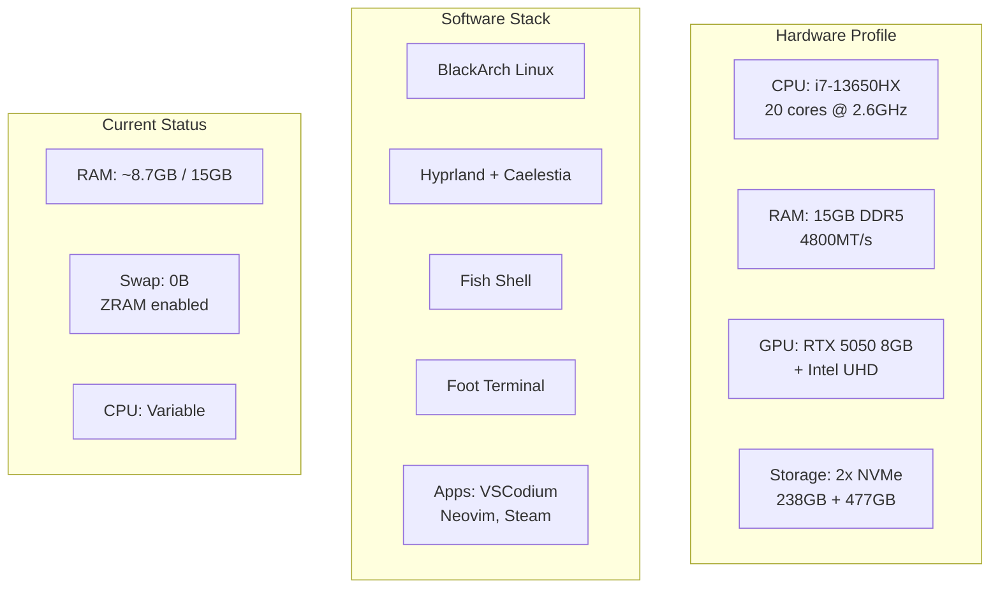

## Architecture Flow

### System Components
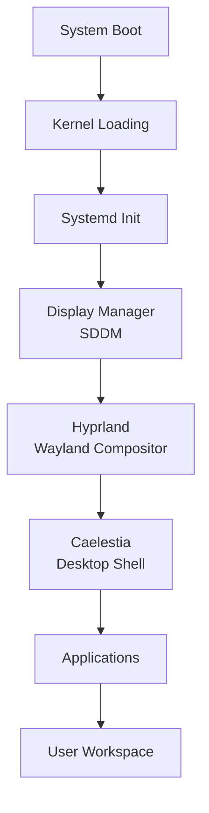

### Performance Pipeline
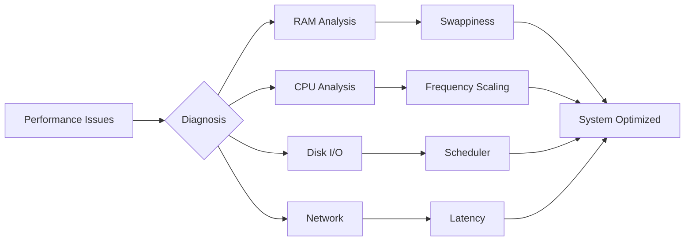

## Recent Activity

### Timeline
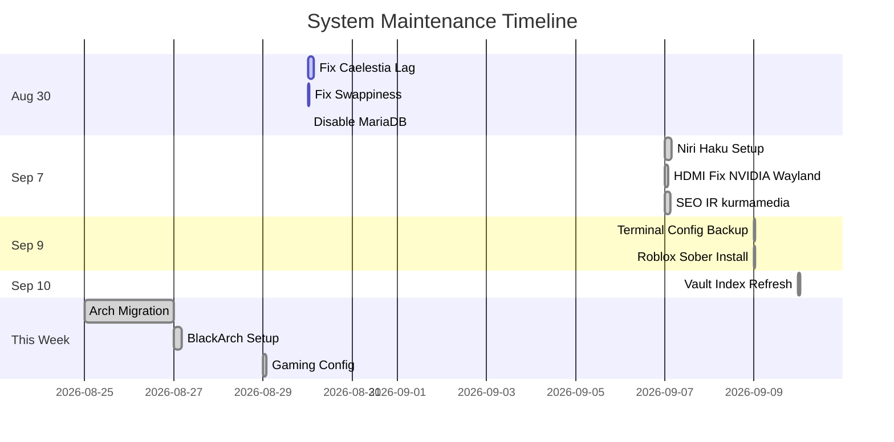

## Cross-Reference Hubs

### Performance & Optimization
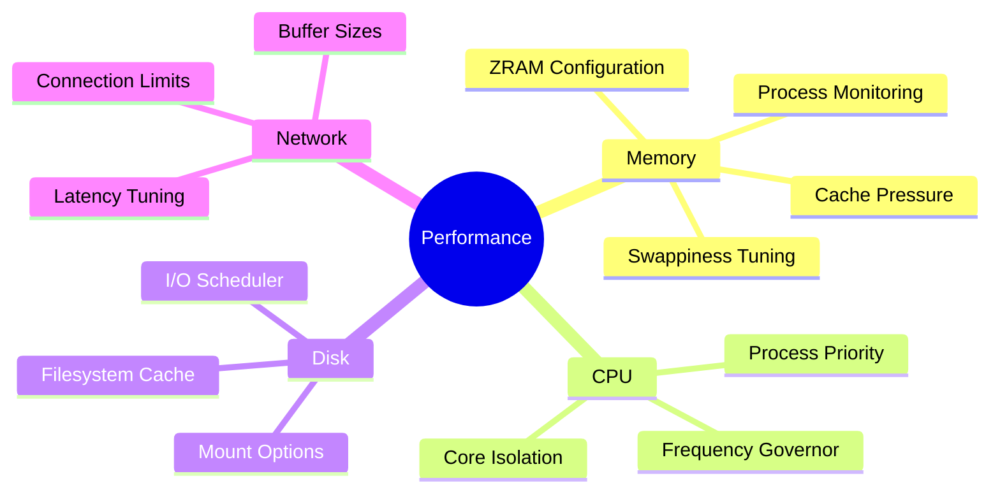

### Cybersecurity Toolkit
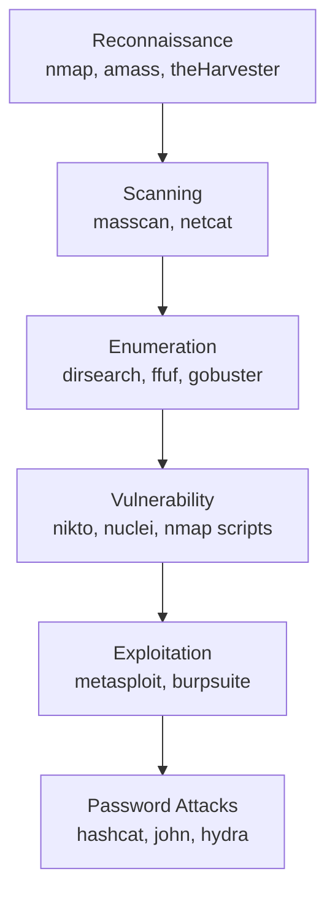

### Development Stack
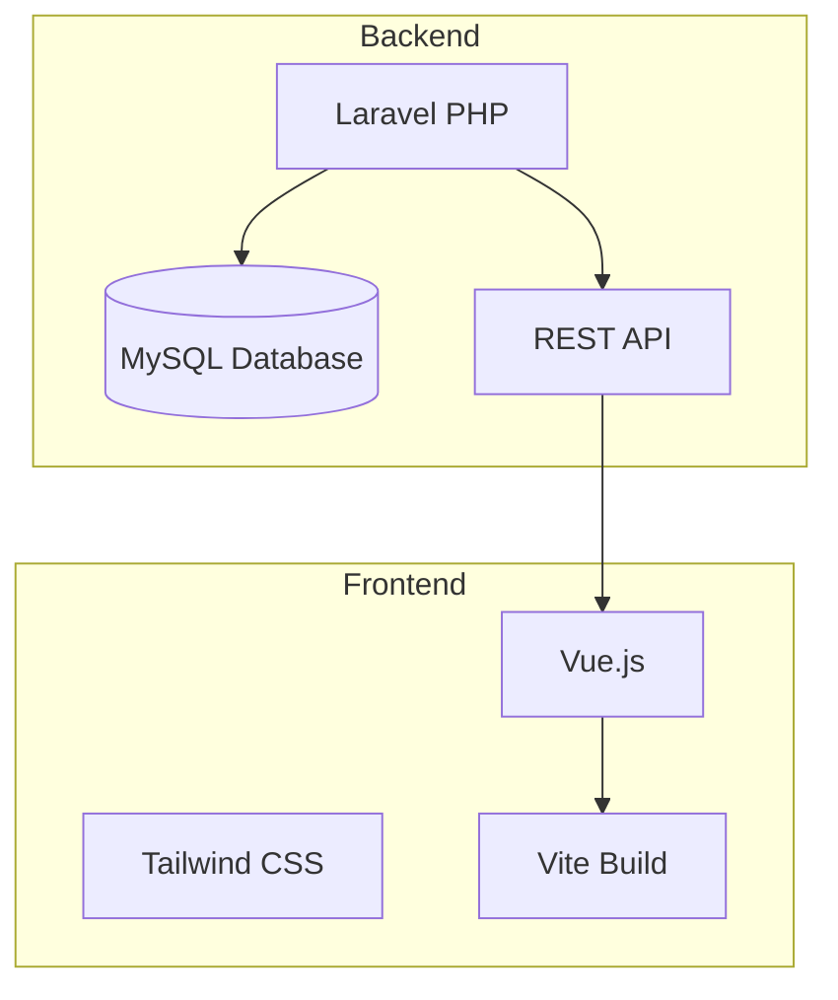

## Fix Status Dashboard (Updated 2026-09-10)

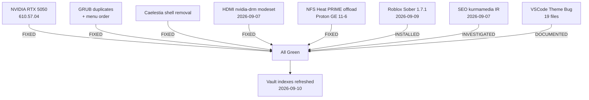

## Vault Growth Map

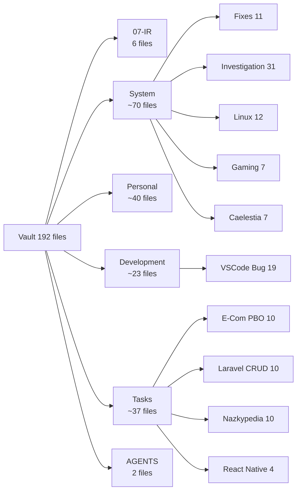

## Incident Response Workflow

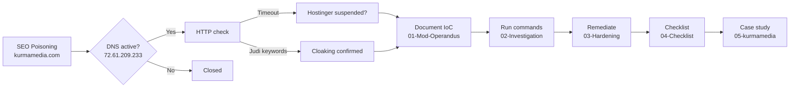

## Gaming Pipeline

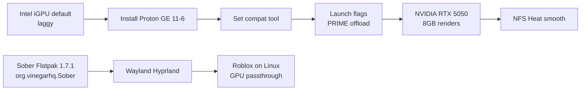

## Folder Structure

```
Obsidian Vault/ (192 md files, updated 2026-09-10)
├── Map of Content.md     <-- YOU ARE HERE
├── README.md / Path.md / PROMPTS.md
│
├── 07-Incident Response/
│   └── SEO-Poisoning-Analysis/  # 6 files: 00-Overview to 05-Case-Study
├── AGENTS/                # AI-CLI-Agents.md + README.md
│
├── System/
│   ├── Linux/            # 12 files: Arch-Perf, BlackArch, Hyprland, ZRAM, CLI, Monitoring
│   ├── Caelestia/        # 7 files: 00-Overview, Architecture, Keybinds, Lock, Mod-Guide, Config-Ref
│   ├── Caelestia-Investigation/  # 31 files: perf debugging
│   ├── Fixes/            # 11 files: NVIDIA x2, GRUB x3, HDMI, Secure-Boot, Quick-Ref, Visuals, README
│   ├── Gaming/           # 7 files: README, Setup-Log, Problem, Solution, System-Info, Launch, Troubleshooting
│   ├── Display-Server/   # hyprland-trackpad-sensitivity.md
│   ├── Starship Installation.md
│   ├── Shell Startup Order.md
│   ├── System-Architecture.md
│   ├── Troubleshooting Steps.md
│   ├── Caelestia Dotfiles Context.md
│   ├── KDE-Plasma-Ricing.md
│   ├── hakuspace-niri-setup-2026-09-07.md
│   ├── terminal-config-backup-2026-09-09.md
│   └── roblox-sober-install.md  # 2026-09-09
│
├── Personal/
│   ├── Cybersecurity/
│   │   ├── Blackarch/    # 7 files
│   │   ├── Tools/        # 9 files: Burp, Nmap, Nuclei, Sqlmap, Dirsearch, Fuzzing
│   │   └── Requierements/ # 6 files: Owasp, Pentest, Auth, DB
│   ├── Device/           # 9 files: 00-Overview to 08-Boot
│   ├── School/           # P3, P3-2, What-to-Create
│   ├── Session-Logs/     # 2026-08-29-Caelestia-Session (7 files)
│   └── Spreadsheets-Auth/ # 4 files
│
├── Development/
│   ├── Database/         # 2 files
│   ├── Github/           # 1 file
│   ├── Prompts/          # empty
│   ├── VSCode/           # empty
│   └── VSCode Theme Bug/ # 19 files: 00-MOC to 15-Matrix + Report + Tags
│
└── Tasks/
    ├── Arch Migration.md / Arch Linux System Fixes.md / Automated tools.md
    ├── E-Commerce PBO/   # 10 files
    ├── Laravel-CRUD/     # 10 files
    ├── Nazkypedia-UI-Improvements/  # 10 files
    └── React-Native-Taskmanager/    # 4 files
```

## Tag Ecosystem

### Related Tags
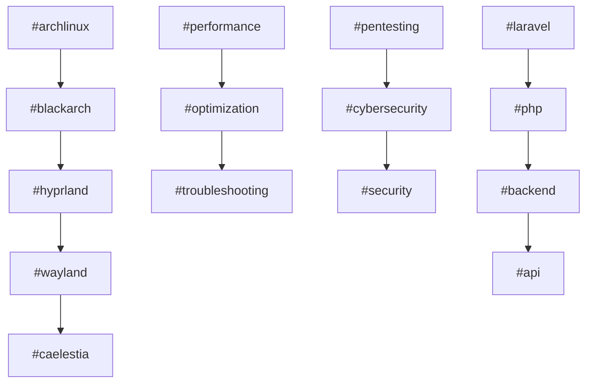

## Resource Usage

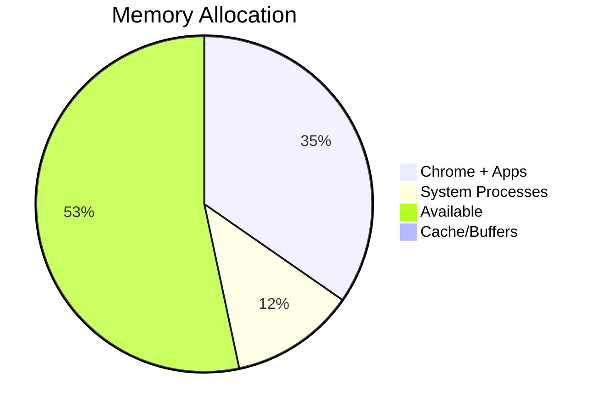

**Tags:** #moc #index #navigation #vault #knowledge-base