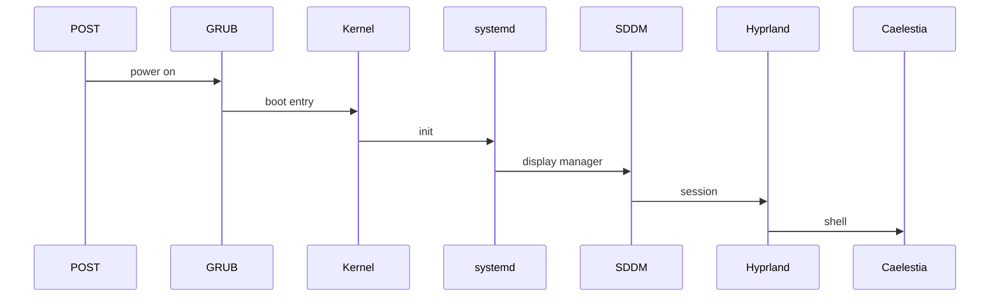

# Boot Sequence Cheatsheet

> Standalone reference. No links in or out. Embed-only.

## Steps

1. BIOS/UEFI POST
2. GRUB loader picks kernel
3. Kernel starts systemd
4. SDDM logs in
5. Hyprland compositor starts
6. Caelestia shell takes over the bar/launcher

## Diagram

![[boot-sequence.svg]]

Handy when something breaks below the desktop: each stage leaves a log to check.

## Tag Line

Tags: #boot #system #troubleshooting