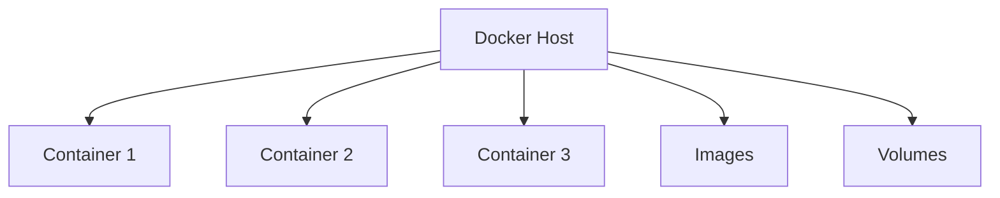

# Docker Container Architecture

> Standalone reference. No links in or out. Embed-only.

## Pieces

- Host runs the daemon and network stack
- Containers are isolated processes from images
- Images are read-only blueprints
- Volumes persist data past container lifecycle

## Diagram

![[docker-architecture.svg]]

Ports map host to container (`8080:80`), named volumes survive restarts, bind mounts mirror live code.

## Tag Line

Tags: #docker #containers #devops