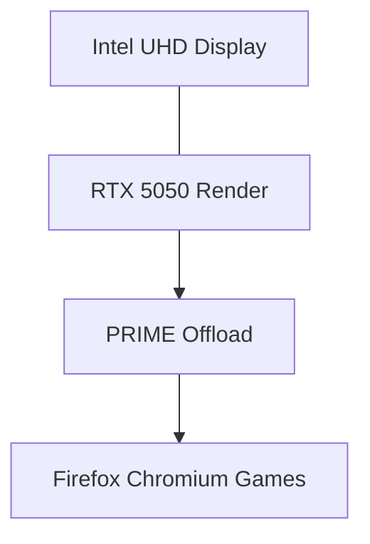

# GPU Offload Pipeline

> Standalone reference. No links in or out. Embed-only.

## Two GPU Story

- Intel UHD drives the desktop compositor and Wayland surfaces
- RTX 5050 handles gaming (NFS Heat via Proton) and CUDA workloads
- PRIME offload routes heavy apps to the discrete GPU on demand

## Diagram

![[gpu-pipeline.svg]]

Hybrid graphics keeps the desktop idle at low wattage while the big GPU stays asleep until needed.

## Tag Line

Tags: #gpu #nvidia #performance