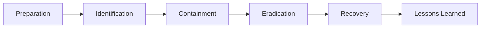

# Incident Response Lifecycle

> Standalone reference. No links in or out. Embed-only.

## SANS PICERL Phases

- Preparation: playbooks, tools, contacts
- Identification: triage and scope the alert
- Containment: stop spread, preserve evidence
- Eradication: remove root cause and artifacts
- Recovery: restore from clean state
- Lessons: document, improve, follow up

## Diagram

![[ir-lifecycle.svg]]

Evidence handling matters more than speed. Timestamps, chain of custody, disk images, no tainted memory.

## Tag Line

Tags: #incident-response #security #forensics