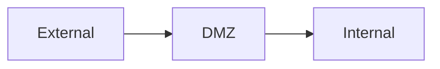

# Network Attack Surface Notes

> Standalone reference. No links in or out. Embed-only.

## Layers

- External: internet-facing edge, load balancers, VPN
- DMZ: web servers, public APIs reachable from outside
- Internal: application servers, databases, AD

## Diagram

![[network-attack-surface.svg]]

The fun is always at the boundary: misconfigured Border Gateway, public buckets, exposed debugging ports.

## Tag Line

Tags: #network #security #recon