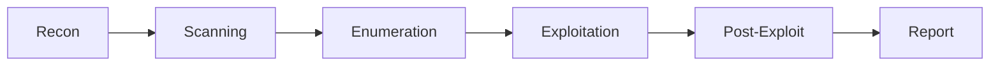

# Pentest Kill Chain Map

> Standalone reference. No links in or out. Embed-only.

## Stages

| Stage | Tools |
|-------|-------|
| Recon | amass, crt.sh, theHarvester |
| Scanning | nmap, masscan |
| Enumeration | ffuf, gobuster, whatweb |
| Exploitation | metasploit, sqlmap, framework |
| Post-Exploit | mimikatz, bloodhound, linpeas |
| Report | documented evidence |

## Diagram

![[kill-chain.svg]]

Every finding needs a screenshot and a timestamped log entry. No tool output, no proof.

## Tag Line

Tags: #pentesting #methodology #recon