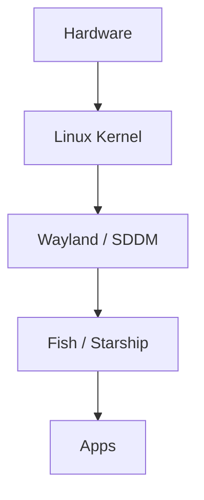

# System Architecture Overview

> Standalone reference. No links in or out. Embed-only.

## Layers

- Hardware: i7 13650HX, 15GB DDR5, RTX 5050
- Kernel: Linux 6.x (BlackArch)
- Display: Wayland via Hyprland, SDDM login
- Shell: Fish + Starship prompt, Foot terminal
- Apps: VSCodium, Neovim, Steam

## Diagram

![[system-architecture.svg]]

The stack runs headless into a tiling compositor: no full desktop environment, just Hyprland with the Caelestia shell on top.

## Tag Line

Tags: #architecture #system #linux