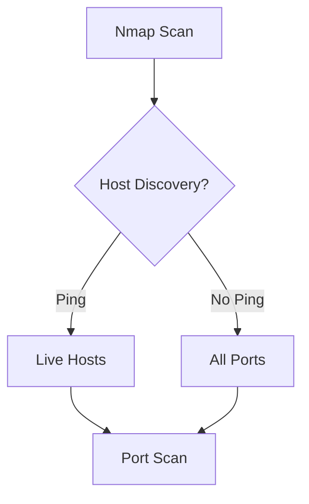
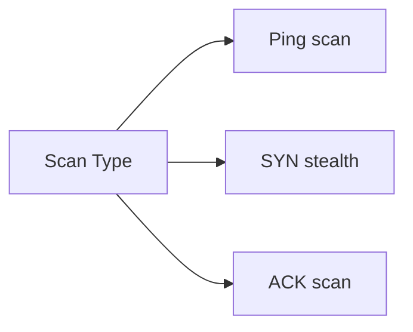

# Nmap - Network Mapper

> **Tool:** Security Scanner
> **Purpose:** Network Reconnaissance
> **Updated:** September 2026

---

## Quick Reference



## Basic Scanning

### Single Target
```bash
nmap target.com              # Basic scan
nmap -v target.com             # Verbose
nmap -oA scan target.com         # All outputs
```

### Network Ranges
```bash
nmap 192.168.1.1-254           # IP range
nmap -sn 192.168.1.0/24              # Discovery scan
nmap 10.0.0.0/8                 # Large network
```

## Port Selection

| Flag | Ports Scanned | Speed |
|------|----------------|-------|
| `-p 22,80,443` | Specific | Fast |
| `-p-` | All 65535 | Slow |
| `-F` | Top 100 | Medium |
| `-p1-1000` | Custom | Medium |

```bash
# Common ports only
nmap -p 22,80,443,8080,3389 target.com

# All ports (slow)
nmap -p- target.com

# Top ports
nmap --top-ports 100 target.com
```

## Scan Types

### Discovery


```bash
# Ping sweep (no port scan)
nmap -sn target.com

# SYN stealth (requires sudo)
sudo nmap -sS target.com

# TCP ACK (firewall testing)
sudo nmap -sA target.com
```

### Version Detection
```bash
# Service version detection
nmap -sV target.com

# Intensity 0-9
nmap -sV --version-intensity 9 target.com

# Light scan
nmap -sV --version-light target.com
```

### OS Detection
```bash
# OS + services + versions
nmap -A target.com

# OS detection only
sudo nmap -O target.com
```

## Script Scanning

### Built-in Scripts
```bash
# Default scripts
nmap -sC target.com

# Vulnerability scan
nmap --script vuln target.com

# HTTP enumeration
nmap --script http-enum target.com

# SSL analysis
nmap --script ssl-enum-ciphers target.com
```

### Script Categories
```bash
nmap --script auth,brute target.com      # Auth attacks
nmap --script default target.com       # Default set
nmap --script discovery target.com      # Discovery
nmap --script exploit target.com       # Exploit scripts
nmap --script vuln target.com          # Vulnerabilities
nmap --script malware target.com       # Malware detection
```

## Output Formats

### Save Results
```bash
nmap -oN scan.txt target.com         # Normal text
nmap -oX scan.xml target.com        # XML
nmap -oG scan.gnmap target.com      # Grepable
nmap -oA scan.target.com target.com       # All formats
```

### Quick Comparison
```bash
# Normal text (readable)
# XML (parsing)
# Grepable (grep-friendly)
# JSON (scripting)
```

## Timing & Performance

### Timing Templates
| Level | Speed | Noise |
|--------|-------|-------|
| `-T0` | Slowest | Stealth |
| `-T2` | Polite | Normal |
| `-T4` | Fast | Noticeable |
| `-T5` | Fastest | Loud |

```bash
# Polite scan
nmap -T2 target.com

# Aggressive (default)
nmap -T4 target.com
```

### Performance Tuning
```bash
# Parallelism
nmap --min-parallelism 10 target.com

# Rate limiting
nmap --max-rate 100 target.com
```

## Evasion Techniques

```bash
# Fragment packets
sudo nmap -f target.com

# Decoy scan
nmap -D RND:10 target.com

# Source port spoofing
nmap --source-port 53 target.com
nmap --data-length 50 target.com
```

## Common Examples

### Full Audit
```bash
sudo nmap -A -T4 -p- target.com -oA scan_audit
```

### Web Server Scan
```bash
nmap -sV -p 80,443,8080 target.com
nmap -sC --script http-* target.com
```

### Firewall Testing
```bash
# ACK scan (often passes firewalls)
sudo nmap -sA target.com

# Script scan for firewall detection
nmap --script firewalk --script-args firewalk.payloads target.com
```

**Tags:** #nmap #network #recon #security #scanner
