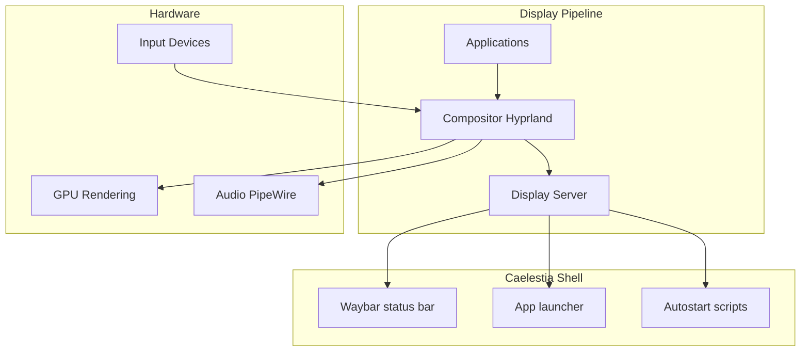
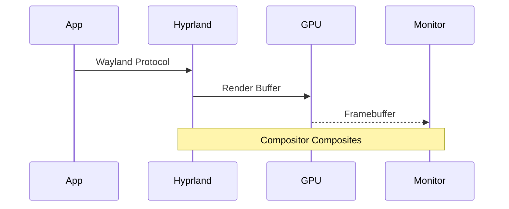
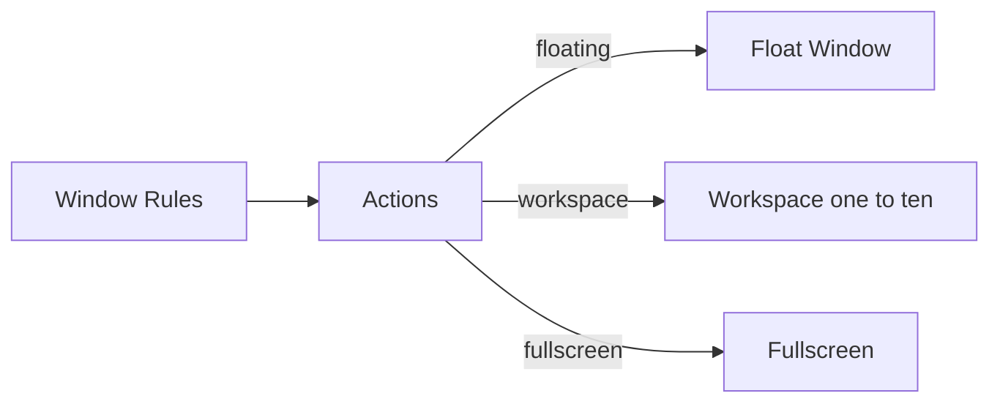

# Caelestia System Architecture

> **Desktop Environment:** Hyprland + Caelestia Shell
> **Category:** Configuration
> **Last Updated:** September 2026

---

## Architecture Overview



## Component Stack

### Layers

| Layer | Component | Purpose |
|-------|-------------|---------|
| **1** | Kernel (Linux) | System calls, hardware access |
| **2** | Wayland | Display protocol |
| **3** | Hyprland | Compositor, window management |
| **4** | Caelestia | Shell customizations |
| **5** | Applications | User software |

## Key Files

```bash
~/.config/
├── hypr/                    # Hyprland config
│   └── hyprland.conf       # Main compositor config
├── caelestia/               # Caelestia-specific
│   ├── config.conf         # Shell settings
│   ├── autostart          # Auto-launch apps
│   └── scripts/           # Custom scripts
├── waybar/                # Status bar config
└── foot/                  # Terminal config
```

## Data Flow



## Window Management



## Tags
 #caelestia #hyprland