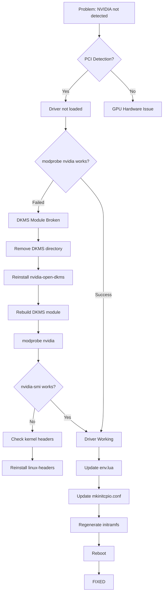
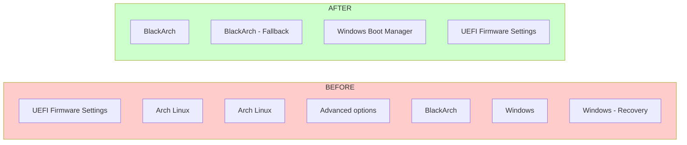
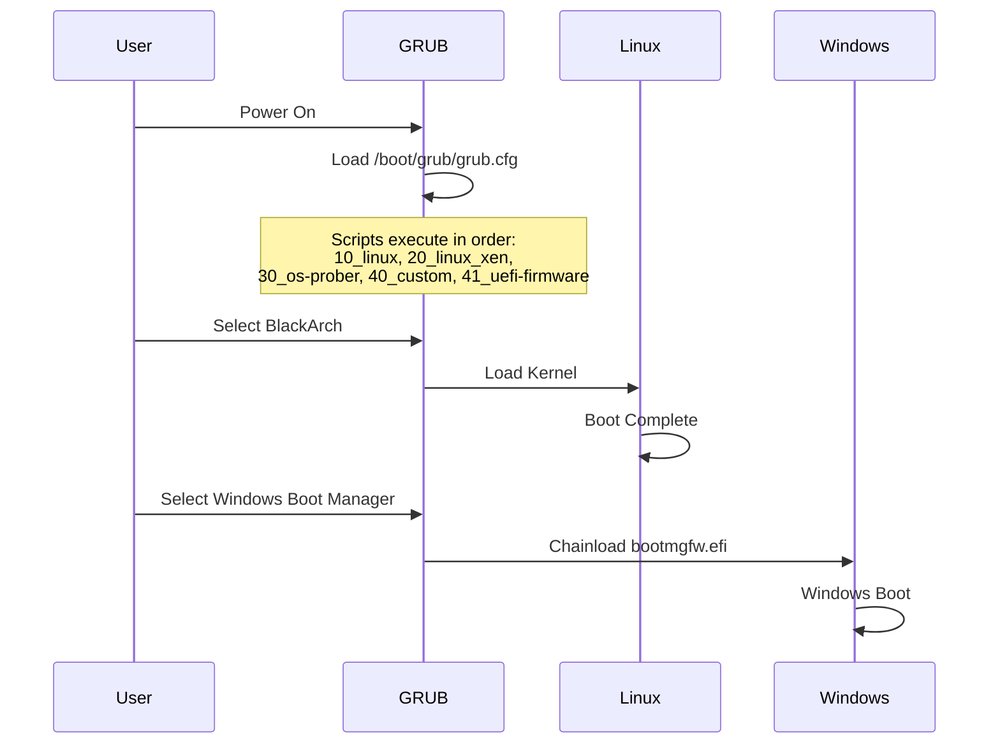
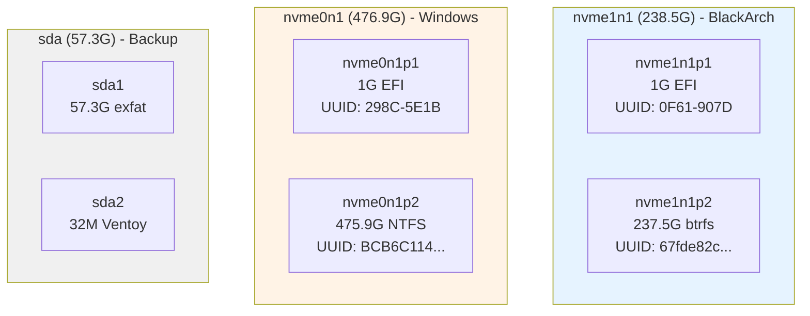
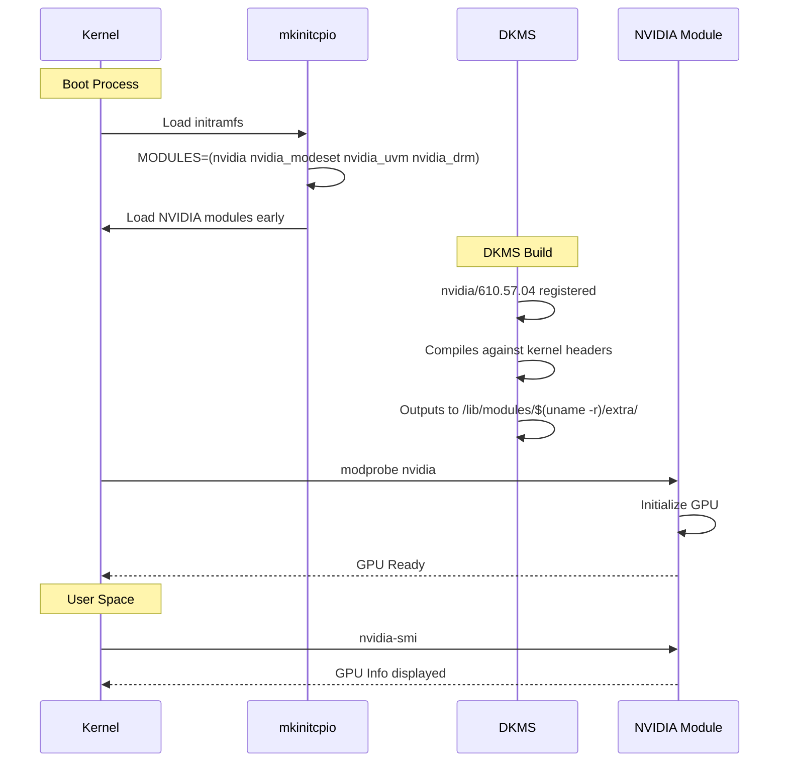
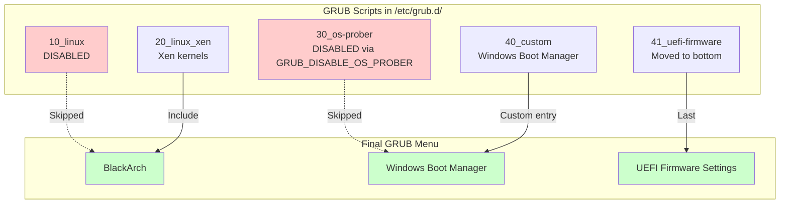
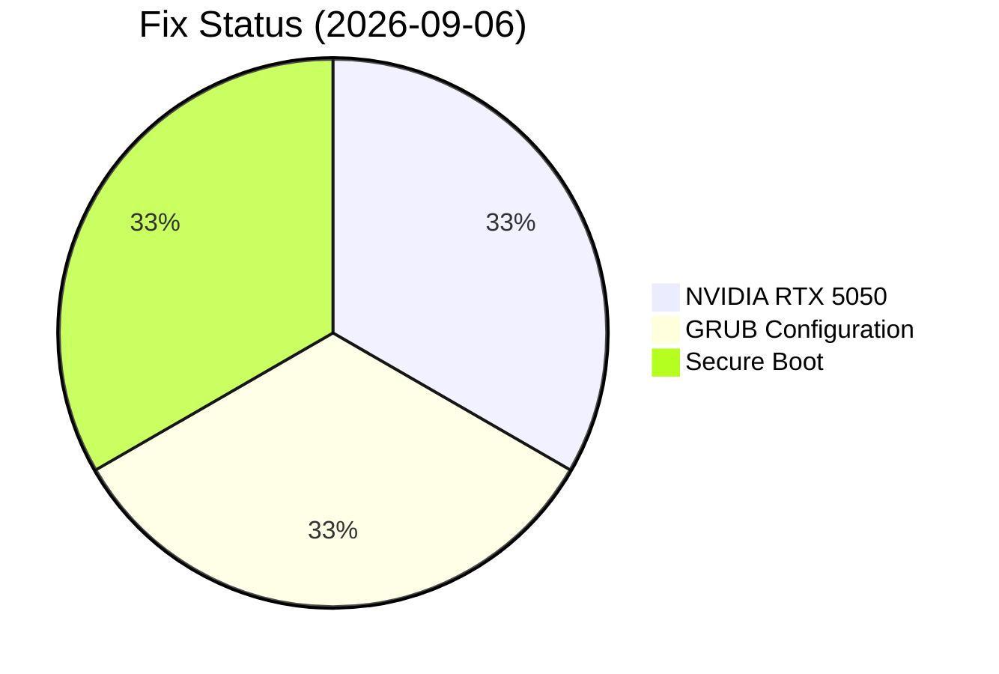

# System Fixes - Visual Guide

**Last Updated:** 2026-09-06

---

## NVIDIA Driver Fix - Flowchart

---

## GRUB Fix - Before vs After

---

## Boot Process - GRUB Menu Flow

---

## Disk Layout Diagram

---

## NVIDIA Module Loading Sequence

---

## GRUB Script Execution Order

---

## System State Summary

