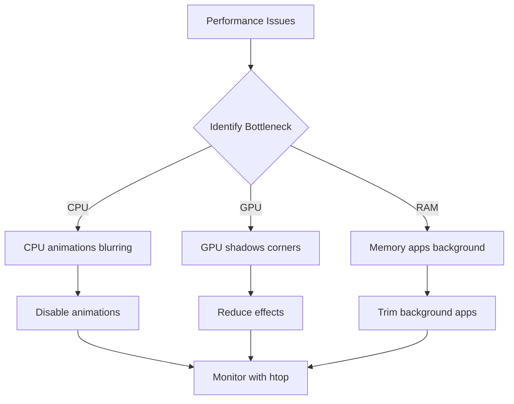
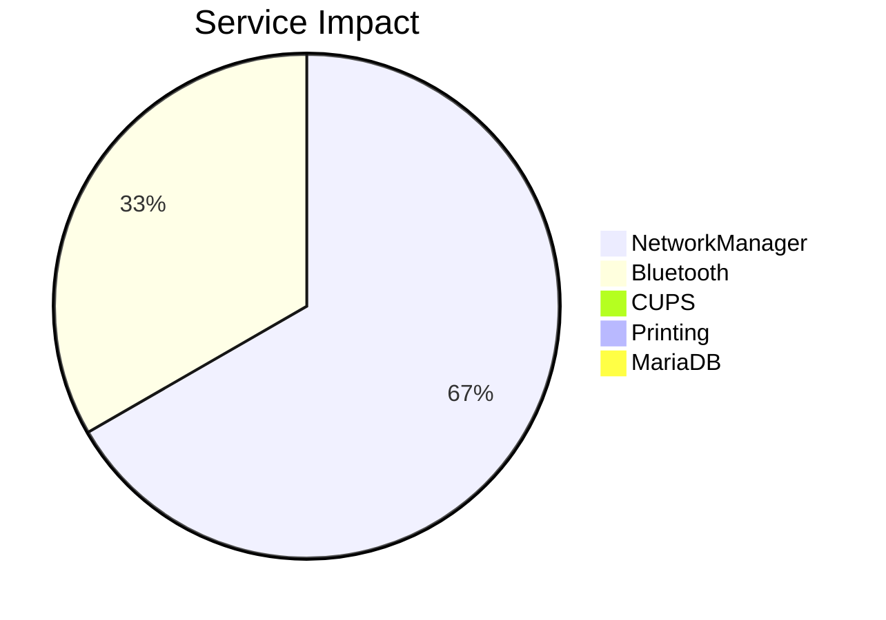

# Hyprland Optimization

> **Compositor:** Hyprland (Wayland)
> **Purpose:** Performance Tuning
> **Last Updated:** September 2026

---

## Optimization Flowchart



## Decorations

### Disable Blur (Major Impact)
```bash
# ~/.config/hypr/hyprland.conf
decoration {
    blur {
        enabled = false     # Disable blur globally
        new_window_borders_color=blur 0
    }
}

# Runtime toggle
hyprctl keyword decoration.blur.enabled false
```

### Disable Shadows
```bash
decoration {
    shadow {
        enabled = false
        render_power: 1        # GPU render power: 1-5
    }
}
```

### Reduce Rounding
```bash
decoration {
    rounding 0                # Sharp corners
    border_size = 1
}
```

## Animations

### Full Disable
```bash
animations {
    enabled = false
    # Fast spring animations if enabled
    bezier = smooth, 0.05, 0.9, 0.1, 1.05
}

# Quick transition
animation = windows, 1, 7, myBezier, default
animation = fade, 1, 5, default
```

### Per-Window Rules
```bash
# Force float for heavy apps
windowrulev2 = float, class:^(mpv)$
windowrulev2 = opacity 0.9 0.9, class:^(mpv)$
```

## XWayland Optimization
```bash
xwayland {
    force_zero_scaling = true
}
```

## Services Review

### Unnecessary Services
```bash
# List running services
systemctl --user list-units --type=service --state=running
```



### Disable Unused
```bash
# Printing (if no printer)
sudo systemctl stop cups
sudo systemctl disable cups

# Database (if local dev only)
sudo systemctl stop mariadb
sudo systemctl disable mariadb
```

## Quick Toggles

### Keyboard Binds
```bash
# ~/.config/hypr/binds.conf

# Toggle blur
bind = SUPER, B, exec, hyprctl keyword decoration.blur.enabled toggle

# Toggle animations
bind = SUPER, A, exec, hyprctl keyword animations.enabled toggle

# Force exit fullscreen
bind = SUPER, F, exit, 0
```

## Monitoring
```bash
# Watch GPU usage
nvidia-smi
# Check compositor logs
tail -f ~/.config/hypr/hyprland.log
```

**Tags:** #linux #optimization #performance #tuning