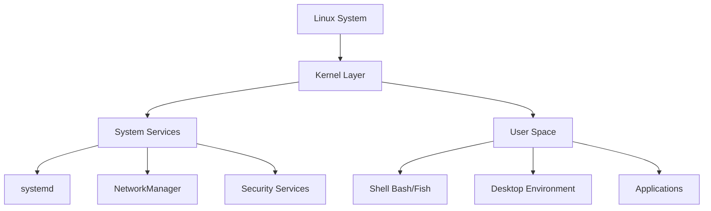
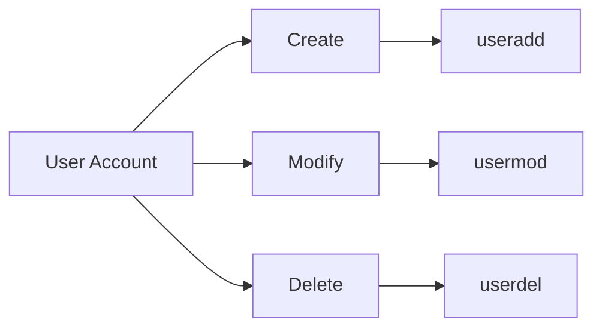
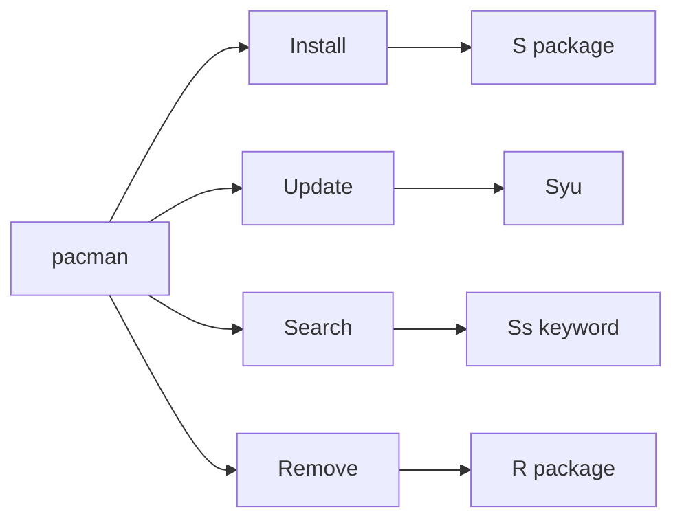
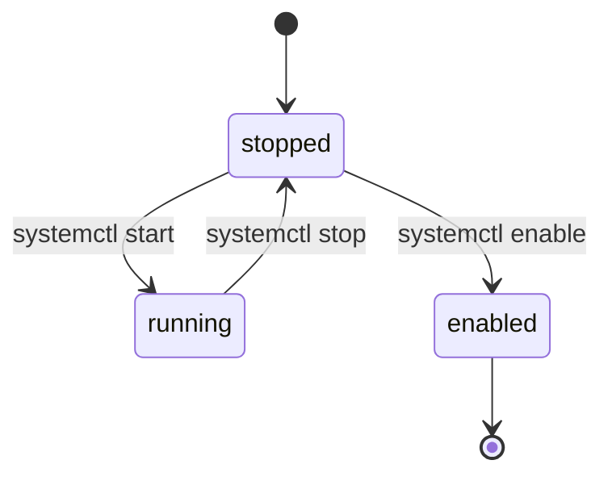
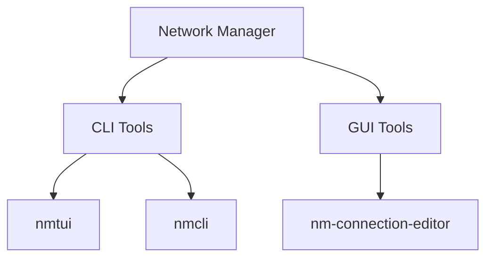

# Linux Reference

> **Category:** System Administration
> **Distribution:** BlackArch Linux
> **Last Updated:** September 2026

---

## System Overview



## System Information

### Hardware Inventory
```bash
# Kernel & OS
uname -a              # Full kernel info
cat /etc/os-release    # OS details
uptime                 # Load averages
hostname              # System name

# CPU Info
lscpu                  # Detailed CPU specs
nproc                  # Core count

# Memory
free -h                # Human-readable RAM
cat /proc/meminfo       # Memory details

# Disk & Storage
df -h                  # Disk usage
lsblk                  # Block devices
fdisk -l              # Partition table

# Hardware
lspci                  # PCI devices
lsusb                   # USB devices
inxi -Fxxx              # Full hardware summary
```

## User Management

### Account Operations


```bash
# Add new user
sudo useradd -m -G wheel,audio,video -s /bin/bash username

# Modify user
sudo usermod -aG wheel username

# Sudo access (edit /etc/sudoers.d/ with visudo)
username ALL=(ALL) NOPASSWD: ALL
```

## Package Management

### Pacman Commands


```bash
# Synchronize & upgrade
sudo pacman -Syu              # Full system update

# Install packages
sudo pacman -S packagename     # Single package
sudo pacman -S pkg1 pkg2      # Multiple packages

# Search & Query
pacman -Ss keyword          # Search remote
pacman -Qs keyword         # Search installed

# Remove packages
sudo pacman -R packagename     # Remove
sudo pacman -Rns packagename  # With deps & config
```

### AUR Helper (paru/yay)
```bash
paru -S packagename          # Install AUR package
paru -Syu                  # Update all AUR
paru -Ss keyword            # Search AUR
```

## Services & Systemd

### Service Lifecycle


```bash
# Service control
systemctl start servicename       # Start now
systemctl stop servicename        # Stop now
systemctl restart servicename     # Restart
systemctl reload servicename      # Reload config

# Boot configuration  
systemctl enable servicename       # Start at boot
systemctl disable servicename     # Disable boot

# Status & Logs
systemctl status servicename     # Current state
journalctl -u servicename       # Service logs
journalctl -xe --no-pager       # Full journal
```

## File System Operations

### Storage Management
```bash
# Mount management
sudo mount /dev/sdX /mnt              # Manual mount
sudo umount /mnt                      # Unmount
mount | grep sdX                         # Verify mount
lsblk -f                                 # Visual tree

# Disk usage analysis
du -sh /var/* /home/*                # Directory sizes
du -h --max-depth=1 /                 # Top-level only
ncdu -x /                          # Interactive scan
```

## Network Configuration

### Connectivity


```bash
# NetworkManager CLI
nmtui                              # Text UI
nmcli device wifi list               # WiFi networks
nmcli device wifi connect SSID password PASSWORD

# Diagnostic
ping -c 3 8.8.8.8               # Connectivity
ip addr show                       # Interfaces
ss -tulpn                         # Listening ports
```

## Performance Tuning

### Memory Management
```bash
# Swappiness (10-30 is optimal)
cat /proc/sys/vm/swappiness       # Current value
sudo sysctl vm.swappiness=10       # Temporary change

# Make permanent
echo 'vm.swappiness=10' | sudo tee /etc/sysctl.d/99-swappiness.conf

# Clear caches (emergency only)
sudo sync && echo 3 | sudo tee /proc/sys/vm/drop_caches
```

### System Monitoring
```bash
htop                                # Interactive process viewer
iotop                                # Disk I/O monitor
nethogs                              # Per-process network
bashtop / btop                      # Resource monitor
```

## Process Control

### Job Management
```bash
# Process signals
kill PID                           # Graceful terminate
kill -9 PID                        # Force kill
killall processname                  # By name

# Background jobs
command &                           # Run in background
jobs                                 # List backgrounded
fg %1                                # Bring to foreground
Ctrl+Z && bg                        # Suspend and background
```

## Tags
#administration #linux #reference