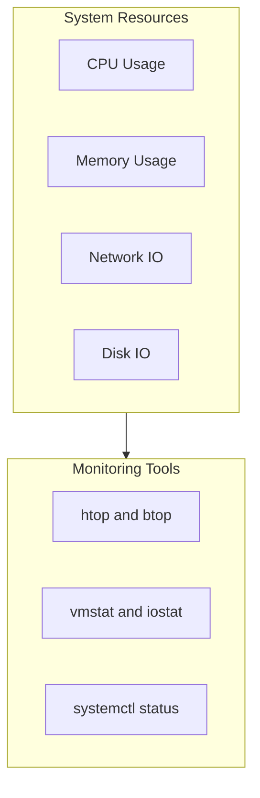
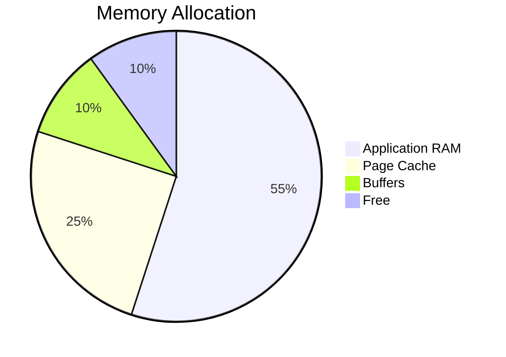

# System Monitoring Guide

> **Category:** System Administration
> **Purpose:** Resource Tracking
> **Last Updated:** September 2026

---

## Monitoring Overview



## Real-Time Monitoring

### htop (Recommended)
```bash
# Interactive process viewer
htop

# Key bindings:
# F3: Search process
# F5: Tree view
# F6: Sort by column
# t: Toggle tree
```

### Quick Commands
```bash
# CPU + Memory summary
top -n 1 | head -10

# Continuous refresh
watch -n 1 'command'
```

## CPU Monitoring

### Load Analysis
```bash
# Quick snapshot
uptime

# Extended stats
cat /proc/loadavg
# Format: 1min 5min 15min processes

# Detailed CPU info
mpstat -P ALL
```

### Process CPU Usage
```bash
# Top CPU consumers
ps aux --sort=-%cpu | head -20

# Per-core stats
mpstat -P ALL 1
```

## Memory Analysis

### RAM Usage
```bash
# Human readable
free -h

# Detailed
cat /proc/meminfo

# Per-process
ps aux --sort=-%mem | head -15
```

### Swap Activity
```bash
swapon --show
vmstat 1
# si/so columns show swap-in/swap-out KB/s
```

### Memory Pressure


## Disk Monitoring

### Usage
```bash
df -h              # Human readable
df -i               # Inode usage
du -sh /var/*        # Directory sizes
```

### I/O Activity
```bash
# Per-device stats
iostat -x 1

# Process I/O
iotop -o

# Specific device
iostat -p sda 1
```

### Health
```bash
smartctl -a /dev/sda          # SMART data
smartctl -H /dev/sda          # Health status
```

## Network Monitoring

### Active Connections
```bash
ss -tulpn                         # Listening ports
ss -tupn | grep ESTAB              # Established
```

### Bandwidth
```bash
# Real-time (nload/bwm-ng)
# Continuous monitoring
nload

# Per-process
nethogs -v
```

## Process Management

### Interactive
```bash
htop
# F9: Send signal
# k: Kill selected
```

### Command-Line Kill
```bash
kill PID                  # Graceful
kill -9 PID             # Force kill
killall process-name     # By name
```

## Service Monitoring

### systemd Services
```bash
# Failed units
systemctl --failed

# Running services
systemctl list-units --type=service --state=running

# Specific service
systemctl status servicename
```

### Logs
```bash
journalctl -u servicename -n 50 --no-pager
journalctl -f                    # Follow mode
journalctl --since "1 hour ago"
```

## Automated Checks

### Health Check Script
```bash
#!/bin/bash
# System Health Check Dashboard

echo "=== System Health ==="
echo ""
echo "Load Average:"
uptime | awk '{print $8,$9,$10}'
echo ""
echo "Memory:"
free -h | grep Mem
echo ""
echo "Top Processes:"
ps aux --sort=-%mem | head -6
echo ""
echo "Failed Services:"
systemctl --failed --no-pager
```

### Performance Alert
```bash
#!/bin/bash
# Alert if memory high
MEM_PCT=$(free | awk '/Mem/{printf "%d", $3/$2 * 100}')
[ "$MEM_PCT" -gt 90 ] && notify-send "Memory High: ${MEM_PCT}%"
```

## Dashboard View

### Summary Output
```bash
# One-liner status
echo "CPU:$(top -bn1 | grepCpu(s): | awk '{print $2}' | "
"L Mem:$(free -h | awk '/^Mem/{print $3"/"$2}' | "
"Dis:$(df -h | awk '/$HOME/{print $5}' | tr -d '%')
```

**Tags:** #performance #resources #system