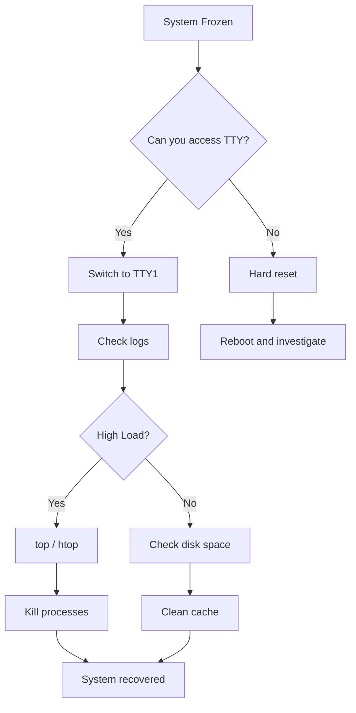
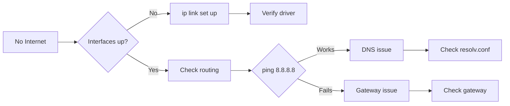
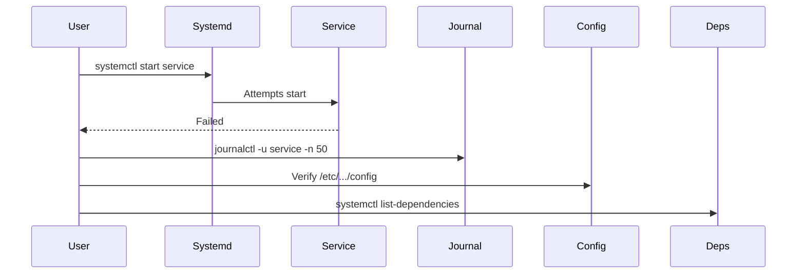

# Troubleshooting Guide

> **Category:** System Administration
> **Severity:** Varies
> **Last Updated:** September 2026

---

## Diagnostic Flowcharts

### System Unresponsive


### Network Issues


## Boot Problems

### System Won't Boot
```bash
# 1. Check boot order in UEFI/BIOS
# 2. Try recovery mode from GRUB menu

# Emergency shell
# Check /boot partition
ls /boot

# Regenerate initramfs (if /boot accessible)
sudo mkinitcpio -P linux

# Reinstall kernel if corrupted
sudo pacman -S linux linux-headers
```

### GRUB Not Showing
```bash
# Reinstall bootloader
sudo grub-install /dev/sda
sudo grub-mkconfig -o /boot/grub/grub.cfg

# Check /boot mount
mount | grep boot
df -h /boot
```

## Package Manager

### Pacman Lock Error
```bash
# Remove stale lock
sudo rm /var/lib/pacman/db.lck

# Fix signature issues
sudo rm -rf /etc/pacman.d/gnupg
sudo pacman-key --init
sudo pacman-key --populate archlinux
sudo pacman -S archlinux-keyring
```

### Database Sync
```bash
# Force refresh
sudo pacman -Syy

# Partial upgrade recovery
sudo pacman -Syu --overwrite '*'
```

## Network

### WiFi Connected, No Internet
```bash
# Test DNS resolution
ping -c 3 google.com
ping -c 3 8.8.8.8

# Reset DNS
sudo rm /etc/resolv.conf
sudo systemctl restart NetworkManager

# Check DHCP
sudo dhcpcd -k && sudo dhcpcd
```

### Service Won't Start


```bash
# Check service logs
journalctl -u NetworkManager -n 50 --no-pager

# Verify configuration
sudo systemctl restart NetworkManager
ip link show
```

## Performance

### System Lagging
```bash
# Identify bottleneck
htop                              # CPU/Memory
iotop -o                           # Disk I/O
nethogs                            # Network
vmstat 1                           # Swapping activity

# Emergency measures
sync && echo 3 | sudo tee /proc/sys/vm/drop_caches
```

### High CPU Temperature
```bash
# Check temps
sensors

# Fan control (if ThinkPad)
sudo tlp setcharge 80  # Start charge at 80%

# Check for thermal paste reapplication
# Consider repasting if sustained >85C
```

## Application Crashes

### Firefox Won't Load
```bash
# Safe mode
firefox --safe-mode

# Profile reset
mv ~/.mozilla/firefox/profile.default ~/.mozilla/firefox/backup

# Cache clear
rm -rf ~/.cache/mozilla/firefox/*
```

### VSCode Fails
```bash
# Full reset
rm -rf ~/.config/Code
rm -rf ~/.config/Code/User

# Extension disable
code --disable-extensions

# Verbose logging
code --verbose --disable-gpu
```

## Disk Space

### Storage Full
```bash
# Find large directories
sudo du -sh /var/* /home/* /tmp/*
sudo pacman -Scc        # Clean cache
sudo journalctl --vacuum-size=100M
```

### Filesystem Read-Only
```bash
# Emergency remount
sudo mount -o remount,rw /

# Check fstab UUID
cat /etc/fstab
blkid /dev/partition
```

## Tags
#troubleshooting #linux #system #fix #debugging