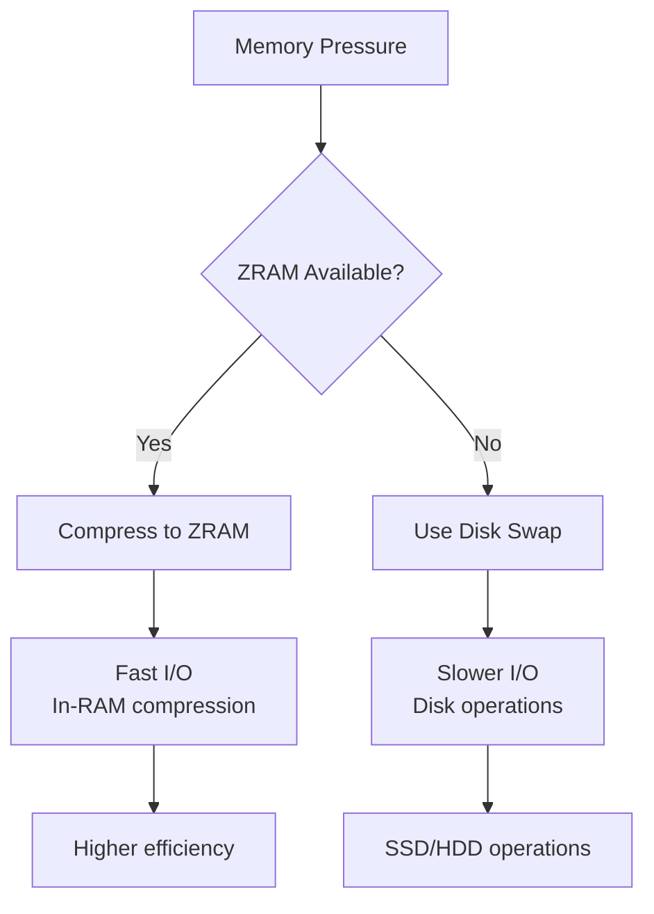
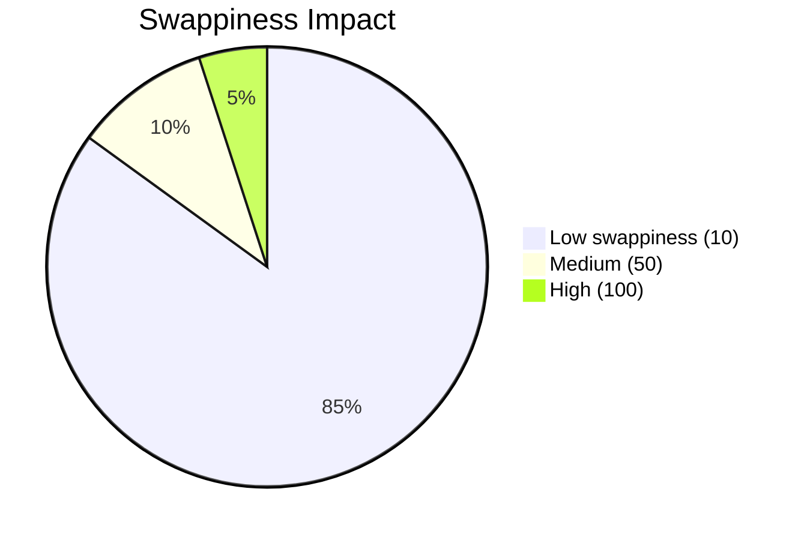
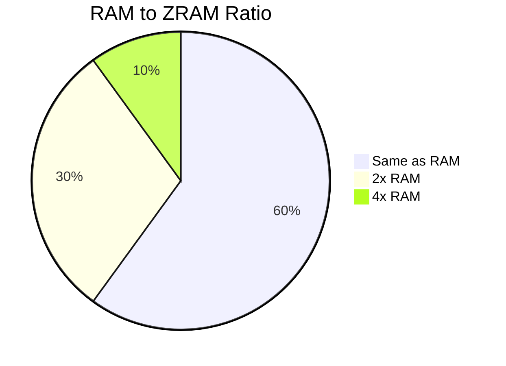

# ZRAM Swap Guide

> **Category:** Performance
> **Purpose:** Memory Optimization
> **Last Updated:** September 2026

---

## What is ZRAM?

ZRAM creates compressed block devices in RAM that function as swap space, providing benefits over disk swap:



### Key Benefits

| Benefit | Description |
|---------|-------------|
| **Speed** | Data stays in RAM, compressed |
| **Compression** | 2-3x space savings |
| **No disk wear | RAM only, zero flash wear |
| **Instant access | No seek latency |

## Setup

### Installation
```bash
# Install zram-generator
sudo pacman -S zram-generator

# Or manual setup
sudo modprobe zram
```

### Configuration File
```ini
# /etc/systemd/zram-generator.conf
[zram0]
zram-size = ram-size        # Same as RAM for systems with 16GB+
compression-algorithm = lz4    # lz4 or zstd
zram-fraction = 0.5          # 50% of RAM
```

### Manual Configuration
```bash
# Load module
sudo modprobe zram

# Set compression algorithm
echo lz4 | sudo tee /sys/block/zram0/comp_algorithm

# Set size (recommend: 2x RAM or more)
echo 8G | sudo tee /sys/block/zram0/disksize

# Create swap
sudo mkswap /dev/zram0

# Enable with priority (higher = preferred)
sudo swapon /dev/zram0 --priority=100
```

## Algorithms Comparison

| Algorithm | Compression | Speed | Use Case |
|-----------|-------------|--------|----------|
| lz4 | 2-3x | Fastest | Default/performance |
| lzo | 2x | Fast | Legacy systems |
| zstd | 3-4x | Moderate | Storage savings |

```bash
# Verify compression ratio
cat /sys/block/zram0/mm_stat
```

## Tuning Parameters

### Swappiness


Lower values keep more data in RAM, benefiting ZRAM systems:
```bash
# Current value
cat /proc/sys/vm/swappiness

# Temporary set to 10
echo 10 | sudo tee /proc/sys/vm/swappiness

# Permanent: /etc/sysctl.d/99-zram.conf
vm.swappiness=10
```

### VFS Cache Pressure
```bash
# Default 100, lower keeps caches longer
echo 50 | sudo tee /proc/sys/vm/vfs_cache_pressure
```

## Monitoring

### Status Commands
```bash
# List all swap devices
swapon --show

# ZRAM statistics
cat /sys/block/zram0/stat

# Compression ratio
cat /sys/block/zram0/mm_stat
```

### Live Monitoring
```bash
# Watch compression stats
watch -n 1 'cat /sys/block/zram0/mm_stat'

# Include in htop display
htop
# Press F2 > Columns > Add ZRAM stats
```

## Troubleshooting

### Not Active
```bash
# Verify module loaded
lsmod | grep zram

# Check dmesg for errors
dmesg | grep -i zram
```

### System Using Disk Swap Instead
```bash
# Verify ZRAM active
swapon --show

# Check swappiness
cat /proc/sys/vm/swappiness
# Should be 10-30, not 100
```

### Performance Issues
```bash
# Switch algorithm
echo zstd | sudo tee /sys/block/zram0/comp_algorithm

# Reduce size if problematic
sudo swapoff /dev/zram0
echo 2G | sudo tee /sys/block/zram0/disksize
sudo mkswap /dev/zram0
sudo swapon /dev/zram0
```

## Recommendations

### Size Guidelines


| System RAM | ZRAM Recommended |
|-----------|-----------------|
| 8GB | 4-8GB |
| 16GB | 8-16GB |
| 32GB | 16-32GB |

**Tags:** #zram #swap #performance #memory #linux #tuning