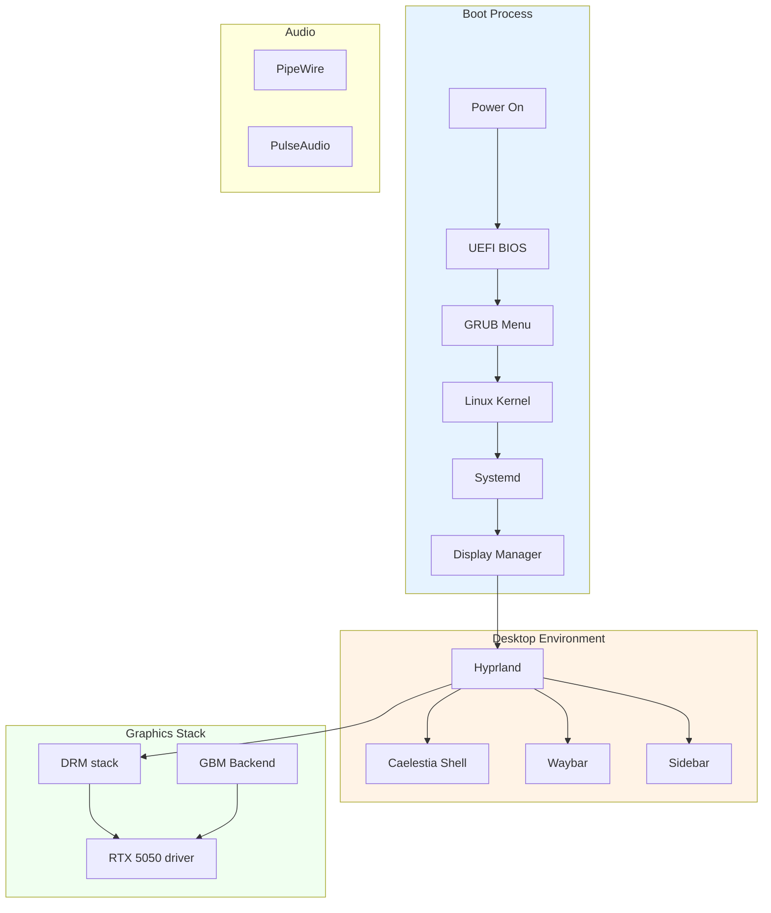
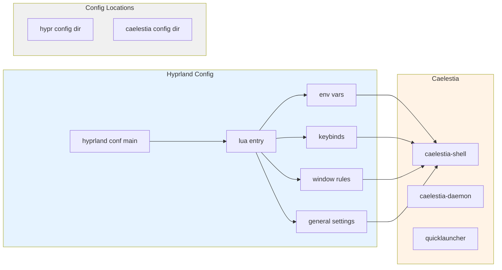
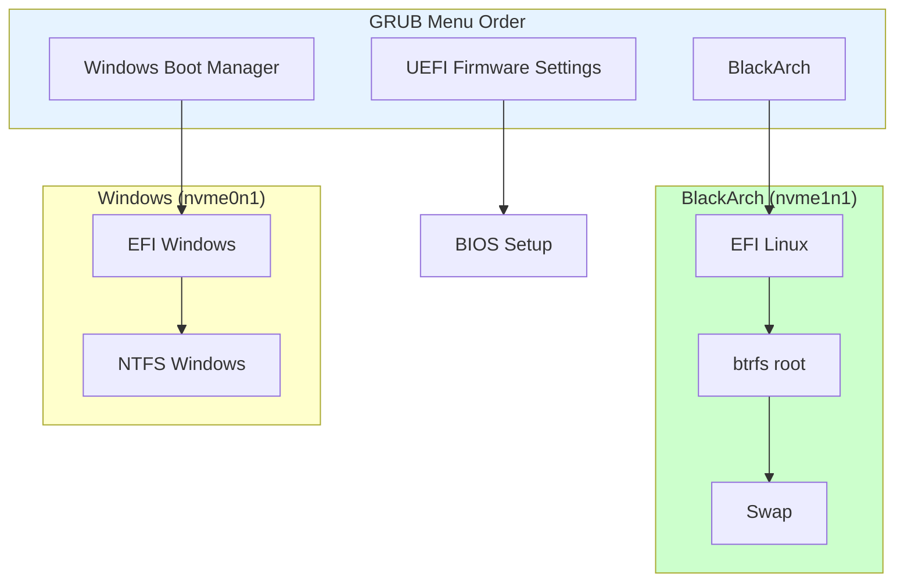
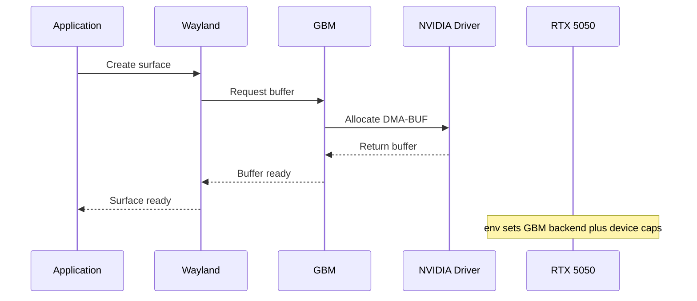

# System Architecture Overview

**Last Updated:** 2026-09-06

---

## BlackArch System Diagram



---

## Hyprland Configuration Architecture



---

## Dual Boot Setup



---

## NVIDIA Wayland Pipeline



---

## Fix Status Timeline

```mermaid
gantt
    title System Fixes 2026-09-06
    dateFormat  HH-mm
    section NVIDIA
    DKMS Fix           :done, 11:00, 5m
    Driver Install     :done, 11:05, 10m
    env.lua Update     :done, 11:10, 2m
    mkinitcpio Update  :done, 11:12, 2m
    section GRUB
    Disable 10_linux   :done, 11:20, 1m
    OS-Prober Disable  :done, 11:21, 1m
    Windows Entry      :done, 11:22, 5m
    UEFI Order Fix    :done, 11:27, 1m
    Regenerate GRUB    :done, 11:28, 2m
```
