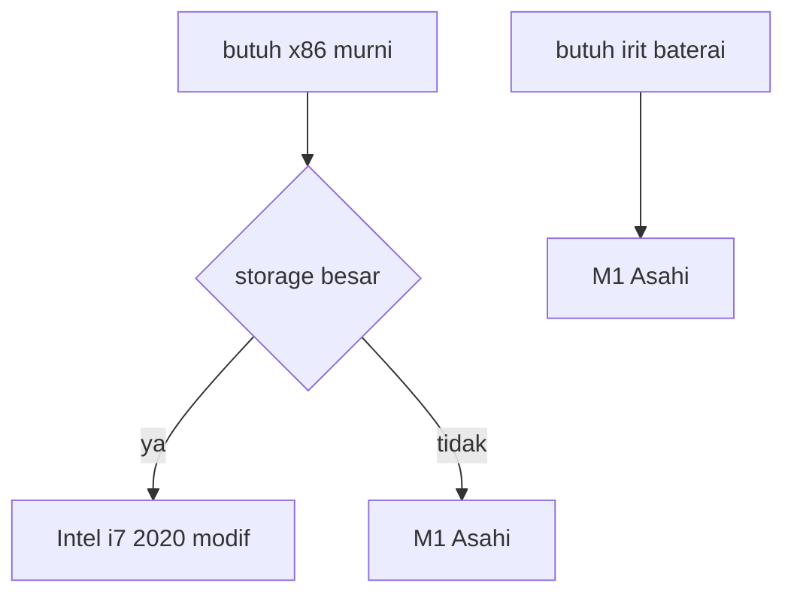

# MacBook Plans Index

**Dibuat:** 2026-09-11
**Tipe:** indeks atas. File detail tidak nge-link kemana-mana, hanya bawa tags.
**Budget:** sekitar Rp14jt total. Bahasa catatan: Indonesia.

## Daftar Rencana

| File | Isi |
|------|-----|
| [[01-Intel-vs-M1-Comparison]] | Perbandingan Intel i7 2020 vs M1 untuk Arch Linux |
| [[02-Cobweb-Case-Mod]] | Modif casing motif cobweb, risiko dan cara aman |
| [[03-Modular-Sleeve-Plan]] | Konsep board modular + sleeve, tips bor dan mesh |
| [[04-Battery-on-Linux]] | Baterai MacBook di Linux vs macOS |
| [[05-Hacking-Tools-on-M1]] | Tools hacking di ARM, wifi injection |
| [[06-Apps-on-M1]] | Peta kompatibilitas aplikasi ARM vs x86 |
| [[07-Final-Verdict]] | Vonis akhir: Intel modif total |
| [[08-Battery-Estimate-Coding]] | Estimasi 3 sampai 5 jam untuk coding |
| [[09-Price-Breakdown]] | Rincian 10jt vs 12-17jt vs 14jt modif |

